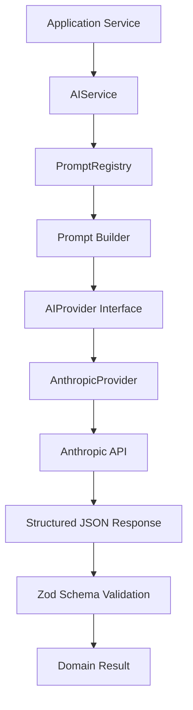
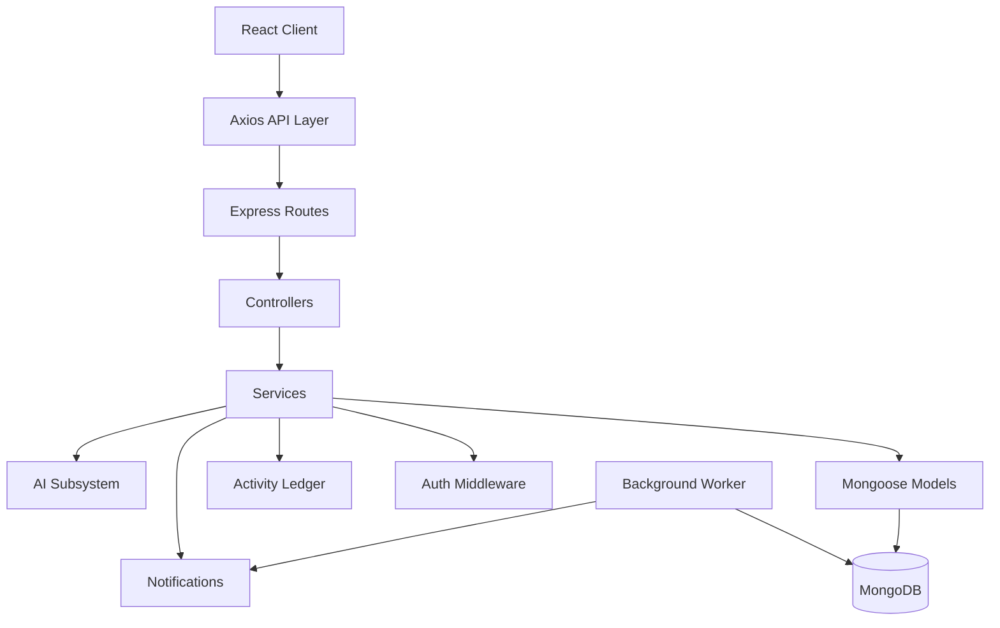
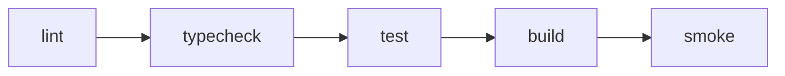

# AI Project Manager

A production-oriented project management platform built with React, TypeScript, Express, MongoDB, and Anthropic — combining conventional task/project CRUD with a structured, schema-validated AI subsystem for planning and summarization.

This repository is as much an exercise in engineering discipline as it is a product: dual-token authentication, optimistic concurrency on large Markdown documents, an auditable activity ledger, deduplicated background notifications, and an AI layer that treats LLM output as untrusted input.

[](https://www.typescriptlang.org/)
[](https://react.dev/)
[](https://nodejs.org/)
[](https://expressjs.com/)
[](https://www.mongodb.com/)
[](https://github.com/RehanIslam09/Odet-X/actions/workflows/ci.yml)

<!--
📸 SCREENSHOT: APPLICATION HERO / DASHBOARD

Recommended screenshot:
- Main dashboard in desktop view
- Sidebar visible
- Dashboard analytics visible
- AI-generated content visible if appropriate

Suggested file:
docs/assets/dashboard-overview.png

After adding the image, replace this comment with:

-->

<!--
🎥 OPTIONAL DEMO GIF

Capture a short workflow:
Create Project → Generate AI Tasks → Open Task Notes → Check Dashboard

Suggested:
docs/assets/demo.gif
-->

---

## Why This Project Exists

Most project-management side projects stop at CRUD. This one was built to explore what a *serious* implementation of the surrounding concerns actually looks like: a dual-token authentication system that never puts a refresh token where JavaScript can read it, optimistic concurrency control on a 250,000-character Markdown document that multiple tabs might edit at once, an append-only activity ledger, a deduplicated background notification worker, and — on top of all of it — an AI subsystem where every model output is Zod-validated before it's allowed anywhere near the database.

The AI layer in particular was built around a specific constraint: **LLM output is untrusted input.** Every generation request runs through prompt validation, XML-delimited prompt construction (to resist injection), and strict schema validation before a single field is persisted.

---

## Features

### Project Management
- Full CRUD with soft-delete (`isDeleted`) and independent archiving (`archived`)
- Search, filtering, and pagination on the dashboard grid
- Project Detail workspace with task overview metrics

<!--
📸 SCREENSHOTS: PROJECT MANAGEMENT

Recommended:
1. Projects overview page (grid view)
2. Project detail workspace

Suggested files:
docs/assets/projects-overview.png
docs/assets/project-detail.png

Suggested Markdown:

| Projects | Project Workspace |
| --- | --- |
|  |  |
-->

### Task Management
- Status (`todo`, `in_progress`, `done`, `cancelled`), priority, due dates, estimates, and labels (max 10)
- Task Detail drawer with quick status/priority workflows
- Soft delete and archive semantics identical to Projects

<!--
📸 SCREENSHOTS: TASK MANAGEMENT

Recommended:
1. Task list / board view
2. Task detail page

Suggested files:
docs/assets/tasks-list.png
docs/assets/task-detail.png

Suggested Markdown:

| Tasks | Task Detail |
| --- | --- |
|  |  |
-->

### Task Notes & Concurrency
- A dedicated `/tasks/:taskId/notes` Markdown workspace (Write / Preview modes) supporting up to 250,000 characters per task
- 1000ms debounced autosave with strictly serialized draft state
- Atomic, version-checked updates — concurrent edits from two tabs resolve with an explicit `409 Conflict` rather than a silent lost update
- Route-leave (`useBlocker`) and browser `beforeunload` guards against losing unsaved drafts

<!--
📸 SCREENSHOT: TASK NOTES WORKSPACE

Recommended: full-width screenshot of the Markdown editor in Write mode, 
with Preview mode toggle visible.

Suggested file:
docs/assets/task-notes-workspace.png

Suggested Markdown:

-->

### Dashboard & Analytics
- Aggregated overview endpoint (`GET /api/v1/dashboard/overview`)
- Productivity metrics grid, recent project progress, and attention/focus task alerts

### Activity Tracking
- Append-only `Activity` ledger recording every user and system event
- Best-effort asynchronous logging — a logging failure never blocks the underlying transaction
- Cursor-paginated feed, filterable per project or task

### Notifications
- Dedicated `Notification` domain, distinct from the Activity ledger, with tenant isolation and BOLA protections
- Bell popover in the navbar plus a full `/notifications` center with All / Unread / Read filters
- Backed by an independent background worker producing `task.due_soon` and `task.overdue` reminders, deduplicated via a sparse MongoDB index

<!--
📸 SCREENSHOT: NOTIFICATION CENTER

Recommended: /notifications page with a mix of read/unread items, 
filter tabs visible.

Suggested file:
docs/assets/notifications-center.png

Suggested Markdown:

-->

### AI Capabilities
- **Project → Tasks generation** — turns a plain-language project description into structured, persisted tasks
- **Task auto-labeling** — suggests context-aware labels for an existing task
- **Project summary generation** — produces a status summary with highlights and risks from active tasks

See [AI Capabilities](#ai-capabilities-1) below for the full picture.

<!--
📸 SCREENSHOTS: AI FEATURES

Recommended:
1. Project → Tasks generation review UI
2. Task auto-labeling suggestion UI
3. Project summary generation output

Suggested files:
docs/assets/ai-generate-tasks.png
docs/assets/ai-task-labels.png
docs/assets/ai-project-summary.png
-->

### Authentication & Security
- Dual-token strategy: 15-minute in-memory access token, 7-day HTTP-only refresh cookie
- SHA-256 refresh token hashing, full rotation on every refresh, reuse detection with global session invalidation
- Transparent Axios refresh locking so components never see a raw 401

<!--
📸 SCREENSHOT: AUTHENTICATION

Recommended: Login page, two-column layout (brand panel + form panel).

Suggested file:
docs/assets/auth-login.png

Suggested Markdown:

-->

<!--
📸 SCREENSHOT: SETTINGS PAGE

Recommended: Settings page showing profile, preferences, and password sections.

Suggested file:
docs/assets/settings-page.png

Suggested Markdown:

-->

---

## AI Capabilities

The AI subsystem is deliberately scoped: three structured, single-record features rather than an open-ended chat interface. Every feature follows the same shape — generate, validate, review, persist.

### 1. Project → Tasks Generation
A user supplies (or the project already has) a plain-language description. The AI proposes a structured breakdown of prioritized, estimated tasks, which are validated and persisted through the same `taskService.createTask()` path used by manual task creation — guaranteeing identical side effects (including Activity logging) whether a task was written by a human or generated by AI.

### 2. Task Auto-Labeling
Given a task's title, description, and surrounding project context, the AI suggests 1–5 relevant labels. Suggestions are normalized (trimmed, deduplicated, lowercased) and appended to existing labels up to the domain-enforced cap of 10 per task.

### 3. Project Summary Generation
The AI analyzes a project's active (non-archived, non-deleted) tasks and produces a summary, a bounded list of highlights, and a bounded list of flagged risks — explicitly instructed not to hallucinate deadlines, percentages, or unearned confidence.

### Engineering Underneath
- **`AIService`** — a single facade (`generateStructuredData`) that every feature calls; it owns prompt validation, provider dispatch, response validation, and structured logging.
- **`AIProvider` abstraction** — a generic contract (`generateStructured`) that shields business logic from any specific vendor SDK.
- **`AnthropicProvider`** — the concrete implementation wrapping `@anthropic-ai/sdk`, mapping SDK-specific errors (e.g. `APIConnectionTimeoutError`) into the internal error hierarchy.
- **`PromptRegistry` / `PromptTemplate`** — prompts are defined once, registered at application startup, and retrieved by name — never constructed ad hoc inside a controller.
- **Prompt validation** — `validatePromptTemplate` runs at startup, asserting every registered template has the required structural sections before the app is considered healthy.
- **Structured JSON output, validated with Zod** — every provider response is parsed and checked against a strict schema (`GenerateTasksResponseSchema`, `GeneratedLabelsSchema`, `GeneratedProjectSummarySchema`) before any domain service sees it.
- **Model tiers** — requests specify an abstract tier (`fast-json`, `deep-context`), which `aiConfig` maps to a concrete Anthropic model, keeping call sites decoupled from specific model names.
- **Error hierarchy** — `AIProviderError`, `AIValidationError`, `AIConfigurationError`, and `AITimeoutError` all inherit from `AIBaseError`, giving calling code a precise, catchable failure taxonomy instead of generic exceptions.

---

## AI Architecture



The `PromptBuilder` wraps every section in deterministic XML delimiters (`<system>`, `<context>`, `<intent>`) before it reaches the provider — structurally guiding the model to treat injected context as data to analyze, not instructions to execute, which is the primary mitigation against prompt injection from user-authored content like Task Notes.

Every AI request follows the same seven-step lifecycle: initialization (unique `executionId`, tier-to-model resolution) → prompt validation → prompt construction → provider execution → response validation → structured logging → typed result return. Logs capture `executionId`, provider, model, duration, and prompt name/version — deliberately **never** raw prompts, model responses, or API keys.

---

## System Architecture



Controllers stay thin by design — they parse the request, call exactly one service function, and format the response. All business rules, ownership checks, and database access live in the service layer, which is the only layer permitted to talk to Mongoose.

---

## Server Process Architecture

The backend deliberately separates *application configuration* from *process execution* across four entry points, rather than folding everything into a single `index.ts`:

| Entry Point | Role | DB Connection | HTTP Listener | Network Calls |
|---|---|:---:|:---:|:---:|
| `app.ts` | Configures Express (middleware, routes, error handlers) and initializes the AI prompt registry | No | No | No |
| `index.ts` | Imports `app.ts`, connects to MongoDB, binds the HTTP listener | Yes | Yes | No |
| `worker.ts` | Connects to MongoDB independently, runs `node-cron` scheduled jobs for notification reminders | Yes | No | No |
| `smoke.ts` | Imports `app.ts` with a fake API key, validates bootstrap and prompt registration | No | No | No |

This separation is what makes [smoke verification](#application-startup-smoke-verification) possible: `smoke.ts` can prove the application *initializes* correctly without needing a real database or triggering a billable Anthropic call, because `app.ts` itself never reaches for either.

---

## Authentication & Security

Authentication uses a dual-token strategy designed to keep the long-lived credential out of reach of JavaScript entirely:

- **Access token** — a 15-minute JWT, returned in the JSON response body and held **only** in a module-level variable in `client/src/services/axios.ts`. Never `localStorage`, never Zustand, never React state.
- **Refresh token** — a 7-day JWT, transmitted **exclusively** as an HTTP-only cookie scoped to `path: /api/v1/auth`. It is never present in any JSON response and is unreadable from the browser's JavaScript context.
- **SHA-256 hashing** — the refresh token is hashed before storage; a database breach yields only `sha256(refreshToken)`, which cannot authenticate a request.
- **Rotation on every refresh** — the old refresh token is invalidated the instant a new one is issued, shrinking the usable window for a stolen token to a single use.
- **Reuse detection** — presenting an already-rotated refresh token is treated as a potential replay attack: it invalidates the session everywhere and forces re-authentication.
- **Axios refresh locking** — a single in-flight refresh promise is shared across all concurrent 401 responses, so a burst of expired requests triggers exactly one refresh call, not one per request.
- **Route protection** — `ProtectedRoute` / `PublicRoute` guards read exclusively from Zustand state populated after bootstrap; they never issue their own network requests.
- **Generic authentication errors** — login and session failures return identical messages regardless of cause, preventing account enumeration.

---

## Concurrency & Data Integrity

Task Notes is a large, freeform Markdown workspace (up to 250,000 characters) that can plausibly be open in two browser tabs — or two collaborators — at once. Rather than accept last-write-wins, updates are protected by optimistic concurrency control:

- Every save includes an `expectedVersion`, checked against Mongoose's `__v` version key.
- The update runs as a single atomic `findOneAndUpdate` combining `_id`, `owner`, and `__v: expectedVersion` — there is no read-then-write race window.
- A version mismatch returns `409 Conflict` instead of silently overwriting another session's edits.
- Saves are debounced client-side at 1000ms via `useTaskNotesAutosave`, with local draft state strictly isolated from last-saved state to avoid merge loops.
- Notes updates deliberately bypass Activity logging and Notification triggers, so autosave doesn't spam either feed.

---

## Notifications & Background Worker

Notifications are modeled as their own domain, distinct from the immutable Activity ledger, because they carry per-user delivery and read state (`readAt`) that Activity intentionally does not.

- An independent `worker.ts` process, powered by `node-cron`, runs scheduled evaluations against MongoDB — decoupled entirely from the HTTP request/response cycle.
- Two producers currently run: `task.due_soon` (tasks due within 24 hours) and `task.overdue`.
- Every generated notification carries a deterministic `dedupeKey`, enforced unique via a **sparse** MongoDB index — so re-running the evaluation, or running multiple worker instances concurrently, can never produce duplicate reminders.

---

## Technology Stack

| Category | Technologies |
|---|---|
| **Frontend** | React 19 (React Compiler), TypeScript 5.9, Vite 6, Tailwind CSS v4, shadcn/ui, React Router v7, Framer Motion |
| **State Management** | TanStack Query v5 (server state), Zustand 5 (UI state), module-level memory (access token) |
| **Backend** | Node.js 20, Express 5, TypeScript 5.9 |
| **Database** | MongoDB 8, Mongoose 9 |
| **Authentication** | JWT (access + refresh), bcrypt (password hashing), SHA-256 (refresh token hashing), HTTP-only cookies |
| **AI** | `@anthropic-ai/sdk` v0.24, Claude 3.5 Sonnet (`deep-context` tier), Claude 3 Haiku (`fast-json` tier) |
| **Validation** | Zod v4 (frontend forms, backend DTOs, AI response schemas) |
| **Forms** | React Hook Form |
| **Background Processing** | node-cron (independent worker process) |
| **Testing** | Vitest 4.1 + React Testing Library (client), Node.js native test runner (server) |
| **Developer Tooling** | ESLint 9 (client, flat config), ESLint 10 (server, flat config), Prettier, Husky, lint-staged |
| **CI** | GitHub Actions, `mongo:8.0` service container |

---

## Project Structure

```
.
├── client/
│   └── src/
│       ├── app/                # Router, providers, QueryClient
│       ├── components/         # Shared UI (layout shells, shadcn primitives)
│       ├── features/           # Feature modules — auth, projects, tasks, dashboard,
│       │                       # activity, notifications, settings
│       ├── routes/              # ProtectedRoute / PublicRoute guards
│       ├── services/            # Centralized Axios client & token manager
│       ├── store/               # Zustand auth store
│       └── utils/
├── server/
│   └── src/
│       ├── ai/                  # AIService, AnthropicProvider, PromptRegistry,
│       │                       # prompt definitions, Zod schemas
│       ├── config/              # Database connection, env validation
│       ├── controllers/         # Thin HTTP adapters
│       ├── services/             # All business logic
│       ├── models/              # Mongoose schemas
│       ├── routes/              # Express route modules
│       ├── middleware/          # Auth, validation, error handling
│       ├── jobs/                # Scheduled reminder jobs
│       ├── tests/               # Server integration test suite
│       ├── app.ts               # Express setup (no DB, no listener)
│       ├── index.ts             # Production HTTP entry point
│       ├── worker.ts            # Background cron worker entry point
│       └── smoke.ts             # Application bootstrap verification
├── docs/                        # Full documentation corpus (Phases 1–19)
└── .github/workflows/           # CI configuration
```

Both the client and server follow a **feature-first** organization: business logic lives inside a feature's own `types/`, `validators/`, `services/`, `hooks/`, `components/` (or `services/`, `controllers/`) — never in shared directories. Shared code is limited to genuinely cross-cutting concerns (UI primitives, the Axios client, error utilities).

---

## Getting Started

### Prerequisites
- Node.js 20
- npm
- MongoDB (local instance or a reachable connection string)
- An Anthropic API key (only required for live AI feature calls — not for running `verify`)

### Clone the repository

```bash
git clone https://github.com/RehanIslam09/Odet-X.git
cd Odet-X
```

### Install dependencies

This repository maintains **separate dependency manifests** for the root, the client, and the server. Install all three:

```bash
npm install
npm install --prefix client
npm install --prefix server
```

---

## Environment Variables

Create a `.env` file for the server and one for the client based on the variables below (never commit real secrets).

**Server**

| Variable | Description |
|---|---|
| `PORT` | HTTP port for the Express server (default `5000`) |
| `NODE_ENV` | `development`, `test`, or `production` |
| `CLIENT_URL` | Origin allowed by CORS, e.g. `http://localhost:5173` |
| `MONGODB_URI` | MongoDB connection string |
| `JWT_ACCESS_SECRET` | Signing secret for access tokens (32+ chars) |
| `JWT_REFRESH_SECRET` | Signing secret for refresh tokens (32+ chars) |
| `ANTHROPIC_API_KEY` | Anthropic API key for AI feature calls |

**Client**

| Variable | Description |
|---|---|
| `VITE_API_URL` | Base URL of the API, e.g. `http://localhost:5000/api/v1` |

---

## Development

From the repository root:

```bash
npm run dev            # Runs client, server, and worker concurrently
npm run dev:client     # Client Vite dev server only
npm run dev:server     # Server Express API only
npm run dev:worker     # Background cron worker only
```

---

## Quality Gates

The repository is built around a single canonical verification contract, run identically by developers locally and by CI:

```bash
npm run verify
```

which executes, in sequence:



Each stage catches a distinct failure domain — style/hygiene, type contracts, business logic regressions, bundler/compilation breaks, and runtime bootstrap crashes, respectively. No stage is a substitute for another: the project's own history includes a case where `tsc` and unit tests both passed while the application crashed on startup, which is precisely the gap smoke verification was introduced to close (see [Engineering Principles](#engineering-principles)).

Individual stages are also runnable independently:

```bash
npm run lint
npm run typecheck
npm test
npm run build
npm run smoke
```

---

## Testing

**Client** — Vitest 4.1 + React Testing Library, co-located with the features they test (e.g. `useTaskNotesAutosave.test.tsx`). Coverage includes in-memory token storage and refresh-lock behavior, the debounced autosave hook, and Markdown/URL sanitization utilities. Currently: **26/26 passing**.

**Server** — Node.js's native test runner, executed via `tsx` against an isolated local MongoDB test database (`ai-project-manager-test`), fully separate from any development or production data. The suite spans 13 runner files covering user/auth flows, project and task CRUD, BOLA/tenant-isolation checks, Task Notes concurrency (`409` on version mismatch), the activity ledger, notification jobs and deduplication, dashboard aggregation, and the AI execution pipeline (prompt building/validation, and both the Project→Tasks and Project Summary features against a mock provider). Currently: **13/13 suite files passing**.

These numbers reflect the current documented state of the repository and will evolve as the codebase grows.

---

## Application Startup Smoke Verification

Compilation succeeding and unit tests passing do not, by themselves, prove that the application *starts*. Both can pass while route mounting, middleware assembly, or dynamic module registration fails at runtime — which is exactly what happened during development, when an AI prompt template that violated the `PromptRegistry`'s structural contract passed `tsc` and all unit tests, then crashed the server on boot.

`server/src/smoke.ts` closes that gap. It imports the real `app.ts` bootstrap and asserts that:

- All routes, controllers, services, and middleware resolve and import cleanly
- The AI subsystem initializes
- Every registered prompt template passes structural validation (`validatePromptTemplate`)
- The Express app builds its full middleware stack without throwing

It deliberately does **not**:

- Connect to MongoDB
- Start an HTTP listener
- Make a real request to the Anthropic API (it runs with a fake key, `ANTHROPIC_API_KEY=smoke-key-do-not-use`)

This keeps smoke verification fast, offline, and fully reproducible — in CI and on every developer machine, identically.

---

## CI

GitHub Actions (`.github/workflows/ci.yml`) runs on every push to `main` and every pull request against `main`, executing the exact same `npm run verify` contract developers run locally — by design, there is no separate CI-only script.

- **Node 20**, with npm dependency caching
- A dedicated `mongo:8.0` service container with a health check gate, so tests run against a fully isolated database (`ai-project-manager-test`) rather than anything shared or persistent
- Safe, fixed dummy secrets for `JWT_ACCESS_SECRET`, `JWT_REFRESH_SECRET`, and `ANTHROPIC_API_KEY` — no production credentials are ever present in the workflow
- `concurrency.cancel-in-progress: true`, so pushing new commits to an open PR cancels the now-stale run automatically
- `permissions: contents: read` — the workflow token cannot write back to the repository

---

## Engineering Principles

A selection of the principles this codebase was built around, drawn from its own development history:

- **Compile-time correctness is not runtime correctness.** `tsc` passing proves types line up, not that the app boots — which is why smoke verification exists as its own stage.
- **CI should execute the exact same contract developers run locally.** Divergent scripts are how "works on my machine" failures reach `main`.
- **AI output is untrusted input.** Every LLM response is Zod-validated before any domain service is allowed to touch it.
- **Concurrent writes require explicit conflict handling**, not last-write-wins — Task Notes resolves version mismatches with an explicit `409`, never a silent overwrite.
- **Background jobs require idempotency.** The notification worker's `dedupeKey` guarantees duplicate-free reminders even under concurrent execution.
- **Shared components must preserve their parent's layout contracts** — refactoring inline UI into a shared component must not silently change how a parent's flex/grid layout renders it.
- **Error causality should be preserved.** Re-thrown errors carry `{ cause: error }` so root-cause debugging doesn't dead-end at the wrapper.
- **Technical debt should be visible, not suppressed.** Accepted `any` usage is tracked as warnings, not silenced with inline lint-disable comments.

---

## Project Evolution

The application was built incrementally, phase by phase, rather than as a single monolithic implementation:

**Foundation → Authentication → Projects → Tasks → Dashboard Analytics → Activity Ledger → Notifications → Task Notes & Concurrency → Reliability Hardening → AI Subsystem → Engineering Hardening**

The full phase-by-phase history — including the specific incidents and fixes referenced above — is documented in [`docs/project-evolution.md`](docs/project-evolution.md).

---

## Documentation

Detailed, implementation-level documentation lives in `docs/`. Highlights:

- [`docs/architecture.md`](docs/architecture.md) — Overall system design
- [`docs/architecture-overview.md`](docs/architecture-overview.md) — End-to-end request flow diagrams
- [`docs/current-project-state.md`](docs/current-project-state.md) — Verified technical baseline (pre-Phase 20)
- [`docs/project-evolution.md`](docs/project-evolution.md) — Phase 1–19 chronological history
- [`docs/authentication.md`](docs/authentication.md) — Full auth flow and security decisions
- [`docs/api-design.md`](docs/api-design.md) — Complete endpoint reference
- [`docs/database-design.md`](docs/database-design.md) — MongoDB schemas and indexing strategy
- [`docs/testing-and-verification.md`](docs/testing-and-verification.md) — Verification pipeline and smoke test spec
- [`docs/ci-cd.md`](docs/ci-cd.md) — GitHub Actions workflow architecture
- [`docs/engineering-lessons.md`](docs/engineering-lessons.md) — 15 hardening principles with real incidents
- [`docs/ai/foundation-architecture.md`](docs/ai/foundation-architecture.md) — AI provider abstraction layer
- [`docs/ai/prompt-engineering.md`](docs/ai/prompt-engineering.md) — Prompt lifecycle, registry, and XML delimiter strategy
- [`docs/ai/execution-pipeline.md`](docs/ai/execution-pipeline.md) — The 7-step AI request lifecycle
- [`docs/ai/project-tasks.md`](docs/ai/project-tasks.md) — Project → Tasks feature
- [`docs/ai/task-labels.md`](docs/ai/task-labels.md) — Task auto-labeling feature
- [`docs/ai/project-summary.md`](docs/ai/project-summary.md) — Project summary generation feature

---

## Current Status

Phase 19 — AI Subsystem & Engineering Hardening — is complete. The canonical verification pipeline (`npm run verify`) passes across lint, typecheck, test, build, and smoke stages, both locally and in CI. The repository is stable and documented, and ready for subsequent development phases.

---

## Contributing

This is currently a solo-developed learning/portfolio project, but the codebase is structured to be contribution-friendly. Before opening a pull request:

```bash
npm run verify
```

should pass with no new failures. Tests should not be deleted, disabled, or weakened to satisfy the pipeline — see [`docs/coding-guidelines.md`](docs/coding-guidelines.md) for the full set of conventions enforced across the codebase.
