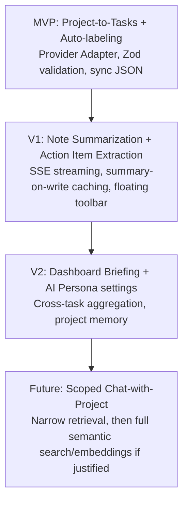

# AI Architecture External Research & Synthesis
### Companion to: AI Product & Architecture Specification (Internal Analysis)
**Document type:** External research + architecture specification
**Audience:** Engineering (implementation blueprint)
**Status:** Phase 2 — Industry Research & Synthesis

---

## Executive Summary

Your internal document already gets the hard part right: AI as an *augmentation layer* sitting behind a validation boundary, not a second brain with write access to your database. That instinct — Zod-validate everything, require human approval before persistence, keep the AI service decoupled from controllers — is exactly the architecture that every mature AI productivity product converges on, whether or not their marketing says so.

Three lessons recur across every product studied (Linear, Notion AI, Cursor, GitHub Copilot Workspace, Claude Projects, Devin, Windsurf, Microsoft Copilot, OpenAI Canvas, Google Gemini Workspace, Atlassian Intelligence, Slack AI, ClickUp AI, Superhuman AI, Replit Agent):

1. **Trust is built through reversibility, not accuracy.** No product markets "our AI is always right." They all market "you're always one click from undoing it." Diff views, accept/reject, draft states — these exist because LLM output is probabilistic and users know it. Your OCC-protected, approval-gated write path already gives you this; the missing piece is *surfacing* the reversibility in the UI as clearly as Cursor's diff view does.
2. **Context is a budget, not a database dump.** Every serious product tiers context (recent/relevant/summarized/discarded) rather than stuffing everything into the window. Your Tier 1/2/3 context budget in Section 12 of your internal doc is structurally identical to what Cursor calls "@-mentions + codebase index" and what Notion AI calls "page + linked pages + workspace search" — you've already designed the right shape.
3. **RAG is over-prescribed by the industry and under-justified for most single-tenant productivity tools.** This is the biggest place where "industry best practice" content online will mislead you if applied uncritically — addressed in detail below.

The rest of this document works through where your architecture should adopt industry patterns as-is, where it should adapt them, and — just as importantly — which popular patterns you should deliberately skip for your MVP.

---

## Industry Patterns

Patterns below appear, in some form, across nearly all fifteen products studied. Where a pattern is universal, it's universal for a structural reason, not a stylistic one.

**1. Contextual triggers over global chat.**
Cursor's Cmd+K, Notion AI's slash command, Linear's AI triage button, Copilot Workspace's issue-scoped launch — all of them anchor AI to the object the user is already looking at. The reason: an AI action scoped to "this task" or "this file" needs far less disambiguation than a global chatbot ("which task did you mean?"), which cuts both prompt-construction complexity and user cognitive load simultaneously. A global chat window is the *easiest* thing to build and the *hardest* thing to make useful, which is why it's usually shipped last, not first, by teams that get this right.

**2. Structured output for anything that touches persistent state.**
Every product that generates tasks, tickets, or structured records (Linear AI, Copilot Workspace, ClickUp AI) forces the model into a schema — JSON mode, function calling, or a constrained grammar — rather than parsing free text. This isn't a nicety; it's the only way to get a validation boundary at all. Your Zod-validation pipeline is this pattern, correctly applied.

**3. Streaming as the default for anything generative.**
Any response over roughly 200 tokens is streamed almost everywhere in the industry now. The reason isn't just perceived latency — it's that streaming gives users an early exit. Devin, Copilot Workspace, and Cursor all let you interrupt mid-generation because half of a bad generation is recoverable in under a second, while waiting for a full bad generation and then discarding it costs 10-30 seconds of dead time.

**4. Explicit, visible "why" for every suggestion.**
Linear AI shows which signals (labels, past triage decisions) drove a suggestion. Notion AI's "based on this page" chip. This is the industry's answer to hallucination anxiety: it doesn't reduce hallucination rate, but it lets users spot-check cheaply, which is what actually earns trust. Your "Explainable Interactions" principle already names this correctly.

**5. Background/async work is queued and notified, not held open on an HTTP connection.**
Copilot Workspace's plan generation, Devin's task execution — long-running AI work is handled by a job system with a notification/webhook on completion, never a blocking request. Your Option C (worker queue + Notification model) is this pattern.

**6. Degradation is silent, not apologetic.**
When Superhuman AI or Slack AI's provider is rate-limited, the AI-specific UI element disables or hides; the core product (sending the email, posting the message) is entirely unaffected. No product surfaces a global "AI is down" banner — because doing so implies the *whole product* is degraded, which erodes more trust than it protects.

---

## Patterns To Adopt

Mapped specifically to your architecture, not generically:

- **Contextual sparkle/trigger points over a global chat tab** — for MVP, skip a persistent chat sidebar entirely. Anchor to Project Detail ("Deconstruct Project") and Task Notes ("Summarize" / "Extract Action Items"). This matches your existing "Contextual Immersion" principle and avoids building session-management infrastructure you don't yet need.
- **Streaming for Task Notes generation, synchronous JSON for Task generation.** This maps directly onto your own Type A / Type B request classification in Section 12 — you've already independently arrived at the split the industry uses; the recommendation is to build the transport layer (SSE) around that classification rather than one generic AI endpoint.
- **Draft-state persistence, never optimistic AI writes.** Cursor's diff view and Copilot Workspace's PR draft are the same idea applied to your Task Notes editor and bulk task creation: render AI output in a distinguishable, editable draft state; only commit to Mongoose on explicit accept. Your Section 10 lifecycle already specifies this — treat it as non-negotiable, not aspirational.
- **Acceptance-rate as the north-star metric**, exactly as you've defined in Success Metrics. This is Linear AI's actual internal metric for triage suggestions, per their public engineering commentary — it's a better product signal than latency or usage count because it directly measures whether the model output was worth generating.
- **Debounced, single-flight AI triggers on the frontend.** Superhuman and Notion both debounce autocomplete-style triggers aggressively (300-800ms) specifically to control cost, not just to reduce jank. Bake this into your React Query / Zustand streaming layer from day one — it's cheap to add now and expensive to retrofit once usage grows.

---

## Patterns To Avoid

- **Global, always-visible chat widget as the primary AI surface.** Generic chatbots (the pattern most enterprise tools shipped first, 2023-2024) consistently show the lowest engagement and the highest "users forget it exists" rate, because they require the user to re-explain context the product already has. Given your rich Task/Project schema, a scoped action is strictly more valuable than a chat box for the same engineering cost.
- **AI acting on data without approval**, even for "safe-looking" actions like auto-labeling. Products that shipped autonomous writes early (auto-triage that silently reassigns tickets) generated disproportionate trust damage relative to the time saved — a single bad autonomous action outweighs dozens of good ones in user perception. Your Human-in-Control principle already forbids this; keep the enforcement in the service layer, not just the UI, so no future endpoint can bypass it by accident.
- **Modal overload / multi-step wizards for AI actions.** Products that gate AI behind a 3-step configuration modal see the feature go unused. Prefer single-click generate → inline review, matching your own Feature Matrix ("One-click generate, review, accept").
- **Overwhelming configuration (AI Persona settings) shipped early.** You've already correctly placed this in V2, not MVP — resist the temptation to move it up. Persona/style configuration only matters once users have enough AI-generated content to notice a voice they dislike; shipping it before that point is configuration nobody has an opinion on yet.
- **Excessive proactive notifications ("AI noticed X, click to review").** Push notifications work for human-generated events (someone assigned you a task) because the user trusts the signal source. AI-generated proactive nudges have a much lower trust floor and train users to dismiss notifications generally. Keep AI surfaces pull-based (user clicks Sparkle) rather than push-based (AI interrupts user) for MVP and V1.

---

## Context Engineering

Your context hierarchy (Task Notes > Project Description > Task Metadata > Activity Logs > User Profile) is the right ranking. The question industry patterns actually help answer is *how much of each tier to include, and when to summarize vs. truncate vs. retrieve*.

| Approach | What it is | Where it fits your app |
|---|---|---|
| **Naive full-context injection** | Dump entire record into the prompt | Fine for Project Description (≤1,000 chars) and Task metadata — cheap, deterministic, no infra needed |
| **Truncation** | Take first N chars/tokens | Reasonable stopgap for Task Notes under ~5,000 chars, but silently drops the back half of a document — risky for a 250k-char worst case |
| **Hierarchical summarization** | Pre-summarize long content once, cache the summary, inject the summary instead of raw text | The correct default for Task Notes above your Tier 2 threshold — cheaper and more faithful than truncation because it doesn't arbitrarily privilege the *first* part of a document |
| **Retrieval (semantic search / embeddings)** | Chunk + embed + retrieve top-k relevant chunks at query time | Only pays for itself once you have cross-task or cross-project queries ("Chat with Project," "find related tasks") — see RAG Strategy below |

**Recommendation:** implement summarization-on-write, not retrieval, for MVP/V1. When a Task Note is saved and exceeds your Tier 2 threshold, generate (or regenerate) a cached summary asynchronously via your existing worker queue, store it alongside the Task, and use *that* for every subsequent AI feature that touches this task (dashboard briefing, project deconstruction context, etc.) instead of re-summarizing on every request. This is Notion AI's actual approach to large pages — summaries are computed once per edit, not once per AI call, which is the single highest-leverage cost optimization available to you.

---

## Memory Architecture

Your product currently has no notion of "AI memory" distinct from the database itself — which is correct, and should stay that way longer than instinct suggests.

| Memory type | Definition | MVP verdict |
|---|---|---|
| **Ephemeral (single-request) memory** | Context assembled fresh per request from Mongoose | **Ship now.** This is what your Prompt Lifecycle already describes. |
| **Session memory** | Multi-turn conversational state within one AI interaction | **Defer to V1**, and only for features that are genuinely multi-turn (e.g., "Chat with Project" if built). Auto-labeling and Deconstruct Project are single-turn; don't build conversation-state machinery for single-turn features. |
| **Project memory** | Durable, structured facts about a project the AI should always know (e.g., "this project uses TypeScript," a house style) | **Defer to V2**, ship only once AI Persona settings exist — otherwise there's no UI for users to correct wrong "memories," which is worse than no memory. |
| **Long-term/cross-project memory** | Learned patterns across a user's whole workspace | **Do not build for MVP or V1.** This is the least differentiated, most infrastructure-heavy tier, and the products that have it (Claude Projects, Gemini Workspace) built it only after their core single-document AI features had high acceptance rates. Building this first is building the least-validated feature first. |

The single biggest risk in memory architecture is committing to persistent "AI memory" before you have a correction UI — a wrong summary is annoying; a wrong *persistent* fact the AI keeps re-injecting is actively damaging to trust and much harder to debug ("why does it keep saying that?"). Stay ephemeral until you've built the UI to inspect and edit whatever you choose to persist.

---

## AI Interaction Models

| Model | Best for | Recommendation for your app |
|---|---|---|
| **Command palette (Cmd+K)** | Power-user, keyboard-driven actions across many commands | Not MVP — you have too few AI actions right now to justify a palette (a palette with 2 entries is worse than 2 buttons). Revisit once you have 5+ distinct AI actions. |
| **Inline actions (toolbar button / context menu)** | Actions scoped to a single object the user is already editing | **Primary MVP pattern.** Sparkle icon in Task Notes toolbar, "Deconstruct Project" button on Project Detail. |
| **Side panel** | Reviewing structured, multi-item AI output (e.g., a batch of generated tasks) | **Use for the review/approval step**, not for triggering — e.g., generated tasks open in a side panel for bulk accept/reject, matching your Feature Matrix's "review, accept" UX. |
| **Chat** | Open-ended, exploratory, multi-turn questions across large unstructured context | Explicitly out of scope until "Chat with Project" ships (your Future Vision tier) — and even then, scope it to one project's context, never global. |
| **Slash commands** | Text-editor-native triggers | Natural fit for your Markdown Task Notes editor in V1 (`/summarize`, `/extract-actions`) once streaming infra exists — cheaper to build than a toolbar once the editor already parses Markdown syntax. |
| **Ghost text (inline completion)** | Low-latency, single-token-stream continuation as the user types | Attractive but **defer** — ghost text needs sub-300ms TTFT to feel good, which typically requires a smaller/faster model and dedicated latency budget you haven't built observability for yet. Revisit after Phase A infra and TTFT metrics exist. |
| **Floating toolbar (select text → act)** | Rewriting/editing a selected passage | Good V1 candidate for Task Notes ("select text → shorten/expand/fix grammar") — reuses your existing Markdown editor selection handling. |

---

## Streaming UX

For any Type B (generative/streaming) request:

- **Time-to-first-token is the perceived-latency metric that matters**, not total generation time. Users judge "did this start working" within ~500ms; they're far more tolerant of a 10-second total generation if the first tokens appeared quickly.
- **Interrupt must be a real cancellation**, not a UI-only stop. Closing the SSE connection client-side without a corresponding server-side abort still burns the provider call (and the cost) to completion. Wire cancellation through to the Provider Adapter (abort the underlying fetch/stream) — this is a common gap that silently doubles cost under heavy interrupt usage.
- **Accept / Reject / Regenerate, not just Accept.** Regenerate should re-run with the same context but note in your observability layer that a regenerate occurred — high regenerate rates are your earliest, cheapest signal that a prompt template needs work, well before acceptance-rate metrics would tell you the same thing.
- **Never stream directly into the persisted field.** Stream into local/Zustand state exactly as your internal doc specifies, and only write to React Query's cache (and eventually Mongoose) on explicit accept. This is what makes your OCC model safe under streaming — the version key never sees a partial generation.

---

## AI Planning

Linear's triage suggestions, Devin's task plans, and Copilot Workspace's PR plans share a structure worth adopting explicitly: **plan, then act, with a checkpoint in between.** Devin in particular decomposes work into a visible plan *before* execution, specifically so a human can redirect before compute is spent on the wrong path.

For your "Deconstruct Project" feature, this maps directly:

1. AI proposes a **plan** — a short list of proposed tasks with titles only (cheap, fast, one JSON call).
2. User reviews/edits the plan at the title level (cheap to regenerate if wrong).
3. Only on confirmation does the system optionally elaborate each task's notes field (more expensive, one call per accepted task, or deferred entirely to V1).

This two-phase approach is strictly better than generating fully-elaborated tasks in one shot: it's cheaper when the plan is wrong (which is common, especially on a first pass), and it mirrors the review/accept pattern your Feature Matrix already commits to. Reserve full multi-step autonomous planning (Devin-style, executing across many tool calls without checkpoints) for a much later phase, if ever — your product's risk profile (persistent project-management data) is far less forgiving of autonomous multi-step drift than Devin's (a disposable sandboxed code branch).

---

## Cost Optimization

In priority order, highest ROI first for your specific architecture:

1. **Cache Task Note summaries on write, not on read** (see Context Engineering above). This alone eliminates the dominant cost driver you identified yourself — repeatedly feeding 60-80k tokens of raw notes into unrelated features.
2. **Prompt caching at the provider level.** Current Anthropic pricing gives roughly a 90% discount on cache hits, with both 5-minute and 1-hour TTL options and flat-rate 1M-token context on flagship models — meaning your system-prompt + schema-instruction boilerplate (which is identical across every request of a given type) should be placed in the cached portion of the prompt, with only the per-request context and user intent outside the cache boundary. This is close to free to implement (a matter of prompt structure) and directly cuts your largest fixed cost.
3. **Type-based model routing.** Route Type A (deterministic/JSON, small context — auto-labeling) to your cheapest capable model tier; reserve your most capable tier for Type B (generative, large context, user-facing prose quality matters). Don't default every request to your most expensive model "to be safe" — auto-labeling doesn't need frontier reasoning.
4. **Batch processing for anything non-interactive.** Background summarization (Task Note caching from #1) is a textbook batch workload — batch APIs typically run at roughly half the price of synchronous calls, with the tradeoff of higher latency, which is irrelevant for a background job.
5. **Debounce + single-flight on the frontend**, as noted in Patterns to Adopt — prevents duplicate billing from double-clicks or rapid re-triggers.
6. **Token budgeting per feature, enforced server-side**, not just prompt-template discipline. Hard-cap context tiers (your existing Tier 1/2/3 model) at the service layer so a future feature can't accidentally balloon context size without a code review catching it.
7. **Semantic caching / response reuse** — lowest priority for MVP. Only valuable once you have enough request volume that identical-or-near-identical requests recur often; premature for a single-tenant-per-user product with low request volume per user.

Do **not** prioritize prompt compression (LLM-based prompt shortening) — it's a second LLM call spent to save tokens on a first one, and rarely nets positive ROI below very high request volumes. It shows up often in "cost optimization" content online but is a poor fit for your scale.

---

## Rate Limit Strategy

- **Exponential backoff with jitter** in the Provider Adapter for `429`s — your internal doc already specifies this; add jitter (small random delay variance) specifically to avoid synchronized retry storms if you ever have concurrent requests from the same process.
- **Circuit breaker at the adapter level.** After N consecutive failures to a provider, trip a breaker that fails fast (skip the retry loop) for a cooldown window, and surface the "AI temporarily unavailable" state to the UI immediately rather than making every user wait through a full retry cycle individually.
- **Graceful quota degradation exactly as you specified** — dim the Sparkle icon, don't 500. Extend this: the dimmed state should be distinguishable from "still loading" so users don't think the button is broken.
- **Separate rate-limit budgets per request type**, not a single global limiter. A burst of background summarization jobs (Type B, non-interactive) should never be able to starve a user's synchronous auto-labeling request (Type A, interactive) of headroom — prioritize interactive requests in your queue/limiter, exactly as your Request Prioritization principle states.
- **User-facing messaging should name the *product* impact, never the *vendor*.** "Suggestions are temporarily paused" beats "OpenAI/Anthropic is experiencing an outage" — the latter both leaks vendor choice (a minor security/negotiating-position concern) and implies a fragility to your whole product that isn't accurate.

---

## Provider Architecture

Direct SDK → Provider abstraction → Multi-provider routing → Fallback models

Given your context (250k-char worst-case documents, cost sensitivity, single engineer or small team maintaining this):

- **Build the Provider Adapter layer now** (you've already scoped this correctly in Section 9) — the cost of building it is low and it's genuinely hard to retrofit once dozens of call sites assume one SDK's response shape.
- **Skip multi-provider *routing* for MVP.** Pick one primary provider and commit. As of mid-2026, Anthropic's flagship and mid tiers offer flat-rate 1M-token context with no long-context surcharge, which matters directly for your worst-case Task Notes size — that's a concrete, current reason to default to Anthropic for Type B (large-context) requests specifically, independent of general provider-loyalty reasoning. Re-evaluate this choice roughly annually as pricing/context windows shift; don't build routing infrastructure speculatively against a decision you might revisit anyway.
- **Do build a fallback model within one provider** (e.g., if your primary flagship model call fails validation twice, retry once against a faster/cheaper model in the same family before surfacing an error) — this is cheap because it reuses the same adapter and API shape, unlike cross-provider fallback which requires normalizing two different response formats.
- **Avoid a heavy orchestration framework (LangChain, LlamaIndex) for MVP.** Every product studied that's known for tight, fast, well-observed AI UX (Cursor, Linear) uses thin, direct provider integration, not a heavy framework — because orchestration frameworks add an abstraction layer between you and the exact prompt/response your observability needs to log, which works against your own Observability requirements (Section 11) more than it helps. The Vercel AI SDK is a lighter-weight, UI-focused exception worth evaluating specifically for its streaming/React-hook ergonomics (useChat/useCompletion-style primitives) rather than as an orchestration layer — it's closer to "prompt is a promise" plumbing than a full agent framework, and pairs well with a thin custom Provider Adapter rather than replacing it.

---

## RAG Strategy

You explicitly asked not to default to a "yes" here, so the honest evaluation:

**What RAG would buy you:** the ability to answer questions or generate content that requires searching *across* tasks/projects rather than within one record — i.e., your Future Vision "Chat with Project" and cross-project search.

**What RAG costs you, concretely, for this product:**
- A vector database (pgvector, Pinecone, or similar) and an embedding pipeline that must stay in sync with every Task Note edit — a new consistency problem layered on top of your existing OCC model.
- Chunking strategy design for Markdown content specifically (code blocks and checklists don't chunk cleanly with naive text splitters).
- A second failure mode class (retrieval quality) on top of generation quality — when output is bad, you now have to debug whether the retrieval or the generation was at fault.
- No current feature in your MVP/V1/V2 roadmap actually needs it. Project-to-Tasks, Auto-labeling, Note Summarization, and Dashboard Briefing are all single-record or single-project scoped — every one of them is satisfied by your Tier 1/2/3 context budget without retrieval.

**Verdict: RAG does not belong in MVP, V1, or V2.** It becomes justified only when you build "Chat with Project" or cross-project search specifically — and even then, evaluate whether a *narrower* form (search scoped to one project's tasks, computed on-demand via a direct Mongoose text/aggregation query, no embeddings) satisfies the actual user need before reaching for a vector DB. Full workspace-wide semantic search is genuinely the only feature in your roadmap that requires embeddings; treat it as a distinct, deliberately-scoped V3+ project, not an early infrastructure investment made "to be ready."

---

## Prompt Engineering

Recommendation: **centralized, modular, versioned — but not over-engineered.**

- **Centralized in one location** (e.g., `services/ai/prompts/`), not scattered across controllers. This is table stakes and matches your "predefined template" language in Section 10.
- **Modular by composing the fixed lifecycle stages you already defined**: System Instructions (immutable, cacheable) + Context (variable, per-request) + User Intent (variable) as separate, composable template pieces rather than one monolithic string per feature. This directly enables the prompt-caching cost optimization above, since the immutable system-instruction block can be cache-anchored independently of the variable context.
- **Versioned via a simple version string/constant per template**, logged with every request (ties directly into your Observability "Prompt Versioning" requirement) — a full prompt-versioning platform (like PromptLayer or LangSmith's prompt hub) is unnecessary at your scale; a version field in your request log accomplishes the same debugging value.
- **One template per AI Request Type (A/B), not one per UI button.** "Summarize Notes" and "Extract Action Items" likely share the same context-assembly and system-instruction shape and differ only in user intent — build them as parameterized variants of one Type-B template rather than two independent templates, to avoid prompt drift between near-identical features.

---

## Observability

Your Section 11 list is already comprehensive and correctly scoped; the additions worth making explicit:

- **Correlate prompt version + acceptance/rejection outcome** as a joined metric, not two separate dashboards — "which prompt version has the lowest acceptance rate" is the single most actionable query you'll run, and it only works if version and outcome are logged against the same request ID.
- **Log at the request-classification level (Type A vs Type B)** so cost and latency dashboards can be split by type — mixing a 50ms auto-label call and a 8s streaming generation into one aggregate latency metric hides both.
- **Redact/hash Task Note content in logs by default**, given your Privacy First principle and tenant isolation requirements — log prompt *structure* and *token counts* for debugging by default, and gate full prompt/response content logging behind an explicit, audited debug flag rather than logging raw user content unconditionally.

---

## Testing

Production AI teams generally combine four layers; recommended scope for you:

| Layer | What it is | MVP scope |
|---|---|---|
| **Golden prompts** | A fixed set of representative inputs with expected-shape outputs, run in CI | **Build this for MVP** — for Type A (JSON) requests especially, this is just schema-conformance testing plus a few hand-picked realistic examples. Cheap and high-value. |
| **Schema/regression testing** | Assert the Zod schema still validates outputs across prompt/model changes | **Build this for MVP** — you already have the Zod schemas; wiring them into a test harness against real model calls (or recorded fixtures) is low-effort given work you've already done. |
| **LLM-as-judge evaluation** | A second model call scores output quality against a rubric | **Defer to V1.** Useful once you have enough real acceptance/rejection data to know what "good" looks like for your users specifically — building a judge rubric before that data exists means guessing at your own quality bar. |
| **Human evaluation / spot-check review** | Periodic manual review of real production outputs | **Do this continuously from MVP**, informally — your acceptance-rate metric plus the ability to log full prompt/response pairs (behind the redaction gate above) means you can review a sample weekly without dedicated tooling. |

Snapshot testing (asserting exact output text) is not appropriate for non-deterministic generation — use schema/shape assertions instead, as noted above.

---

## Security

Applying your Section 13 concerns concretely:

- **Prompt injection via Task Notes is a real, not theoretical, risk given your architecture** — Task Notes are long-form, user-authored Markdown that gets fed directly into prompts as context. Mitigate with: (1) clear structural delimiters between system instructions and injected user content in every prompt template (e.g., explicit tags/markers the model is instructed to treat injected content as data, not instructions), (2) never let AI output from a Task Note context directly trigger a *different* task's mutation — the write path should always be scoped to the object that was the subject of the request, and (3) treat any AI-proposed action that references an object ID not present in the original context as a validation failure, not a valid instruction (this is exactly what your Zod pipeline should catch, but it's worth stating as an explicit rule rather than an incidental side effect).
- **Tenant isolation** — your rigid `owner: Types.ObjectId` scoping is the right primitive; the risk isn't the database query, it's the *prompt construction step* accidentally concatenating context from the wrong owner if a service function is ever called with the wrong ID. Add an assertion at the prompt-construction boundary (not just the DB-query boundary) that every piece of injected context carries the same owner ID as the requesting user, as a defense-in-depth check independent of the query layer.
- **Hallucination mitigation** — your validation pipeline (Zod → business rules → human approval) is the correct mitigation and is stronger than most products' equivalent, because it adds a human checkpoint most auto-triage products skip. The one gap: business-rule validation should include *referential* checks (does this labelId/projectId actually exist and belong to this owner), not just shape checks, since Zod alone validates structure, not existence.
- **Data leakage** — given your Provider Adapter pattern, ensure request/response logging (Observability) never logs to a third-party APM/logging vendor without the same redaction rules applied as your primary logs; it's easy to correctly redact your own database logs and then leak raw content via an unredacted error-tracking integration.

---

## MVP Recommendation

Highest ROI, not most impressive — matching your own framing:

**Ship exactly two features first: Project-to-Tasks generation (Type A) and Basic Auto-labeling (Type A).** This is precisely your own MVP row, and the research above confirms rather than revises it:

- Both are synchronous, JSON-schema-validated, single-record-scoped — no streaming infra, no worker queue, no vector DB required.
- Both produce a measurable acceptance-rate signal immediately, which de-risks every downstream investment (streaming, RAG, memory) by giving you real data on whether users trust and want AI suggestions before you spend engineering time on more expensive infrastructure.
- Both fit inside your existing REST/Zod/Mongoose architecture with zero new infrastructure — Section 14's own "Extremely high readiness for basic integrations" assessment is accurate; the research doesn't change that conclusion, it just confirms it against outside evidence.

Add the Provider Adapter (Phase A) as a prerequisite, not a separate phase — build it as thin scaffolding around these two features rather than a standalone infrastructure sprint, since a Provider Adapter with no callers yet is hard to validate.

---

## Future Roadmap

**Why this ordering is optimal, beyond restating your own phases:**

- **MVP → V1** is gated on *infrastructure* (SSE, summary caching) becoming necessary, not merely available — you don't build streaming until Note Summarization needs it, avoiding speculative infra.
- **V1 → V2** is gated on *data* — Dashboard Briefing (cross-task aggregation) and AI Persona settings are meaningfully better with acceptance-rate and usage data from V1 informing what "good" briefings and personas look like, so V1 usage data should directly shape V2's prompt design, not just its scheduling.
- **V2 → Future** is gated on *validated need*, specifically for RAG — per the RAG Strategy analysis, embeddings should be the last major infrastructure investment, added only once a specific feature (Chat-with-Project) is committed to, never spec'd "for future flexibility."

---

## Final Recommendations

If I were the Lead AI Architect on this project, here is exactly how I would build the AI layer:

1. **Build the Provider Adapter first, thin.** One interface, one Anthropic implementation, mockable for tests. No routing, no fallback-across-providers yet.
2. **Ship Project-to-Tasks and Auto-labeling together as MVP**, both Type A, both synchronous JSON, both behind the same Zod-validation → human-approval pipeline you've already designed. Instrument acceptance rate from day one — this metric is the input to every subsequent decision in this roadmap.
3. **Do not build a chat interface, a vector database, or a persistent AI-memory system until each is the specific bottleneck for a specific, already-validated feature.** Every one of those three is over-represented in "AI architecture best practices" content relative to how often they're actually the right first investment — and your own roadmap already sequences them last, correctly.
4. **Build prompt caching and summary-on-write caching early** — these are the two cost optimizations with the best ratio of engineering effort to dollar impact, and both are far cheaper to build into V1's streaming work than to retrofit after usage grows.
5. **Treat acceptance rate and regenerate rate as your primary product signals**, reviewed weekly, feeding directly into prompt template revisions (versioned, logged, so you can see whether a revision actually moved the metric).
6. **Keep every AI-touched write behind the same three gates**: Zod schema validation, business-rule/referential validation, and explicit human approval. This is your strongest asset relative to the rest of the industry — many competitors' "trust" problems trace directly to skipping one of these three gates under growth pressure. Don't let a future feature (autonomous triage, proactive suggestions) quietly bypass it because it seems "low risk."

Your internal document didn't need architectural correction so much as external validation and sequencing discipline — the design principles in Section 1 are already the right ones; the job of this phase was to confirm which industry patterns support them and, just as importantly, to name which popular patterns to deliberately not build.

---

*Sources: Anthropic API pricing and context-window figures reflect publicly available pricing information as of July 2026 and should be re-verified against current Anthropic documentation before implementation, as rates and model lineups change frequently.*