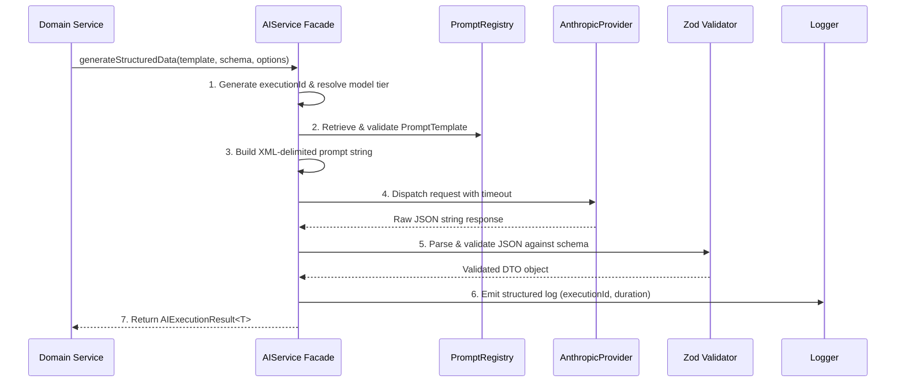

[Docs Wiki Portal](../README.md) > [AI](README.md) > Execution Pipeline

# AI Request Execution Pipeline

This document defines the 7-step execution pipeline executed by `AIService` for every LLM request.

---

## 📋 Table of Contents
1. [The 7-Step Lifecycle](#1-the-7-step-lifecycle)
2. [Lifecycle Diagram](#2-lifecycle-diagram)
3. [Observability & Structured Logging](#3-observability--structured-logging)

---

## 1. The 7-Step Lifecycle

1. **Initialization & Context Setup:** Generate a unique `executionId` (UUID v4), record request start timestamp, and resolve abstract model tier (`fast-json` or `deep-context`) into concrete model string (`claude-3-haiku` or `claude-3-5-sonnet`).
2. **Template Retrieval & Validation:** Retrieve `PromptTemplate` from `PromptRegistry` and run `validatePromptTemplate`.
3. **Prompt Construction:** Invoke `PromptBuilder` to format system instructions and wrap context/intent in XML tags (`<system>`, `<context>`, `<intent>`).
4. **Provider Dispatch:** Pass compiled prompt to `AIProvider.generateStructured()`, attaching timeout `AbortController` (30,000ms default).
5. **Zod Schema Response Validation:** Pass raw JSON string output through the feature's Zod schema (e.g. `GenerateTasksResponseSchema`). If validation fails, throw `AIValidationError`.
6. **Observability & Logging:** Log execution metadata (`executionId`, prompt template name/version, duration, model tier, status) to logger. Deliberately omit raw prompt context, user data, or API keys.
7. **Typed Result Return:** Wrap validated data in `AIExecutionResult<T>` envelope containing `data` and execution `metadata`.

---

## 2. Lifecycle Diagram



---

## 3. Observability & Structured Logging

Execution logs output JSON objects structured as follows:

```json
{
  "level": "info",
  "executionId": "f47ac10b-58cc-4372-a567-0e02b2c3d479",
  "promptName": "project-to-tasks",
  "promptVersion": "1.0.0",
  "model": "claude-3-5-sonnet-20240620",
  "durationMs": 1420,
  "status": "success"
}
```
