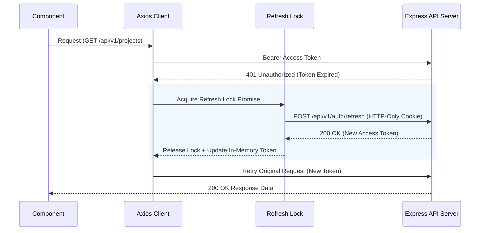

[Docs Wiki Portal](../README.md) > [Architecture](README.md) > Frontend Architecture

# Frontend Architecture & State Management

The client is built as a production-grade single page application (SPA) using React 19, TypeScript 5.9, Vite 6, and Tailwind CSS v4.

---

## 📋 Table of Contents
1. [Feature-First Directory Organization](#1-feature-first-directory-organization)
2. [Four-Tier State Management Model](#2-four-tier-state-management-model)
3. [Token Security & In-Memory Isolation](#3-token-security--in-memory-isolation)
4. [Application Bootstrap Flow](#4-application-bootstrap-flow)
5. [Frontend Routing & Route Guards](#5-frontend-routing--route-guards)

---

## 1. Feature-First Directory Organization

Business logic belongs strictly inside feature modules under `client/src/features/`. Features never depend on each other's internal implementation details; shared code is limited to `components/ui/`, `components/layout/`, and `services/axios.ts`.

```
client/src/
├── app/             # Application bootstrap (router, providers, QueryClient)
├── components/
│   ├── common/      # Shared utility components (AppLoader, PageContainer)
│   ├── layout/      # Layout shells (AuthLayout, DashboardLayout, DashboardNavbar)
│   └── ui/          # shadcn/ui primitive components (button, badge, tabs)
├── features/        # Feature modules — all business logic lives here
│   ├── activity/    # Activity timeline feature
│   ├── auth/        # Authentication pages, forms, hooks, validators
│   ├── dashboard/   # Analytics overview grid & task attention cards
│   ├── notifications/# Notification center, popover, bell badge
│   ├── projects/    # Project CRUD, workspace detail, options dropdown
│   ├── settings/    # Profile, preferences, password management
│   └── tasks/       # Task CRUD, notes editor workspace, Kanban drawer
├── hooks/           # Shared cross-cutting hooks
├── routes/          # Route guards (ProtectedRoute, PublicRoute)
├── services/        # Centralized Axios client & token manager (axios.ts)
├── store/           # Zustand store (auth.store.ts)
└── utils/           # API error handlers & form utilities
```

---

## 2. Four-Tier State Management Model

State is strictly partitioned across four distinct layers to prevent overlap and race conditions:

| Layer | Technology | Owns | Never Owns |
|---|---|---|---|
| **Initialization** | `AuthBootstrap` | Session restoration coordination on startup | UI State, Network fetching |
| **Server State** | TanStack Query v5 | Caching, invalidation, retry policies, server data | Tokens, client UI state |
| **Client UI State**| Zustand 5 | `isBootstrapping`, `isAuthenticated`, `user: User \| null` | Tokens, cached server data |
| **Token State** | Module Memory | Access token (`let accessToken`) in `services/axios.ts` | Persistent storage, React state |

---

## 3. Token Security & In-Memory Isolation

Access tokens live **exclusively** in a module-level variable inside `client/src/services/axios.ts`:

- **Never** stored in `localStorage` or `sessionStorage`
- **Never** stored in Zustand
- **Never** stored in React component state
- **Never** attached manually by components

### Axios Interceptor & Refresh Lock



---

## 4. Application Bootstrap Flow

Session initialization is centralized in a single `<AuthBootstrap>` component that wraps the application route tree:

```
Page Load
    │
    ▼
AuthBootstrap Component (Mounted inside Router)
    │
    ├── Executing useCurrentUser() [React Query]
    │       │
    │       ├── GET /api/v1/auth/me (Access token in memory? Attach header)
    │       │
    │       ├── 401 Unauthorized → Axios Interceptor fires
    │       │         ├── POST /api/v1/auth/refresh (HTTP-only cookie sent by browser)
    │       │         ├── Success ➔ Set new token in memory ➔ Retry GET /auth/me
    │       │         └── Failure ➔ clearToken() ➔ clearZustand() ➔ Reject
    │       │
    │       └── 200 OK ➔ Return user object
    │
    └── finishBootstrap() ➔ Updates Zustand (isBootstrapping = false)
            │
            ▼
        Route Guards (ProtectedRoute / PublicRoute) read Zustand
            │
            ├── if isBootstrapping ➔ Render AppLoader
            ├── if unauthenticated ➔ Redirect to /auth/login
            └── if authenticated   ➔ Render route children
```

---

## 5. Frontend Routing & Route Guards

### Route Structure
```
/                           ← ProtectedRoute → DashboardLayout
  /                         ← DashboardPage
  /projects                 ← ProjectsDashboardPage
  /projects/:id             ← ProjectDetailPage
  /tasks                    ← TasksPage
  /tasks/:id                ← TaskDetailPage
  /tasks/:id/notes          ← TaskNotesWorkspacePage
  /activities               ← ActivityPage
  /notifications            ← NotificationsPage
  /settings                 ← SettingsPage

/auth                       ← PublicRoute → AuthLayout
  /auth/login               ← LoginPage
  /auth/register            ← RegisterPage

/session-expired            ← SessionExpiredPage (Unprotected)
/unauthorized               ← UnauthorizedPage (Unprotected)
*                           ← NotFoundPage
```
