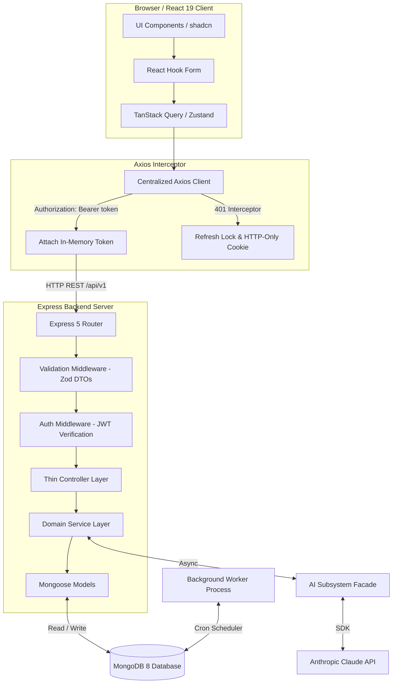

[Docs Wiki Portal](../README.md) > [Architecture](README.md) > System Overview

# System Request Flow & Process Boundaries

This document provides a structural overview of the **AI Project Manager** system architecture, showing how user interactions flow through frontend layers, backend controllers, domain services, database models, background processing, and the AI subsystem.

---

## 📋 Table of Contents
1. [End-to-End System Request Flow](#1-end-to-end-system-request-flow)
2. [Process Boundaries & Entry Points](#2-process-boundaries--entry-points)
3. [Core Subsystem Architecture](#3-core-subsystem-architecture)

---

## 1. End-to-End System Request Flow



---

## 2. Process Boundaries & Entry Points

The backend codebase is divided into four distinct entry points, each serving a dedicated runtime role:

```
server/src/
├── app.ts        # Application Initialization Boundary (Express setup, routes, AI init, no listening)
├── index.ts      # HTTP Production Entry Point (App bootstrap + MongoDB connect + app.listen)
├── worker.ts     # Independent Background Worker Entry Point (Node-cron + MongoDB connect)
└── smoke.ts      # Offline Verification Entry Point (App bootstrap + Prompt validation, no DB/HTTP)
```

### Entry Point Capabilities Matrix

| Entry Point | Execution Role | DB Connection? | HTTP Listener? | External Network Calls? |
|---|---|:---:|:---:|:---:|
| `server/src/app.ts` | Configures Express, imports routes, registers AI prompts | No | No | No |
| `server/src/index.ts` | Starts production HTTP API server | Yes (MongoDB) | Yes (Port 5000) | No |
| `server/src/worker.ts` | Runs scheduled cron jobs for notification reminders | Yes (MongoDB) | No | No |
| `server/src/smoke.ts` | Validates app instantiation and prompt registry integrity | No | No | No (Fake API key) |

---

## 3. Core Subsystem Architecture

### A. Authentication & Session Management
- **In-Memory Access Token**: Transmitted in JSON response, stored strictly in module-level memory (`client/src/services/axios.ts`).
- **HTTP-Only Refresh Cookie**: Scoped to `Path=/api/v1/auth`, stored as SHA-256 hash in MongoDB (`refreshTokenHash`).
- **Axios Interceptor**: Handles 401 errors by queuing requests behind a refresh lock promise, rotating refresh tokens transparently.

### B. Domain & Task Notes Concurrency Control
- **Soft Delete & Archiving**: Deleting an entity sets `isDeleted: true`; archiving sets `archived: true`.
- **Task Notes**: Markdown notes up to 250,000 characters stored in `Task.notes` (excluded from list projections).
- **Optimistic Concurrency Control**: `PATCH /tasks/:id/notes` requires `expectedVersion`. Uses atomic `Task.findOneAndUpdate` checking `_id`, `owner`, and `__v`. Mismatch returns `409 Conflict`.

### C. Activity & Notification Subsystem
- **Activity Ledger**: Append-only log of user/system actions (`recordActivity`), executed asynchronously in best-effort mode.
- **Notifications**: Actionable notifications (`recipientId`, `readAt`), featuring navbar bell popover and `/notifications` center page.
- **Background Worker (`worker.ts`)**: Evaluates tasks due within 24 hours (`task.due_soon`) or overdue tasks (`task.overdue`) on a recurring cron schedule, using a sparse `dedupeKey` index to prevent duplicate notifications.

### D. AI Subsystem (`server/src/ai/`)
- **Facade**: `AIService` provides unified entry point `generateStructuredData(template, schema, options)`.
- **Provider**: `AnthropicProvider` encapsulates `@anthropic-ai/sdk`.
- **Prompts**: `PromptRegistry` holds `PromptTemplate` definitions. `validatePromptTemplate` asserts structure at startup. `PromptBuilder` wraps prompt sections in XML tags (`<system>`, `<context>`, `<intent>`) for prompt injection defense.
- **Validation**: LLM response JSON is validated against Zod schemas before domain services persist data.
