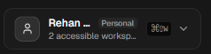
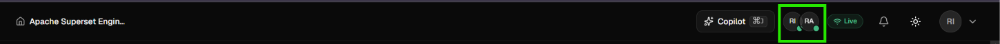
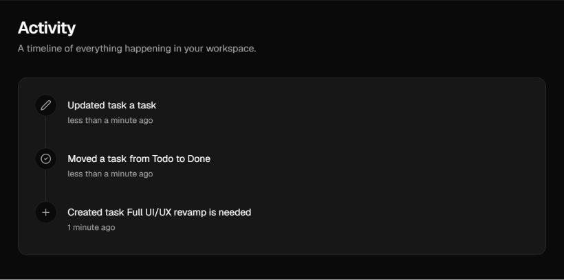
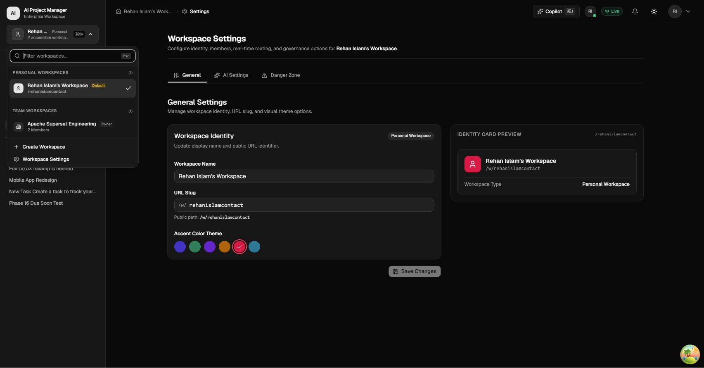
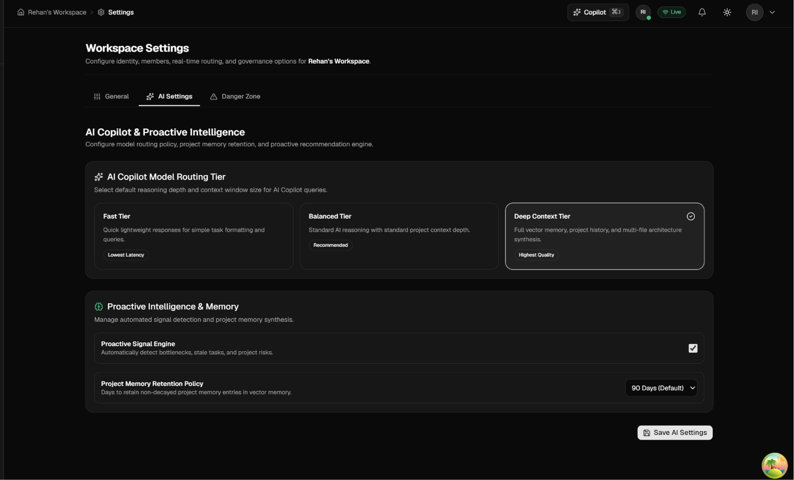
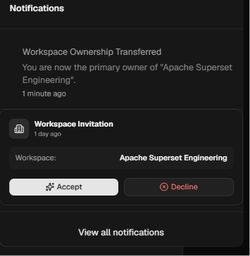
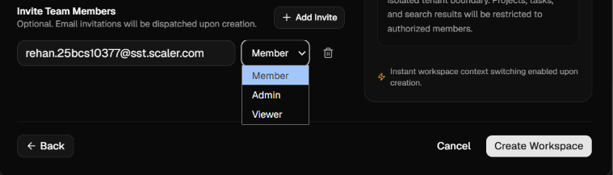
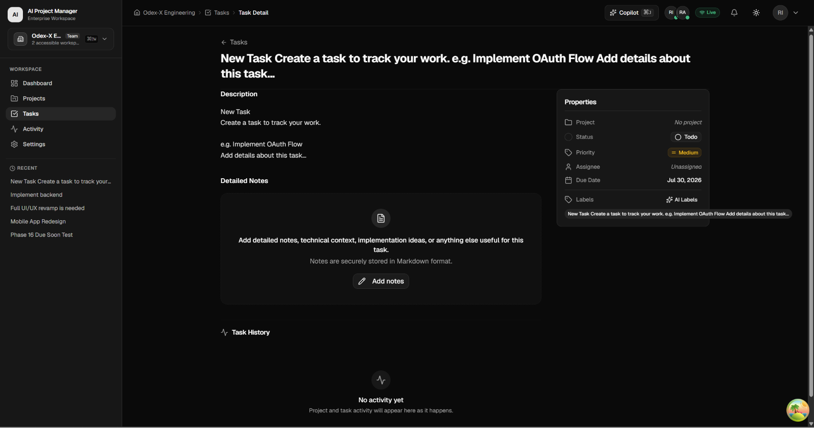

# Project Current Issues 
1. *Warning* : [0] (node:93499) [MONGOOSE] Warning: mongoose: Duplicate schema index on {"slug":1} for model "Workspace". This is often due to declaring an index using both "index: true" and "schema.index()". Please remove the duplicate index definition.
[0] (Use `node --trace-warnings ...` to show where the warning was created)

2. Project icon is ctrl arrow up w it should be ctrl w 
 
    Pressing ctrl w closes the active tab 
3. Clicking settings under profile opens the same workspace settings page 
    For example if im on personal workspace clicking the profile icon and selecting settings opens the Personal workspace, if im on team workspace it opens team worskpace settings 
    There's no proper personal settings which I want to have per profile 
4. I don't like the design the way it shows the active users for the workspace, i want  the style to be  better make it more discord like, and when you click you can view each member's profile 
The profile of each member I want it to display what they will choose to publically display in the profile settings which i asked to be added in point 3   

5. There's something wrong in activity page what's this : 
Updated task a task ? 

6. I can't change the colour of the workspace, its not letting me save it ! 

7. Changing the workspace tier in workspace ai settings doesn't work it keeps defaulting back to deep context tier 
It's the same with every ai setting  

8. Even after accepting the workspace invitation the notifications still shows the option to accept or decline  
This is what it shows in google console when i again try to accept or decline the invitation : 
`Failed to load resource: the server responded with a status of 404 (Not Found)
:5000/api/v1/invitations/7b15e7a284356f09cb4cf698a59faba949d454d2f90e60c6b2302d75a08efbe1/decline:1  Failed to load resource: the server responded with a status of 404 (Not Found)`

9. Transfering ownership works weird, it makes both me and the member i transfered ownership to as owner, there should be only one owner per workspace 

10. the roles are very limited its just members and owners, I want there to be detailed roles and also an option to create different sorts of roles where the person can decide to give a role where a person maybe allowed certain responsibilities, i want the roles to go deep, for example a person can set a role that allows him to only see and work in a given specified project such that it is easier to manage large teams working on a project. There should also be a few more defined user roles by default which will be provided to be given that would be standard roles any team may need 

11. Not an issue : deleting a workspace works well and just fine im very impressed by the procedure to delete it as well. 

12. While creating a workspace there are 3 roles  memberadmin and viewer but when i tried to change roles before in my past workspace it showed only owner and member hmm whats up with this  

13. This is bad, when i create a workspace, things are not in sync.. 
    The person who joined the workspace only sees things that are in their personal workspace, that stuff is what shows up in the team workspace 

14. Creating a project in team workspace also shows up in personal workspace 

15. Opening stuff using the notifications for  a new task you can see the style is a little broken in the task properties card  
