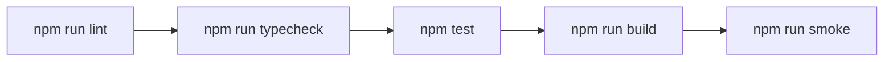

[Docs Wiki Portal](../README.md) > Operations Index

# Operations, Verification & CI/CD Infrastructure

This directory contains specifications for local quality gates, automated testing, application startup verification, and GitHub Actions CI pipelines for **AI Project Manager**.

---

## 📚 Section Directory

| Document | Primary Focus | Key Commands & Concepts |
|---|---|---|
| [`verification-and-testing.md`](verification-and-testing.md) | Quality Gate & Testing Strategy | `npm run verify`, Vitest 4.1, Node native test runner, `smoke.ts` startup test |
| [`ci-cd-infrastructure.md`](ci-cd-infrastructure.md) | Continuous Integration Setup | `.github/workflows/ci.yml`, Local/CI parity, `mongo:8.0` container, dummy secrets |

---

## 🚀 The Canonical Quality Contract

Both local developer workstations and the GitHub Actions CI pipeline execute the exact same 5-stage quality gate:

```bash
npm run verify
```


