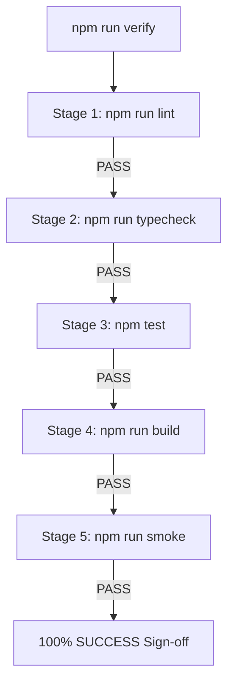

[Docs Wiki Portal](../README.md) > [Operations](README.md) > Verification & Testing

# Testing & Canonical Verification Pipeline

This document defines the testing architecture, test suites, and canonical quality verification pipeline enforced across **AI Project Manager**.

---

## 📋 Table of Contents
1. [Overview & Canonical Quality Contract](#1-overview--canonical-quality-contract)
2. [The 5-Stage Verification Pipeline](#2-the-5-stage-verification-pipeline)
3. [Client Test Suite (Vitest)](#3-client-test-suite-vitest)
4. [Server Test Suite (Node.js Test Runner)](#4-server-test-suite-nodejs-test-runner)
5. [Application Startup Smoke Verification (`smoke.ts`)](#5-application-startup-smoke-verification-smokets)

---

## 1. Overview & Canonical Quality Contract

To prevent regressions, compilation failures, or runtime bootstrap crashes from reaching `main`, the repository enforces a strict, reproducible verification contract executed identically by developers locally and by GitHub Actions CI:

```bash
npm run verify
```

---

## 2. The 5-Stage Verification Pipeline

The `verify` command runs 5 sequential quality gates:



### Stage Breakdown
1. **`npm run lint`**: Executes ESLint across `client/` (ESLint 9 Flat Config) and `server/` (ESLint 10 Flat Config).
2. **`npm run typecheck`**: Executes TypeScript compilation checks (`tsc -b` for client, `tsc --noEmit` for server).
3. **`npm test`**: Runs Vitest test suite in `client/` and Node native integration test suite in `server/`.
4. **`npm run build`**: Executes Vite production bundle build for client and TypeScript compilation to `server/dist/`.
5. **`npm run smoke`**: Executes `server/src/smoke.ts` to prove the Express application bootstraps without throwing exceptions.

---

## 3. Client Test Suite (Vitest)

- **Framework**: Vitest 4.1 + React Testing Library + happy-dom
- **Location**: Co-located with features (e.g. `useTaskNotesAutosave.test.tsx`, `axios.test.ts`)
- **Current Status**: 26 / 26 passing tests
- **Key Test Areas**: In-memory token management, 401 refresh lock, debounced autosave, Markdown/URL sanitization.

---

## 4. Server Test Suite (Node.js Test Runner)

- **Framework**: Native Node.js test runner executed via `tsx`
- **Database**: Runs against an isolated MongoDB test database (`ai-project-manager-test`)
- **Current Status**: 13 / 13 test runner suite files passing (100+ assertions)
- **Key Test Areas**: Dual-token auth, BOLA multi-tenant isolation, Task Notes optimistic concurrency (`409 Conflict`), Notification worker deduplication, AI facade prompt validation.

---

## 5. Application Startup Smoke Verification (`smoke.ts`)

Compilation and unit tests can pass even if application route mounting or prompt registry validation fails at runtime. `server/src/smoke.ts` closes this gap by importing `app.ts` in a test environment with dummy credentials (`ANTHROPIC_API_KEY=smoke-key-do-not-use`).

It asserts that:
- All routes, controllers, middleware, and services import cleanly.
- `PromptRegistry` initializes and passes `validatePromptTemplate`.
- The Express app constructs its middleware stack without throwing exceptions.

It deliberately does NOT connect to MongoDB, start an HTTP listener, or make billable LLM network calls.
