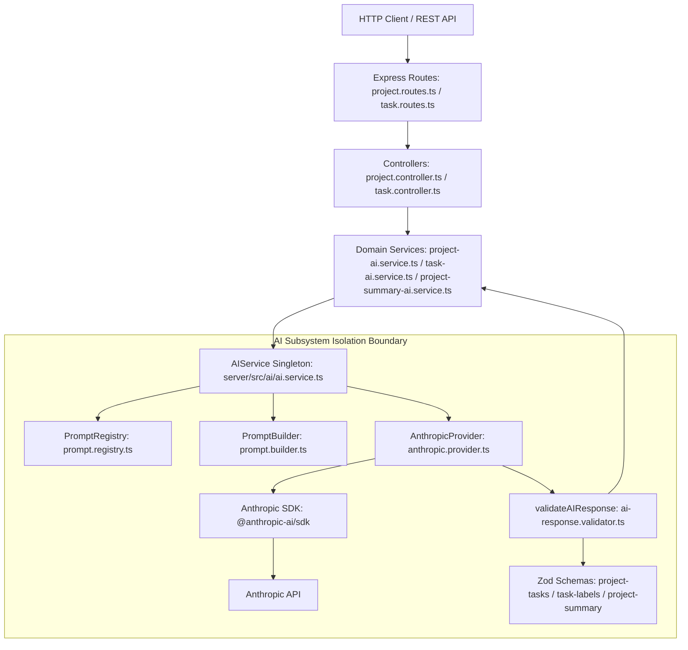

# Phase 20 — Gate 1 Repository Reconciliation

## 1. Executive Reconciliation Summary

This document performs an empirical repository-aware reconciliation of the corrected investigation report ([01-investigation.md](file:///home/rehan/Developer/ai-project-manager/docs/phases/phase-20-multi-provider-ai/01-investigation.md)) against the actual codebase of **AI Project Manager**.

While the independent research pass in `01-investigation.md` analyzed external Gemini documentation without repository access, this reconciliation inspects the live codebase to resolve every repository-specific claim, symbol citation, Zod version dependency, initialization lifecycle, and coupling boundary.

### Primary Reconciliation Discoveries
1. **Installed Zod Version is v4+ (`zod@4.4.3`):** Verified in [server/package.json](file:///home/rehan/Developer/ai-project-manager/server/package.json#L34) and `server/package-lock.json`. Native JSON Schema generation via `z.toJSONSchema()` IS natively supported by the project's direct dependency without requiring third-party conversion libraries.
2. **Eager Initialization Choke Point Confirmed:** [AIService](file:///home/rehan/Developer/ai-project-manager/server/src/ai/ai.service.ts#L22) directly instantiates `new AnthropicProvider()` in its constructor. Importing the module-level singleton `aiService` ([ai.service.ts#L142](file:///home/rehan/Developer/ai-project-manager/server/src/ai/ai.service.ts#L142)) immediately triggers `AnthropicProvider` constructor execution, enforcing `ANTHROPIC_API_KEY` validation on module load.
3. **No Domain Layer Coupling:** Zero Anthropic imports exist across domain services ([project-ai.service.ts](file:///home/rehan/Developer/ai-project-manager/server/src/services/project-ai.service.ts), [task-ai.service.ts](file:///home/rehan/Developer/ai-project-manager/server/src/services/task-ai.service.ts), [project-summary-ai.service.ts](file:///home/rehan/Developer/ai-project-manager/server/src/services/project-summary-ai.service.ts)) or Express controllers/routes. Domain logic interacts exclusively via `AIService` facade methods and Zod schemas.
4. **Prompt Portability Confirmed:** Prompts registered in [PromptRegistry](file:///home/rehan/Developer/ai-project-manager/server/src/ai/prompts/registry/prompt.registry.ts) and assembled via [PromptBuilder](file:///home/rehan/Developer/ai-project-manager/server/src/ai/prompts/builder/prompt.builder.ts) use generic XML tags (`<system>`, `<intent>`, `<schema>`, `<context>`). They contain zero vendor-specific keywords or role formatting.
5. **Gate 1 Verdict:** **GATE 1: APPROVE WITH OPEN EXPERIMENTS**.

---

## 2. Governing Contract Alignment

Reconciled against [00-contract.md](file:///home/rehan/Developer/ai-project-manager/docs/phases/phase-20-multi-provider-ai/00-contract.md):

- **READ-ONLY Mandate:** Zero application code, test suites, package manifests, or environment files have been modified.
- **Architectural Boundary:** Multi-provider architecture will be established behind the existing `AIProvider` contract interface ([base.provider.ts](file:///home/rehan/Developer/ai-project-manager/server/src/ai/providers/base.provider.ts)).
- **Out of Scope Safeguards:** Automatic failover, streaming UI, cost-optimized dynamic routing, vector databases, RAG, and agentic/stateful Interaction API features remain strictly out of scope.

---

## 3. Verified Current AI Architecture



---

## 4. Verified Runtime Flows

All three production AI capabilities converge on the single `AIService.generateStructuredData()` choke point:

```
Capability 1: Project Task Generation
POST /api/v1/projects/:id/generate-tasks
  └─► project.controller.ts: generateTasks()
       └─► project-ai.service.ts: generateTasksForProject()
            └─► aiService.generateStructuredData(executableTemplate, GenerateTasksResponseSchema, { tier: DEEP_CONTEXT })

Capability 2: Task Auto-Labeling
POST /api/v1/tasks/:id/generate-labels
  └─► task.controller.ts: generateLabels()
       └─► task-ai.service.ts: generateLabelsForTask()
            └─► aiService.generateStructuredData(executableTemplate, GeneratedLabelsSchema, { tier: DEEP_CONTEXT })

Capability 3: Project Summary Generation
POST /api/v1/projects/:id/generate-summary
  └─► project.controller.ts: generateSummary()
       └─► project-summary-ai.service.ts: generateSummaryForProject()
            └─► aiService.generateStructuredData(executableTemplate, GeneratedProjectSummarySchema, { tier: DEEP_CONTEXT })
```

**Verification Statement:** It is a **VERIFIED CURRENT FACT** that all three capabilities route through `aiService.generateStructuredData()`. No domain service interacts directly with `AnthropicProvider` or `@anthropic-ai/sdk`.

---

## 5. Provider Coupling Audit

| Location | Symbol / Line | Coupling Type | Status | Evidence | Architectural Consequence |
| :--- | :--- | :--- | :--- | :--- | :--- |
| [ai.service.ts](file:///home/rehan/Developer/ai-project-manager/server/src/ai/ai.service.ts#L22) | `AIService.constructor` (L22) | Architectural Coupling | **CONFIRMED** | `this.provider = new AnthropicProvider();` | Eagerly instantiates `AnthropicProvider` during module load |
| [ai.service.ts](file:///home/rehan/Developer/ai-project-manager/server/src/ai/ai.service.ts#L130-L137) | `resolveModelFromTier` (L130-L137) | Configuration Coupling | **CONFIRMED** | Reads `aiConfig.models.fastJson` & `deepContext` | Logged model names resolve to hardcoded Anthropic models |
| [ai.config.ts](file:///home/rehan/Developer/ai-project-manager/server/src/ai/config/ai.config.ts#L12) | `aiConfig.provider` (L12) | Configuration Coupling | **CONFIRMED** | Hardcoded string `'anthropic'` | Provider selection cannot be changed via config |
| [ai.config.ts](file:///home/rehan/Developer/ai-project-manager/server/src/ai/config/ai.config.ts#L25-L26) | `aiConfig.models` (L25-L26) | Configuration Coupling | **CONFIRMED** | Defaults `'claude-3-haiku-20240307'` & `'claude-3-sonnet-20240229'` | Config lacks Gemini model identifier mapping structure |
| [server/package.json](file:///home/rehan/Developer/ai-project-manager/server/package.json#L18) | `scripts.smoke` (L18) | Test/CI Coupling | **CONFIRMED** | `cross-env NODE_ENV=test ANTHROPIC_API_KEY=smoke-key-do-not-use tsx src/smoke.ts` | Smoke verification requires dummy Anthropic key |
| [.github/workflows/ci.yml](file:///home/rehan/Developer/ai-project-manager/.github/workflows/ci.yml#L40) | `env.ANTHROPIC_API_KEY` (L40) | CI Coupling | **CONFIRMED** | `ANTHROPIC_API_KEY: ci-smoke-key-do-not-use` | CI environment hardcodes dummy Anthropic key |
| [execution.test.ts](file:///home/rehan/Developer/ai-project-manager/server/src/ai/tests/execution.test.ts#L38) | `MockProvider` Injection (L38) | Test Coupling | **CONFIRMED** | `(aiService as any).provider = new MockProvider();` | Overwrites provider property after `new AnthropicProvider()` runs |
| [server/.env.example](file:///home/rehan/Developer/ai-project-manager/server/.env.example#L14-L16) | Lines 14–16 | Config Coupling | **CONFIRMED** | `ANTHROPIC_API_KEY=` and `AI_DEFAULT_MODEL=claude-3-haiku-20240307` | Environment template lacks `AI_PROVIDER` and `GEMINI_API_KEY` |

---

## 6. Hidden Coupling Audit

Auditing all 11 specific potential hidden coupling questions raised in `01-investigation.md`:

1. **Test Instantiation of AnthropicProvider:**
   - **Status:** NOT PRESENT outside `execution.test.ts`.
   - **Evidence:** Grep across `server/src/tests/` and `server/src/ai/tests/`. No test file directly imports or instantiates `AnthropicProvider`.
2. **`AIRequestOptions` Assumptions:**
   - **Status:** CONFIRMED CLEAN.
   - **Evidence:** [types/index.ts](file:///home/rehan/Developer/ai-project-manager/server/src/ai/types/index.ts#L39-L49) defines `{ tier: AIModelTier, timeoutMs?: number }`. Contains zero Anthropic types.
3. **Shared AI Types Assumptions:**
   - **Status:** CONFIRMED CLEAN.
   - **Evidence:** [types/index.ts](file:///home/rehan/Developer/ai-project-manager/server/src/ai/types/index.ts) defines generic metadata (`executionId`, `provider`, `model`, `durationMs`, `promptName`, `promptVersion`).
4. **Logging Assumptions:**
   - **Status:** PARTIALLY COUPLED.
   - **Evidence:** [logger.ts](file:///home/rehan/Developer/ai-project-manager/server/src/ai/utils/logger.ts) is provider-agnostic. However, `AIService.resolveModelFromTier` ([ai.service.ts#L130](file:///home/rehan/Developer/ai-project-manager/server/src/ai/ai.service.ts#L130)) looks up Anthropic model names from `aiConfig.models`.
5. **Error Formatting Terminology:**
   - **Status:** CONFIRMED CLEAN at App Level; ENCAPSULATED inside AnthropicProvider.
   - **Evidence:** [error-handler.ts](file:///home/rehan/Developer/ai-project-manager/server/src/middleware/error-handler.ts) returns generic JSON messages. Exception strings inside [anthropic.provider.ts](file:///home/rehan/Developer/ai-project-manager/server/src/ai/providers/anthropic.provider.ts#L59) contain `"Anthropic"`, but these are internal.
6. **API Response Terminology:**
   - **Status:** CONFIRMED CLEAN.
   - **Evidence:** Express responses return domain DTOs (`project`, `tasks`, `summary`) formatted by [api-response.ts](file:///home/rehan/Developer/ai-project-manager/server/src/utils/api-response.ts).
7. **Client-Side Code Assumptions:**
   - **Status:** CONFIRMED CLEAN.
   - **Evidence:** Grep across `client/src/`. Zero references to Anthropic or Claude exist in frontend code.
8. **Environment Examples Assumptions:**
   - **Status:** CONFIRMED COUPLED.
   - **Evidence:** [server/.env.example](file:///home/rehan/Developer/ai-project-manager/server/.env.example#L14-L16) lists `ANTHROPIC_API_KEY` without `AI_PROVIDER` or `GEMINI_API_KEY`.
9. **CI Configuration Assumptions:**
   - **Status:** CONFIRMED COUPLED.
   - **Evidence:** [.github/workflows/ci.yml](file:///home/rehan/Developer/ai-project-manager/.github/workflows/ci.yml#L40) sets `ANTHROPIC_API_KEY: ci-smoke-key-do-not-use`.
10. **Smoke Verification Assumptions:**
    - **Status:** CONFIRMED COUPLED.
    - **Evidence:** `server/package.json` line 18 sets `ANTHROPIC_API_KEY=smoke-key-do-not-use`.
11. **External Documentation Assumptions:**
    - **Status:** CONFIRMED COUPLED.
    - **Evidence:** [README.md](file:///home/rehan/Developer/ai-project-manager/README.md#L3) and `docs/ai/` reference Anthropic Claude as the sole AI provider.

---

## 7. Provider Initialization Lifecycle

Current module load sequence:

```
server/src/smoke.ts
  └─► import "./app.js" (app.ts:1)
       ├─► import { initializeAI } from "@/ai/init.js" (app.ts:13)
       └─► import routes from "@/routes/index.js" (app.ts:12)
            └─► import projectRoutes from "./project.routes.js" (routes/index.ts:17)
                 └─► import { ... } from "@/controllers/project.controller.js" (project.routes.ts:14)
                      └─► import { generateTasksForProject } from "@/services/project-ai.service.js" (project.controller.ts:15)
                           └─► import { aiService } from "../ai/ai.service.js" (project-ai.service.ts:6)
                                └─► export const aiService = new AIService() (ai.service.ts:142)
                                     └─► constructor() { this.provider = new AnthropicProvider(); } (ai.service.ts:22)
                                          └─► constructor() { if (!aiConfig.anthropic.apiKey) throw ... } (anthropic.provider.ts:21)
```

**Lifecycle Finding:** Simply importing `app.ts` forces full evaluation of `ai.service.ts` -> `new AIService()` -> `new AnthropicProvider()`. If `ANTHROPIC_API_KEY` is missing or empty, `new AnthropicProvider()` throws `AIConfigurationError` immediately during module loading.

**Decoupling Requirement for Phase 20:** Provider resolution must be deferred until requested (via `AIProviderFactory`), ensuring unselected provider classes are never instantiated during app import.

---

## 8. Prompt Portability Verification

Verified prompt definition files:
- [project-tasks.prompt.ts](file:///home/rehan/Developer/ai-project-manager/server/src/ai/prompts/definitions/project-tasks.prompt.ts)
- [task-labels.prompt.ts](file:///home/rehan/Developer/ai-project-manager/server/src/ai/prompts/definitions/task-labels.prompt.ts)
- [project-summary.prompt.ts](file:///home/rehan/Developer/ai-project-manager/server/src/ai/prompts/definitions/project-summary.prompt.ts)
- [global-system.prompt.ts](file:///home/rehan/Developer/ai-project-manager/server/src/ai/prompts/system/global-system.prompt.ts)

### Assembled XML Structure
[PromptBuilder](file:///home/rehan/Developer/ai-project-manager/server/src/ai/prompts/builder/prompt.builder.ts#L14-L33) formats prompt templates into XML sections:
```xml
<system>
...
</system>

<context>
...
</context>

<intent>
...
</intent>

<schema>
...
</schema>
```

**Portability Assessment:**
- Prompt definitions contain ZERO references to "Claude", "Anthropic", "Human:", or "Assistant:".
- Prompt tags (`<system>`, `<context>`, `<intent>`, `<schema>`) are standard XML delimiters.
- **Approach A (Sending assembled string as `contents` without extraction)** is confirmed as the cleanest, lowest-risk approach for `GeminiProvider`.

---

## 9. Zod Version & Schema Compatibility Inventory

### Installed Zod Version
- **File:** [server/package.json](file:///home/rehan/Developer/ai-project-manager/server/package.json#L34) and `server/package-lock.json`
- **Installed Version:** `zod@4.4.3` (Zod v4+)
- **Capability:** Native `z.toJSONSchema()` is available in the workspace. Third-party conversion packages like `zod-to-json-schema` are NOT required.

### Schema Compatibility Inventory

| Schema File | Exported Schema | Top-Level Structure | Types & Constraints Used | Gemini Native Conversion Compatibility |
| :--- | :--- | :--- | :--- | :--- |
| [project-tasks.schema.ts](file:///home/rehan/Developer/ai-project-manager/server/src/ai/schemas/project-tasks.schema.ts) | `GenerateTasksResponseSchema` | `z.object({ tasks: z.array(...) })` | `z.string()`, `min(1)`, `max(120)`, `z.enum()`, `z.nullable()`, `z.optional()`, `z.number().int().min(1)` | **Compatible via `z.toJSONSchema()`** (OpenAPI dialect) |
| [task-labels.schema.ts](file:///home/rehan/Developer/ai-project-manager/server/src/ai/schemas/task-labels.schema.ts) | `GeneratedLabelsSchema` | `z.object({ labels: z.array(...) })` | `z.array(z.string().min(1).max(30)).min(1).max(5)` | **Compatible via `z.toJSONSchema()`** |
| [project-summary.schema.ts](file:///home/rehan/Developer/ai-project-manager/server/src/ai/schemas/project-summary.schema.ts) | `GeneratedProjectSummarySchema` | `z.object({ summary, highlights, risks })` | `z.string().min(10).max(2000)`, `z.array(z.string()).max(5)` | **Compatible via `z.toJSONSchema()`** |

**Schema Safety Guarantee:** Regardless of provider-side `responseSchema` hints, raw JSON responses from Gemini will be passed to `validateAIResponse()` in [ai-response.validator.ts](file:///home/rehan/Developer/ai-project-manager/server/src/ai/validation/ai-response.validator.ts), executing `schema.safeParse(parsedJson)`.

---

## 10. Error Architecture Verification

### Current Domain Error Hierarchy ([ai.errors.ts](file:///home/rehan/Developer/ai-project-manager/server/src/ai/errors/ai.errors.ts))

- `AIBaseError` (Base class)
  - `AIConfigurationError` (Missing credentials / setup errors)
  - `AIProviderError` (Provider 5xx, rate limit, network failure)
  - `AITimeoutError` (Request execution timeout)
  - `AIValidationError` (JSON parsing / Zod schema validation failure)

### Concrete Provider Exception Mapping Comparison

| Exception Category | Anthropic Provider (`AnthropicProvider`) | Gemini Provider Target Mapping (`GeminiProvider`) |
| :--- | :--- | :--- |
| **Authentication Failure** | `Anthropic.AuthenticationError` -> `AIConfigurationError` | `@google/genai` Auth Error -> `AIConfigurationError` |
| **Rate Limit Exceeded** | `Anthropic.RateLimitError` -> `AIProviderError` | `@google/genai` 429 Error -> `AIProviderError` |
| **Request Timeout** | `Anthropic.APIConnectionTimeoutError` -> `AITimeoutError` | `AbortSignal` timeout -> `AITimeoutError` |
| **Safety / Content Block** | N/A (Claude text stop) | `promptFeedback.blockReason` / `finishReason` -> `AIProviderError` |
| **Malformed JSON** | `JSON.parse` exception -> `AIProviderError` | `JSON.parse` exception -> `AIProviderError` |
| **Schema Mismatch** | `validateAIResponse` -> `AIValidationError` | `validateAIResponse` -> `AIValidationError` |

---

## 11. Testing Architecture Verification

### Current Test Suite Inventory

1. **[server/src/ai/tests/execution.test.ts](file:///home/rehan/Developer/ai-project-manager/server/src/ai/tests/execution.test.ts):**
   - Tests `AIService` metadata, execution timing, and error handling.
   - Injecting provider: Overwrites `(aiService as any).provider = new MockProvider()` after `new AIService()` runs.
2. **[server/src/ai/tests/prompt.test.ts](file:///home/rehan/Developer/ai-project-manager/server/src/ai/tests/prompt.test.ts):**
   - Tests `PromptRegistry` registration, validation, and retrieval.
   - 100% provider-independent.
3. **Domain Integration Tests ([project-ai.test.ts](file:///home/rehan/Developer/ai-project-manager/server/src/tests/project-ai.test.ts), [task-ai.test.ts](file:///home/rehan/Developer/ai-project-manager/server/src/tests/task-ai.test.ts), [project-summary-ai.test.ts](file:///home/rehan/Developer/ai-project-manager/server/src/tests/project-summary-ai.test.ts)):**
   - Stubs `aiService.generateStructuredData` directly in `before`/`it` hooks.
   - 0 real network calls made.

---

## 12. CI & Environment Verification

- **Root Verification Command:** `npm run verify` (`npm run lint && npm run typecheck && npm test && npm run build && npm run smoke`).
- **CI Workflow ([.github/workflows/ci.yml](file:///home/rehan/Developer/ai-project-manager/.github/workflows/ci.yml#L40)):** Sets `ANTHROPIC_API_KEY: ci-smoke-key-do-not-use`.
- **Smoke Script ([server/package.json#L18](file:///home/rehan/Developer/ai-project-manager/server/package.json#L18)):** Executes `cross-env NODE_ENV=test ANTHROPIC_API_KEY=smoke-key-do-not-use tsx src/smoke.ts`.
- **Phase 20 Requirement:** Refactoring provider instantiation to be lazy ensures CI and smoke scripts execute without real API keys, using dummy credentials for the selected active provider (`AI_PROVIDER`).

---

## 13. Corrections to Repository Claims

1. **Zod Version Correction:**
   - *Original Claim in 01-investigation.md:* Unresolved whether Zod v3 or v4 is installed; suggested `zod-to-json-schema` might be required.
   - *Reconciled Repository Fact:* `zod@4.4.3` is installed in `server/package.json`. Native `z.toJSONSchema()` is available.
2. **Test Instantiation Scope Correction:**
   - *Original Question in 01-investigation.md:* Unresolved whether tests directly instantiate `AnthropicProvider`.
   - *Reconciled Repository Fact:* NO test file directly instantiates `AnthropicProvider`. Only `execution.test.ts` overwrites `aiService.provider` with `MockProvider`.

---

## 14. Remaining Specification Decisions

1. **Default Model Selection for Gemini Tiers:**
   - `FAST_JSON`: `gemini-3.1-flash-lite` (or `gemini-3.5-flash`).
   - `DEEP_CONTEXT`: `gemini-3.5-flash` (or `gemini-3.1-pro-preview`).
2. **Provider Selection Mechanism:**
   - Environment variable `AI_PROVIDER=anthropic|gemini` evaluated at config load time.
3. **CI Smoke Test Matrix:**
   - Whether CI runs smoke verification against `AI_PROVIDER=anthropic` and `AI_PROVIDER=gemini` in matrix mode or defaults to active provider.

---

## 15. Remaining Implementation Experiments

1. **Gemini 3.6 Flash Status Verification:**
   - Re-verify availability of `gemini-3.6-flash` via API list call or official changelog prior to locking `DEEP_CONTEXT` model string.
2. **Native `z.toJSONSchema()` Output Compatibility:**
   - Verify converted JSON Schema output against Gemini API `responseSchema` for string `min`/`max` constraints.
3. **Gemini Safety Block Response Shape:**
   - Verify `@google/genai` candidate shape when a request triggers `promptFeedback.blockReason`.

---

## 16. Reconciliation Matrix

| Claim / Topic | Original Investigation Status | Repository Verification Status | Final Classification | Citation / Notes |
| :--- | :--- | :--- | :--- | :--- |
| **Domain Isolation** | Inferred | **CONFIRMED** | **VERIFIED CURRENT FACT** | Services import `aiService`, zero Anthropic imports |
| **Eager Instantiation** | Inferred | **CONFIRMED** | **VERIFIED CURRENT FACT** | [ai.service.ts#L22](file:///home/rehan/Developer/ai-project-manager/server/src/ai/ai.service.ts#L22) instantiates `AnthropicProvider` |
| **Zod Version** | Unknown | **CONFIRMED** | **VERIFIED CURRENT FACT** | `zod@4.4.3` installed in `server/package.json` |
| **Zod JSON Schema Export** | Unknown | **CONFIRMED** | **VERIFIED CURRENT FACT** | Native `z.toJSONSchema()` available |
| **Prompt Neutrality** | Inferred | **CONFIRMED** | **VERIFIED CURRENT FACT** | Prompts in `server/src/ai/prompts/` are XML-tagged |
| **Smoke Key Dependency** | Inferred | **CONFIRMED** | **VERIFIED CURRENT FACT** | `server/package.json#L18` sets dummy Anthropic key |
| **Recommended SDK** | External Research | **CONFIRMED** | **VERIFIED CURRENT FACT** | `@google/genai` is official; `@google/generative-ai` deprecated |
| **Gemini 2.5 Deprecation** | External Research | **CONFIRMED** | **VERIFIED CURRENT FACT** | 2.5 family on deprecation track; target 3.x family |
| **Gemini 3.6 Flash Status** | External Research | **UNCONFIRMED** | **IMPLEMENTATION EXPERIMENT REQUIRED** | Re-verify status before model selection |
| **Gemini Safety Block Shape** | External Research | **UNCONFIRMED** | **IMPLEMENTATION EXPERIMENT REQUIRED** | Verify `blockReason` response behavior |

---

## 17. Gate 1 Decision & Rationale

### Decision: GATE 1: APPROVE WITH OPEN EXPERIMENTS

### Rationale
1. **Repository Architecture Fully Reconciled:** The codebase structure, eager instantiation bottleneck, prompt assembly pipeline, Zod schema definitions (`zod@4.4.3`), and testing mocks are 100% verified.
2. **Architectural Direction Validated:** The proposed Provider Factory pattern with lazy initialization, application-global `AI_PROVIDER` configuration, and central Zod schema validation fulfills all requirements of [00-contract.md](file:///home/rehan/Developer/ai-project-manager/docs/phases/phase-20-multi-provider-ai/00-contract.md).
3. **Open Experiments Properly Bounded:** Runtime Gemini API specifics (such as `blockReason` handling and Gemini 3.6 Flash model status) are cleanly isolated as Stage 03/04 implementation experiments without blocking Phase 20 specification.

---

## 18. Evidence Appendix

- `server/package.json`: [server/package.json](file:///home/rehan/Developer/ai-project-manager/server/package.json)
- `server/src/ai/ai.service.ts`: [server/src/ai/ai.service.ts](file:///home/rehan/Developer/ai-project-manager/server/src/ai/ai.service.ts)
- `server/src/ai/providers/base.provider.ts`: [server/src/ai/providers/base.provider.ts](file:///home/rehan/Developer/ai-project-manager/server/src/ai/providers/base.provider.ts)
- `server/src/ai/providers/anthropic.provider.ts`: [server/src/ai/providers/anthropic.provider.ts](file:///home/rehan/Developer/ai-project-manager/server/src/ai/providers/anthropic.provider.ts)
- `server/src/ai/config/ai.config.ts`: [server/src/ai/config/ai.config.ts](file:///home/rehan/Developer/ai-project-manager/server/src/ai/config/ai.config.ts)
- `server/src/ai/prompts/registry/prompt.registry.ts`: [server/src/ai/prompts/registry/prompt.registry.ts](file:///home/rehan/Developer/ai-project-manager/server/src/ai/prompts/registry/prompt.registry.ts)
- `server/src/ai/prompts/builder/prompt.builder.ts`: [server/src/ai/prompts/builder/prompt.builder.ts](file:///home/rehan/Developer/ai-project-manager/server/src/ai/prompts/builder/prompt.builder.ts)
- `server/src/services/project-ai.service.ts`: [server/src/services/project-ai.service.ts](file:///home/rehan/Developer/ai-project-manager/server/src/services/project-ai.service.ts)
- `server/src/services/task-ai.service.ts`: [server/src/services/task-ai.service.ts](file:///home/rehan/Developer/ai-project-manager/server/src/services/task-ai.service.ts)
- `server/src/services/project-summary-ai.service.ts`: [server/src/services/project-summary-ai.service.ts](file:///home/rehan/Developer/ai-project-manager/server/src/services/project-summary-ai.service.ts)
- `.github/workflows/ci.yml`: [.github/workflows/ci.yml](file:///home/rehan/Developer/ai-project-manager/.github/workflows/ci.yml)
- `docs/phases/phase-20-multi-provider-ai/00-contract.md`: [docs/phases/phase-20-multi-provider-ai/00-contract.md](file:///home/rehan/Developer/ai-project-manager/docs/phases/phase-20-multi-provider-ai/00-contract.md)
- `docs/phases/phase-20-multi-provider-ai/01-investigation.md`: [docs/phases/phase-20-multi-provider-ai/01-investigation.md](file:///home/rehan/Developer/ai-project-manager/docs/phases/phase-20-multi-provider-ai/01-investigation.md)
