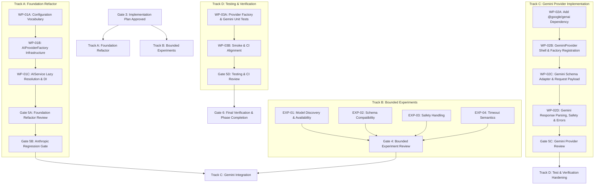

# Phase 20 — Stage 03 Implementation Plan

## 1. Executive Summary

### Implementation Plan Objective
This document defines the authoritative, dependency-aware implementation plan for **Phase 20 (Multi-Provider AI Architecture & Google Gemini Integration)**. It translates the approved technical specification ([02-specification.md](file:///home/rehan/Developer/ai-project-manager/docs/phases/phase-20-multi-provider-ai/02-specification.md)) into bounded experiments, granular work packages (WP-01A through WP-03B), exact file-level change surfaces, verification gates, rollback strategies, and human approval checkpoints.

### Key Planning Invariants
- **Zero Architecture Invention:** Implementation agents MUST NOT invent new patterns or override Gate 2 specification decisions.
- **Strict Bounded Execution:** Implementation proceeds strictly one Work Package at a time. Each WP represents an independently reviewable, testable, and revertible diff.
- **Incremental Factory Construction:** `AIProviderFactory` created in Track A resolves `AnthropicProvider` without importing or referencing `GeminiProvider`. `GeminiProvider` is created and connected to the factory only in Track C (WP-02B).
- **Discovery-First Experimentation:** EXP-01 discovers Gemini models dynamically from authoritative sources before selecting tier mappings. No unverified production model identifier is treated as an implementation fact.
- **No Executable Configuration Placeholders:** Track A MUST NOT introduce fake, provisional, illustrative, or placeholder Gemini model identifiers into executable runtime configuration. Actual Gemini model mappings are introduced in WP-02C after EXP-01 approval at Gate 4.
- **Anthropic Safety Baseline:** Refactoring the provider abstraction MUST NOT regress existing Anthropic functionality. An explicit Anthropic Regression Gate (Gate 5B) MUST pass before Gemini implementation begins.
- **Zero CI Network Calls:** Live Gemini experiments are local, manual, bounded research tasks. Automated unit tests, smoke verification, and CI pipelines execute strictly offline with 0 external network requests.
- **Gate Authorization Boundaries:** Gate 3 approval authorizes execution of Track A and Track B only. Track C remains prohibited until both Gate 4 and Gate 5B receive explicit human approval.

---

## 2. Governing Artifacts

1. **Governing Contract:** [00-contract.md](file:///home/rehan/Developer/ai-project-manager/docs/phases/phase-20-multi-provider-ai/00-contract.md) — Product/phase boundary & explicit non-goals.
2. **Investigation Evidence:** [01-investigation.md](file:///home/rehan/Developer/ai-project-manager/docs/phases/phase-20-multi-provider-ai/01-investigation.md) — External research and technical findings.
3. **Repository Reconciliation:** [01a-repository-reconciliation.md](file:///home/rehan/Developer/ai-project-manager/docs/phases/phase-20-multi-provider-ai/01a-repository-reconciliation.md) — Repository-grounded evidence & facts.
4. **Authoritative Specification:** [02-specification.md](file:///home/rehan/Developer/ai-project-manager/docs/phases/phase-20-multi-provider-ai/02-specification.md) — Authoritative technical architecture & design decisions.

---

## 3. Current Repository Baseline

Verified from repository inspection on branch `docs/readme-overhaul` (commit `8c0b348`):

- **Facade Singleton:** [server/src/ai/ai.service.ts](file:///home/rehan/Developer/ai-project-manager/server/src/ai/ai.service.ts) exports `aiService = new AIService()`. Constructor executes `this.provider = new AnthropicProvider()`.
- **Concrete Provider:** [server/src/ai/providers/anthropic.provider.ts](file:///home/rehan/Developer/ai-project-manager/server/src/ai/providers/anthropic.provider.ts) wraps `@anthropic-ai/sdk`. Constructor checks `aiConfig.anthropic.apiKey`.
- **Config Schema:** [server/src/ai/config/ai.config.ts](file:///home/rehan/Developer/ai-project-manager/server/src/ai/config/ai.config.ts) hardcodes `provider: 'anthropic'` and shared `models.fastJson` / `models.deepContext` Claude model identifiers.
- **Installed Zod:** `zod@4.4.3` installed in `server/package.json`. Native `z.toJSONSchema()` is available.
- **Domain Services:** [project-ai.service.ts](file:///home/rehan/Developer/ai-project-manager/server/src/services/project-ai.service.ts), [task-ai.service.ts](file:///home/rehan/Developer/ai-project-manager/server/src/services/task-ai.service.ts), [project-summary-ai.service.ts](file:///home/rehan/Developer/ai-project-manager/server/src/services/project-summary-ai.service.ts) import only `aiService`, `AIModelTier`, `promptRegistry`, and Zod schemas.

---

## 4. Pre-Implementation Repository Drift

**Status:** NO REPOSITORY DRIFT DETECTED.
Current repository state matches the baseline established in [01a-repository-reconciliation.md](file:///home/rehan/Developer/ai-project-manager/docs/phases/phase-20-multi-provider-ai/01a-repository-reconciliation.md) and specified in [02-specification.md](file:///home/rehan/Developer/ai-project-manager/docs/phases/phase-20-multi-provider-ai/02-specification.md).

---

## 5. Architectural Invariants

- **INV-01 (Domain Independence):** Domain services, controllers, routes, and client code MUST NOT import `@anthropic-ai/sdk`, `@google/genai`, or concrete provider classes.
- **INV-02 (Lazy Instantiation):** Provider instances MUST NOT be constructed at module import time. Unselected providers MUST NOT be instantiated or validate credentials.
- **INV-03 (Credential Isolation):** `AI_PROVIDER=gemini` MUST NOT require `ANTHROPIC_API_KEY`. `AI_PROVIDER=anthropic` MUST NOT require `GEMINI_API_KEY`.
- **INV-04 (Zod Authority):** Every LLM response MUST be parsed and validated via `validateAIResponse()` / Zod `safeParse()`.
- **INV-05 (Deterministic Selection):** `AI_PROVIDER` selection is deterministic; unsupported provider strings fail with `AIConfigurationError`.
- **INV-06 (Error Containment):** Provider SDK exceptions MUST NOT escape provider boundaries. All failures map to the `AIBaseError` hierarchy.
- **INV-07 (Zero CI Network Calls):** Automated tests and CI verification MUST NOT make live network calls to Anthropic or Google Gemini.

---

## 6. Dependency Graph



---

## 7. Execution Philosophy

1. **Gate 3 Execution Scope:** Gate 3 approval authorizes execution of Track A (Foundation Refactor) and Track B (Bounded Experiments) only. Track C remains prohibited until both Gate 4 and Gate 5B receive explicit human approval.
2. **Parallelizable Initial Tracks:** Track A and Track B CAN proceed in parallel. Foundation work does NOT require live Gemini API calls and does NOT reference uncreated files.
3. **Strict Multi-Gate Convergence:** Track C (Gemini Implementation) MUST NOT begin until BOTH Gate 4 (Bounded Experiments Review) AND Gate 5B (Anthropic Regression Gate) are explicitly approved by a human reviewer.
4. **Small Blast Radius:** Every Work Package touches only its explicitly allowed file list. Unrelated modifications trigger immediate rollback.

---

## 8. Stage Overview & Execution Sequencing

| Stage / Gate | Focus / Purpose | Deliverable / Gate Requirement | Parallelizable? |
| :--- | :--- | :--- | :--- |
| **Stage 03 (Current)** | Implementation Plan & WP Design | `03-implementation-plan.md` | N/A |
| **Gate 3** | Human Review of Implementation Plan | Authorizes Track A and Track B execution ONLY | No |
| **Track A Execution** | WP-01A, WP-01B, WP-01C | Refactored config vocabulary, factory infra, `AIService` DI | Yes (with Track B) |
| **Track B Execution** | EXP-01, EXP-02, EXP-03, EXP-04 | Discovery-first research artifacts | Yes (with Track A) |
| **Gate 4** | Human Review of Bounded Experiments | Approval of EXP-01 through EXP-04 artifacts | No |
| **Gate 5A** | Foundation Refactor Review | Review WP-01A..C architecture & compilability | No |
| **Gate 5B** | Anthropic Regression Gate | Full pass of existing test suite under `AI_PROVIDER=anthropic` | No |
| **Track C Execution** | WP-02A, WP-02B, WP-02C, WP-02D | `@google/genai` dependency & `GeminiProvider` creation | No (Requires Gate 4 AND Gate 5B) |
| **Gate 5C** | Gemini Provider Review | Review `GeminiProvider` implementation against spec & exps | No |
| **Track D Execution** | WP-03A, WP-03B | Offline test suite & smoke alignment | No (Sequential) |
| **Gate 5D** | Testing & CI Review | Review test isolation, smoke behavior, and CI setup | No |
| **Gate 6** | Final Phase Verification | `npm run verify` passes 100% clean | No |

---

## 9. Bounded Experiment Plan

### EXP-01 — Gemini Model Discovery & Tier Mapping
- **Methodology (Discovery-First):**
  1. Discover currently available Gemini models by querying the authenticated Google Gemini API / official SDK `ai.models.list()` or inspecting official current Google documentation.
  2. Record exact returned/documented model identifiers.
  3. Evaluate candidate models from the discovered set against project requirements (JSON output, schema support, latency, context).
  4. Run capability benchmarks for candidate fast and deep-context models.
  5. Lock final tier mappings for Gemini FAST_JSON and DEEP_CONTEXT tiers based on empirical evidence.
- **Prerequisite:** Valid local `GEMINI_API_KEY`.
- **Allowed Temporary Script:** `server/src/ai/scratch/exp-01-models.ts` (deleted or moved to scratch directory before completion).
- **Execution Environment:** Local environment ONLY. NOT run in CI or `npm test`.
- **Expected Artifact:** `docs/phases/phase-20-multi-provider-ai/experiments/exp-01-model-selection.md`
- **Pass Condition:** Documented discovery log and evidence-backed model selection locked for FAST_JSON and DEEP_CONTEXT tiers.
- **Blocks:** Default model strings in `ai.config.ts` during WP-02C.
- **Does NOT Block:** WP-01A, WP-01B, WP-01C.

### EXP-02 — Zod 4 JSON Schema -> Gemini responseSchema Compatibility
- **Prerequisite:** EXP-01 complete; `@google/genai` installed locally or in experiment script.
- **Purpose:** Pass `z.toJSONSchema()` outputs for all 3 production schemas ([project-tasks.schema.ts](file:///home/rehan/Developer/ai-project-manager/server/src/ai/schemas/project-tasks.schema.ts), [task-labels.schema.ts](file:///home/rehan/Developer/ai-project-manager/server/src/ai/schemas/task-labels.schema.ts), [project-summary.schema.ts](file:///home/rehan/Developer/ai-project-manager/server/src/ai/schemas/project-summary.schema.ts)) to `@google/genai` `responseSchema` and check for keyword rejection.
- **Allowed Temporary Script:** `server/src/ai/scratch/exp-02-schemas.ts`.
- **Execution Environment:** Local environment ONLY.
- **Expected Artifact:** `docs/phases/phase-20-multi-provider-ai/experiments/exp-02-schema-compatibility.md`
- **Pass Condition:** Confirmed schema conversion stability; identified if Schema Adapter requires keyword cleaning.
- **Blocks:** WP-02C schema conversion adapter implementation.
- **Does NOT Block:** WP-01A, WP-01B, WP-01C.

### EXP-03 — Gemini Safety / Blocked Response Behavior
- **Prerequisite:** Local `GEMINI_API_KEY`.
- **Purpose:** Execute safety-triggering test prompts to record actual SDK response object properties (`promptFeedback.blockReason`, candidate `finishReason`).
- **Allowed Temporary Script:** `server/src/ai/scratch/exp-03-safety.ts`.
- **Execution Environment:** Local environment ONLY.
- **Expected Artifact:** `docs/phases/phase-20-multi-provider-ai/experiments/exp-03-safety-handling.md`
- **Pass Condition:** Verified response property paths for blocked/refused generations.
- **Blocks:** WP-02D safety error normalization logic.
- **Does NOT Block:** WP-01A, WP-01B, WP-01C.

### EXP-04 — Gemini Timeout & Cancellation Semantics
- **Prerequisite:** Local `GEMINI_API_KEY`.
- **Purpose:** Verify whether `@google/genai` `generateContent` natively supports `config.abortSignal` or requires promise-race timer wrapping.
- **Allowed Temporary Script:** `server/src/ai/scratch/exp-04-timeout.ts`.
- **Execution Environment:** Local environment ONLY.
- **Expected Artifact:** `docs/phases/phase-20-multi-provider-ai/experiments/exp-04-timeout-semantics.md`
- **Pass Condition:** Verified timeout cancellation behavior and caught exception type on abort.
- **Blocks:** WP-02D timeout implementation.
- **Does NOT Block:** WP-01A, WP-01B, WP-01C.

---

## 10. Experiment Dependency Matrix

| Experiment | Blocks | Does NOT Block | Expected Artifact |
| :--- | :--- | :--- | :--- |
| **EXP-01** (Model Discovery) | Default model strings in WP-02C | WP-01A, WP-01B, WP-01C | `exp-01-model-selection.md` |
| **EXP-02** (Schema Adapter) | WP-02C Schema Adapter transformation logic | WP-01A, WP-01B, WP-01C | `exp-02-schema-compatibility.md` |
| **EXP-03** (Safety Handling) | WP-02D Safety refusal normalization logic | WP-01A, WP-01B, WP-01C | `exp-03-safety-handling.md` |
| **EXP-04** (Timeout Semantics) | WP-02D Timeout cancellation logic | WP-01A, WP-01B, WP-01C | `exp-04-timeout-semantics.md` |

---

## 11. Work Package Overview

| Package ID | Track | Focus / Objective | Output Files |
| :--- | :--- | :--- | :--- |
| **WP-01A** | Track A | Multi-provider config schema & vocabulary | `server/src/ai/config/ai.config.ts` |
| **WP-01B** | Track A | Implement `AIProviderFactory` infrastructure (Anthropic only) | `server/src/ai/providers/provider.factory.ts` |
| **WP-01C** | Track A | `AIService` constructor DI seam & lazy resolution refactor | `server/src/ai/ai.service.ts`, `execution.test.ts` |
| **WP-02A** | Track C | Add `@google/genai` dependency | `server/package.json`, `server/package-lock.json` |
| **WP-02B** | Track C | `GeminiProvider` shell creation & factory registration | `server/src/ai/providers/gemini.provider.ts`, `provider.factory.ts` |
| **WP-02C** | Track C | `GeminiProvider` schema conversion, model mapping & request payload | `server/src/ai/providers/gemini.provider.ts`, `ai.config.ts` |
| **WP-02D** | Track C | `GeminiProvider` response parsing, safety & errors | `server/src/ai/providers/gemini.provider.ts` |
| **WP-03A** | Track D | Unit test suite (Factory, Provider, DI seams) | `server/src/ai/tests/*.test.ts` |
| **WP-03B** | Track D | Smoke verification & env example alignment | `server/.env.example`, `server/src/smoke.ts` |

---

## 12. WP-01A — Configuration Schema & Vocabulary

#### Objective
Refactor [ai.config.ts](file:///home/rehan/Developer/ai-project-manager/server/src/ai/config/ai.config.ts) to support `AI_PROVIDER` configuration vocabulary and separate provider configuration blocks (`anthropic` vs `gemini`).

#### Why This Package Exists
Establishes provider-aware configuration structure without breaking existing Anthropic behavior.

#### Prerequisites
Gate 3 approval.

#### Files Allowed to Change
- [server/src/ai/config/ai.config.ts](file:///home/rehan/Developer/ai-project-manager/server/src/ai/config/ai.config.ts)

#### Files Explicitly Forbidden
- `server/src/ai/ai.service.ts`
- `server/src/ai/providers/*`
- `server/src/services/*`

#### Planned Changes
- Read `process.env.AI_PROVIDER`, default to `'anthropic'`, normalize to lowercase.
- Nest existing Anthropic settings under `aiConfig.anthropic`.
- Add `aiConfig.gemini` configuration block containing credentials (`apiKey: process.env.GEMINI_API_KEY || ''`).
- **Model Deferral Invariant:** Track A MUST NOT introduce fake, provisional, illustrative, or placeholder Gemini model identifiers into executable runtime configuration. Gemini model mappings remain unpopulated in `aiConfig` during WP-01A and will be added in WP-02C after Gate 4 EXP-01 approval.
- Preserve `aiConfig.timeouts`.

#### Architectural Invariants Protected
INV-03, INV-05.

#### Expected Diff Shape
- Modified `aiConfig` object in `ai.config.ts`. ~20 lines changed. No placeholder strings.

#### Tests Required
- Run `npm test` (existing test suite must pass).

#### Verification Commands
- `npx tsx -e "import { aiConfig } from './server/src/ai/config/ai.config.js'; console.log(aiConfig);"`

#### Success Criteria
- `aiConfig.provider` defaults to `'anthropic'`.
- `aiConfig.anthropic.models.fastJson` returns `'claude-3-haiku-20240307'`.
- Zero executable code files contain placeholder strings.

#### Failure / Stop Conditions
- Existing `aiConfig.anthropic.apiKey` access breaks.
- Executable runtime config contains `<EXP-01` or fake model strings.

#### Rollback Boundary
- Revert `server/src/ai/config/ai.config.ts`.

#### Human Review Gate
- Code diff inspection of `ai.config.ts`.

---

## 13. WP-01B — AIProviderFactory Infrastructure (Anthropic Only)

#### Objective
Implement `AIProviderFactory` in `server/src/ai/providers/provider.factory.ts` with lazy instantiation and process-wide instance caching, supporting `AnthropicProvider` without importing or referencing `GeminiProvider`.

#### Why This Package Exists
Decouples concrete provider creation from `AIService`, preventing import-time provider construction, while keeping Track A fully compilable without dependencies on uncreated files.

#### Prerequisites
WP-01A complete.

#### Files Allowed to Change
- `server/src/ai/providers/provider.factory.ts` **[NEW]**

#### Files Explicitly Forbidden
- `server/src/ai/ai.service.ts`
- `server/src/ai/config/ai.config.ts`
- `server/src/ai/providers/gemini.provider.ts` (Does NOT exist yet)

#### Planned Changes
- Implement static class `AIProviderFactory`.
- `getProvider(name?: string): AIProvider`: Reads `name || aiConfig.provider`. Checks private `cache: Map<string, AIProvider>`.
- Switch branch for `'anthropic'`: Returns `new AnthropicProvider()`.
- Unsupported or unregistered provider (including `'gemini'` prior to WP-02B): Throws `AIConfigurationError("Unsupported or unregistered AI provider: '<name>'. Supported provider is 'anthropic'.")`.
- `clearCache()`: Resets map.

#### Architectural Invariants Protected
INV-02, INV-03, INV-05.

#### Expected Diff Shape
- 1 new file: `server/src/ai/providers/provider.factory.ts` (~35 lines). NO Gemini references.

#### Tests Required
- Run `npx tsc --noEmit` and `npm test`.

#### Verification Commands
- `npx tsc --noEmit`

#### Success Criteria
- `AIProviderFactory.getProvider('anthropic')` returns `AnthropicProvider` instance lazily.
- Code compiles cleanly with zero imports of non-existent files.

#### Failure / Stop Conditions
- `provider.factory.ts` attempts to import `GeminiProvider` before it exists.

#### Rollback Boundary
- Delete `server/src/ai/providers/provider.factory.ts`.

#### Human Review Gate
- Code diff inspection of `provider.factory.ts`.

---

## 14. WP-01C — AIService DI & Facade Refactor

#### Objective
Add constructor dependency injection `AIService(provider?: AIProvider)` to [ai.service.ts](file:///home/rehan/Developer/ai-project-manager/server/src/ai/ai.service.ts), delegate active provider resolution to `AIProviderFactory`, and update test seams.

#### Why This Package Exists
Eliminates eager `new AnthropicProvider()` in `AIService` constructor and removes `(aiService as any).provider` mutation hacks in tests.

#### Prerequisites
WP-01B complete.

#### Files Allowed to Change
- [server/src/ai/ai.service.ts](file:///home/rehan/Developer/ai-project-manager/server/src/ai/ai.service.ts)
- [server/src/ai/tests/execution.test.ts](file:///home/rehan/Developer/ai-project-manager/server/src/ai/tests/execution.test.ts)

#### Files Explicitly Forbidden
- `server/src/services/*`
- `server/src/controllers/*`

#### Planned Changes
- Remove `import { AnthropicProvider }` from `ai.service.ts`.
- Add `constructor(provider?: AIProvider)`.
- Replace direct `this.provider` property with getter delegating to `this.customProvider || AIProviderFactory.getProvider()`.
- Update `resolveModelFromTier` to look up active provider model from `aiConfig`.
- Update `execution.test.ts` to instantiate `new AIService(new MockProvider())`.

#### Architectural Invariants Protected
INV-01, INV-02, INV-04.

#### Expected Diff Shape
- `ai.service.ts` modified (~20 lines). `execution.test.ts` modified (~10 lines).

#### Tests Required
- `npm test`

#### Verification Commands
- `npm run typecheck && npm test`

#### Success Criteria
- Importing `ai.service.ts` does NOT execute `AnthropicProvider` constructor.
- All existing execution tests pass.

#### Failure / Stop Conditions
- `import { aiService } from './ai.service.js'` throws key validation error when `ANTHROPIC_API_KEY` is empty.

#### Rollback Boundary
- Revert `ai.service.ts` and `execution.test.ts`.

#### Human Review Gate
- Code diff inspection & test execution confirmation.

---

## 15. Granular Gate Definitions (Gates 5A & 5B)

### Gate 5A — Foundation Refactor Review
- **Timing:** Occurs immediately after WP-01C completion.
- **Scope:** Technical architecture review of Track A refactoring.
- **Verification Checklist:**
  - [ ] Architecture matches specification; provider resolution is lazy.
  - [ ] `AIService` no longer eagerly constructs `AnthropicProvider`.
  - [ ] No `@google/genai` dependency or `GeminiProvider` file exists yet.
  - [ ] Domain services remain provider-independent.
  - [ ] Repository compiles cleanly (`npx tsc --noEmit`).
  - [ ] Focused unit tests pass (`npm test`).

### Gate 5B — Anthropic Regression Gate
- **Timing:** Occurs immediately after Gate 5A approval.
- **Scope:** Functional regression verification of existing Anthropic AI capabilities.
- **Verification Checklist:**
  - [ ] `AI_PROVIDER=anthropic` executes task generation, auto-labeling, and summary generation cleanly.
  - [ ] `npm test` passes 100% clean.
  - [ ] `npm run build` compiles clean.
  - [ ] `npm run smoke` succeeds.
  - [ ] `git diff` shows ONLY changes in `ai.config.ts`, `provider.factory.ts`, `ai.service.ts`, and `execution.test.ts`.

**Human Authorization Requirement:** Gate 3 approval authorizes execution of Track A and Track B only. Track C remains prohibited until both Gate 4 and Gate 5B receive explicit human approval.

---

## 16. Gemini Dependency Introduction (WP-02A)

#### Objective
Add `@google/genai` dependency to [server/package.json](file:///home/rehan/Developer/ai-project-manager/server/package.json).

#### Why This Package Exists
Provides the official Google GenAI SDK for Gemini integration.

#### Prerequisites
Gate 4 (Experiments Approved) AND Gate 5B (Anthropic Regression Gate Approved).

#### Files Allowed to Change
- [server/package.json](file:///home/rehan/Developer/ai-project-manager/server/package.json)
- `server/package-lock.json`

#### Files Explicitly Forbidden
- All source files in `server/src/`.

#### Planned Changes
- Run `npm install @google/genai --prefix server`.
- Verify `server/package.json` receives `@google/genai` under `dependencies`.

#### Architectural Invariants Protected
- Standard package isolation.

#### Expected Diff Shape
- `server/package.json` diff (+1 line). `server/package-lock.json` diff.

#### Tests Required
- `npm run typecheck`

#### Verification Commands
- `npm run typecheck`

#### Success Criteria
- `@google/genai` installed cleanly without breaking existing server dependencies.

#### Failure / Stop Conditions
- Package installation introduces audit vulnerabilities or peer dependency conflicts.

#### Rollback Boundary
- `git checkout server/package.json server/package-lock.json`.

#### Human Review Gate
- Dependency diff review.

---

## 17. Gemini Provider Work Packages

### WP-02B — GeminiProvider Shell & Factory Registration

#### Objective
Create `server/src/ai/providers/gemini.provider.ts` shell implementing `AIProvider` and constructor credential validation, and register `GeminiProvider` in `AIProviderFactory`.

#### Prerequisites
WP-02A complete.

#### Files Allowed to Change
- `server/src/ai/providers/gemini.provider.ts` **[NEW]**
- `server/src/ai/providers/provider.factory.ts` (register `GeminiProvider` import and switch case)

#### Planned Changes
- Implement `GeminiProvider implements AIProvider`.
- Constructor: Validates `aiConfig.gemini.apiKey`, throws `AIConfigurationError` if empty. Instantiates `this.ai = new GoogleGenAI({ apiKey })`.
- Update `AIProviderFactory`: Import `GeminiProvider` and connect switch branch `'gemini'` -> `return new GeminiProvider()`.

#### Success Criteria
- `AI_PROVIDER=gemini` lazily instantiates `GeminiProvider` when resolved.

---

### WP-02C — Gemini Schema Adapter & Request Payload

#### Objective
Implement Zod-to-JSON-Schema conversion (`z.toJSONSchema`), caching WeakMap, introducing approved Gemini model mappings into [ai.config.ts](file:///home/rehan/Developer/ai-project-manager/server/src/ai/config/ai.config.ts) based on EXP-01 evidence, and assembling `generateContent` request payloads in `GeminiProvider`.

#### Prerequisites
WP-02B complete AND EXP-01 / EXP-02 artifacts approved at Gate 4.

#### Files Allowed to Change
- `server/src/ai/providers/gemini.provider.ts`
- [server/src/ai/config/ai.config.ts](file:///home/rehan/Developer/ai-project-manager/server/src/ai/config/ai.config.ts) (Add approved Gemini model mapping defaults)

#### Planned Changes
- Update `aiConfig.gemini.models` in `ai.config.ts` with the approved model strings discovered in EXP-01.
- Implement schema conversion using native `z.toJSONSchema(schema)`.
- Apply Schema Adapter transformation logic confirmed by EXP-02.
- Cache schema conversions in `WeakMap<ZodSchema<any>, object>`.
- Build `generateContent` payload using EXP-01 selected model strings: `{ model, contents: prompt, config: { responseMimeType: 'application/json', responseSchema } }`.

#### Success Criteria
- Approved Gemini model strings loaded into `aiConfig.gemini.models` from EXP-01 evidence.
- Schema converted and passed to `@google/genai` request payload without type errors.

---

### WP-02D — Gemini Response Parsing, Safety & Error Mapping

#### Objective
Implement text extraction, fence cleaning, safety/refusal normalization (EXP-03), timeout handling (EXP-04), and error mapping in `GeminiProvider`.

#### Prerequisites
WP-02C complete AND EXP-03 / EXP-04 artifacts approved at Gate 4.

#### Files Allowed to Change
- `server/src/ai/providers/gemini.provider.ts`

#### Planned Changes
- Extract `response.text`, strip markdown code fences (` ```json ... ``` `), parse `JSON.parse()`.
- Check response safety states confirmed by EXP-03; normalize refusals to `AIProviderError`.
- Implement request timeout cancellation confirmed by EXP-04; normalize timeout to `AITimeoutError`.
- Map SDK exceptions to `AIBaseError` subclasses (`AIConfigurationError`, `AITimeoutError`, `AIProviderError`).

#### Success Criteria
- `GeminiProvider.generateStructured()` fulfills the `AIProvider` contract end-to-end.

---

## 18. Granular Gate Definition (Gate 5C)

### Gate 5C — Gemini Provider Implementation Review
- **Timing:** Occurs immediately after WP-02D completion.
- **Scope:** Architecture and implementation review of Gemini provider integration.
- **Verification Checklist:**
  - [ ] Official Google SDK (`@google/genai`) integrated cleanly.
  - [ ] `GeminiProvider` respects `AIProvider` interface contract.
  - [ ] Model mappings based on EXP-01 evidence.
  - [ ] Structured output conversion based on EXP-02 evidence.
  - [ ] Safety handling based on EXP-03 evidence.
  - [ ] Timeout semantics based on EXP-04 evidence.
  - [ ] Zod `validateAIResponse()` remains authoritative.
  - [ ] SDK exceptions map cleanly to `AIBaseError` hierarchy.
  - [ ] Anthropic path remains intact and functional.

---

## 19. Test Hardening & Refactoring Work Packages

### WP-03A — Unit Test Suite Hardening

#### Objective
Add dedicated unit tests for `AIProviderFactory` and `GeminiProvider` in `server/src/ai/tests/`.

#### Prerequisites
Gate 5C approved.

#### Files Allowed to Change
- `server/src/ai/tests/provider.factory.test.ts` **[NEW]**
- `server/src/ai/tests/gemini.provider.test.ts` **[NEW]**

#### Planned Changes
- `provider.factory.test.ts`: Test default provider selection, explicit provider selection (`anthropic` and `gemini`), invalid provider error throwing, lazy initialization, and `clearCache()`.
- `gemini.provider.test.ts`: Test mock `@google/genai` response parsing, fence stripping, safety block mapping, and timeout error mapping offline.

#### Success Criteria
- `npm test` runs 100% offline and passes all new unit tests.

---

### WP-03B — Smoke & CI Verification Alignment

#### Objective
Update [server/.env.example](file:///home/rehan/Developer/ai-project-manager/server/.env.example) and confirm [smoke.ts](file:///home/rehan/Developer/ai-project-manager/server/src/smoke.ts) and CI pipelines operate cleanly.

#### Prerequisites
WP-03A complete.

#### Files Allowed to Change
- [server/.env.example](file:///home/rehan/Developer/ai-project-manager/server/.env.example)

#### Planned Changes
- Add `AI_PROVIDER=anthropic`, `GEMINI_API_KEY=`, and model examples to `server/.env.example`.
- Confirm `npm run smoke` passes under default configuration without network calls.

#### Success Criteria
- `npm run verify` passes cleanly across lint, typecheck, test, build, and smoke stages.

---

## 20. Granular Gate Definition (Gate 5D)

### Gate 5D — Testing & CI Review
- **Timing:** Occurs immediately after WP-03B completion.
- **Scope:** Review unit test coverage, smoke behavior, test isolation, and CI environment setup.
- **Verification Checklist:**
  - [ ] Provider factory tests cover lazy initialization and multi-provider resolution offline.
  - [ ] Gemini provider tests use mock SDK objects offline.
  - [ ] `AIService` dependency injection tests pass cleanly.
  - [ ] Existing Anthropic regression tests pass cleanly.
  - [ ] Smoke test ([smoke.ts](file:///home/rehan/Developer/ai-project-manager/server/src/smoke.ts)) boots application without making network calls.
  - [ ] Zero external API requests occur during automated verification (`npm run verify`).
  - [ ] No real provider credentials required in CI environment.

---

## 21. Test Matrix

| Test Suite | Purpose | Mock Boundary | Network Allowed? | Live Keys Required? | Execution Command |
| :--- | :--- | :--- | :--- | :--- | :--- |
| **`provider.factory.test.ts`** | Tests factory resolver & caching | Internal config | **NO** | **NO** | `npm test` |
| **`gemini.provider.test.ts`** | Tests Gemini provider response parsing & errors | Mock `@google/genai` SDK | **NO** | **NO** | `npm test` |
| **`execution.test.ts`** | Tests `AIService` facade orchestration | Mock `AIProvider` | **NO** | **NO** | `npm test` |
| **Domain AI Tests** | Tests domain logic & persistence | Stubbed `generateStructuredData` | **NO** | **NO** | `npm test` |
| **Smoke Test (`smoke.ts`)** | Tests app bootstrap & route loading | Lazy Provider Init | **NO** | **NO** | `npm run smoke` |
| **Full Verification Pipeline** | Full repository check | Offline Mocks | **NO** | **NO** | `npm run verify` |

---

## 22. Environment Matrix

| Environment | `AI_PROVIDER` | `ANTHROPIC_API_KEY` | `GEMINI_API_KEY` | Network Allowed? |
| :--- | :--- | :--- | :--- | :--- |
| **Local Development** | `anthropic` or `gemini` | Valid user key (if active) | Valid user key (if active) | YES (for live dev) |
| **Automated Unit Tests** | `anthropic` (mocked) | Dummy / Unset | Dummy / Unset | **NO** |
| **Smoke Verification** | `anthropic` | Dummy (`smoke-key-do-not-use`) | Dummy | **NO** |
| **GitHub Actions CI** | `anthropic` | Dummy (`ci-smoke-key-do-not-use`) | Dummy | **NO** |
| **Bounded Experiments** | N/A (Script-specific) | N/A | Valid key (local env only) | YES (local research script) |

---

## 23. CI / Smoke Strategy

- **Application Smoke Test (`smoke.ts`):** Verifies Express route registration, middleware loading, and prompt registry initialization. Lazy provider resolution guarantees that importing `app.ts` executes ZERO provider constructors and makes ZERO network calls.
- **CI Pipeline (`.github/workflows/ci.yml`):** Runs `npm run verify` completely offline. Provider unit tests use mock SDK doubles. Zero paid API credits are consumed.

---

## 24. Verification Ladder

Implementation agents MUST execute verification in increasing order of cost:

```
Level 1: Focused Syntax & Types Check
  └─► npx tsc --noEmit

Level 2: Focused Unit Test Execution
  └─► npm test (executes node:test runner)

Level 3: Full Server Build & Test
  └─► npm run build --prefix server && npm test --prefix server

Level 4: Full Repository Verification Pipeline
  └─► npm run verify (lint, typecheck, test, build, smoke)

Level 5: Manual Bounded Local Experiment (Local dev only during Track B)
  └─► Local experiment runner script
```

---

## 25. Failure Classification

| Failure Type | Description | Immediate Action Required |
| :--- | :--- | :--- |
| **TYPE A: Implementation Bug** | Syntax error, broken import, typo | Fix locally within current Work Package |
| **TYPE B: Specification Contradiction** | Code requires breaking a Gate 2 invariant | **STOP**. Revert Work Package. Request human review. |
| **TYPE C: Experiment Result Contradiction** | Live API behavior differs from hypothesis | **STOP**. Update experiment artifact. Request human review. |
| **TYPE D: External SDK Breaking Change** | `@google/genai` API surface differs from spec | **STOP**. Document SDK diff. Request architectural review. |
| **TYPE E: Repository Regression** | Existing Anthropic or domain test fails | **STOP**. Revert Work Package immediately. |
| **TYPE F: Environment / Credential Failure** | Missing local key during local experiment | Check local `.env` setup. |

---

## 26. Rollback Strategy

- **WP-01 Series (Track A):** Revert modified files (`ai.config.ts`, `ai.service.ts`, `execution.test.ts`) and delete `provider.factory.ts`. Restores exact original Anthropic single-provider baseline.
- **WP-02 Series (Track C):** Delete `server/src/ai/providers/gemini.provider.ts`, revert `provider.factory.ts` to Anthropic-only state, and revert `server/package.json`. Track A foundation remains functional.
- **WP-03 Series (Track D):** Delete new test files. Core provider code remains unaffected.

---

## 27. Commit Strategy

Implementation agents MUST commit work strictly at Work Package boundaries:

1. `refactor(ai): implement multi-provider configuration vocabulary (WP-01A)`
2. `feat(ai): add AIProviderFactory infrastructure for Anthropic (WP-01B)`
3. `refactor(ai): add AIService constructor DI seam and lazy resolution (WP-01C)`
4. `chore(deps): add @google/genai dependency to server (WP-02A)`
5. `feat(ai): add GeminiProvider and register with AIProviderFactory (WP-02B, WP-02C, WP-02D)`
6. `test(ai): add unit tests for AIProviderFactory and GeminiProvider (WP-03A)`
7. `docs(ai): update environment example for multi-provider configuration (WP-03B)`

---

## 28. Human Approval Gates Hierarchy

```
Gate 3 (Current): Implementation Plan Approval
  │
  ├─► Track A Execution (WP-01A, WP-01B, WP-01C)
  │     └─► Gate 5A: Foundation Refactor Review
  │           └─► Gate 5B: Anthropic Regression Gate (HUMAN APPROVAL REQUIRED)
  │
  ├─► Track B Execution (EXP-01, EXP-02, EXP-03, EXP-04)
  │     └─► Gate 4: Bounded Experiment Review (HUMAN APPROVAL REQUIRED)
  │
  └─► Convergence (Gate 4 APPROVED AND Gate 5B APPROVED)
        └─► Track C Execution (WP-02A, WP-02B, WP-02C, WP-02D)
              └─► Gate 5C: Gemini Provider Review (HUMAN APPROVAL REQUIRED)
                    └─► Track D Execution (WP-03A, WP-03B)
                          └─► Gate 5D: Testing & CI Review (HUMAN APPROVAL REQUIRED)
                                └─► Gate 6: Final Verification & Completion (HUMAN APPROVAL REQUIRED)
```

---

## 29. Documentation Update Plan

After successful Gate 6 verification, the following documentation artifacts will be updated to reflect implemented truth:

- `server/src/ai/README.md`: Document `AI_PROVIDER` configuration, `AIProviderFactory`, and `GeminiProvider`.
- [docs/architecture/ai-subsystem.md](file:///home/rehan/Developer/ai-project-manager/docs/architecture/ai-subsystem.md): Update architecture diagrams to show multi-provider factory and Gemini SDK.
- [docs/current-project-state.md](file:///home/rehan/Developer/ai-project-manager/docs/current-project-state.md): Update current project state with completed Phase 20 status.
- [README.md](file:///home/rehan/Developer/ai-project-manager/README.md): Update AI architecture overview table.

---

## 30. Final Definition of Done

Phase 20 is complete ONLY when:

- [ ] Both `AI_PROVIDER=anthropic` and `AI_PROVIDER=gemini` execute all three domain AI capabilities.
- [ ] `AIProviderFactory` lazily resolves providers without import-time side effects.
- [ ] Unselected providers do NOT instantiate or validate credentials.
- [ ] Domain services contain ZERO provider SDK imports.
- [ ] `validateAIResponse()` / Zod schema validation enforces runtime output safety for Gemini.
- [ ] Provider errors map cleanly into `AIBaseError` hierarchy.
- [ ] Offline unit tests for `AIProviderFactory` and `GeminiProvider` pass cleanly.
- [ ] Zero external network calls occur during CI or `npm run verify`.
- [ ] `npm run verify` passes 100% clean across lint, typecheck, test, build, and smoke.
- [ ] Documentation is synchronized with implemented behavior.

---

## 31. Stage 03 Verdict

### Verdict: GATE 3B: FINAL CORRECTION COMPLETE — READY FOR HUMAN APPROVAL

**Reasoning:**
The Phase 20 implementation plan has undergone its final surgical correction. Executable code placeholders for unverified Gemini models have been completely removed from Track A, deferring Gemini model mapping configuration to WP-02C following EXP-01 approval at Gate 4. The Gate 3 authorization semantics have been explicitly aligned: Gate 3 approval authorizes execution of Track A and Track B only. Track C remains strictly prohibited until both Gate 4 and Gate 5B receive explicit human approval.

*Note: Gate 3 approval authorizes execution of Track A and Track B only. Track C remains prohibited until both Gate 4 and Gate 5B receive explicit human approval.*
