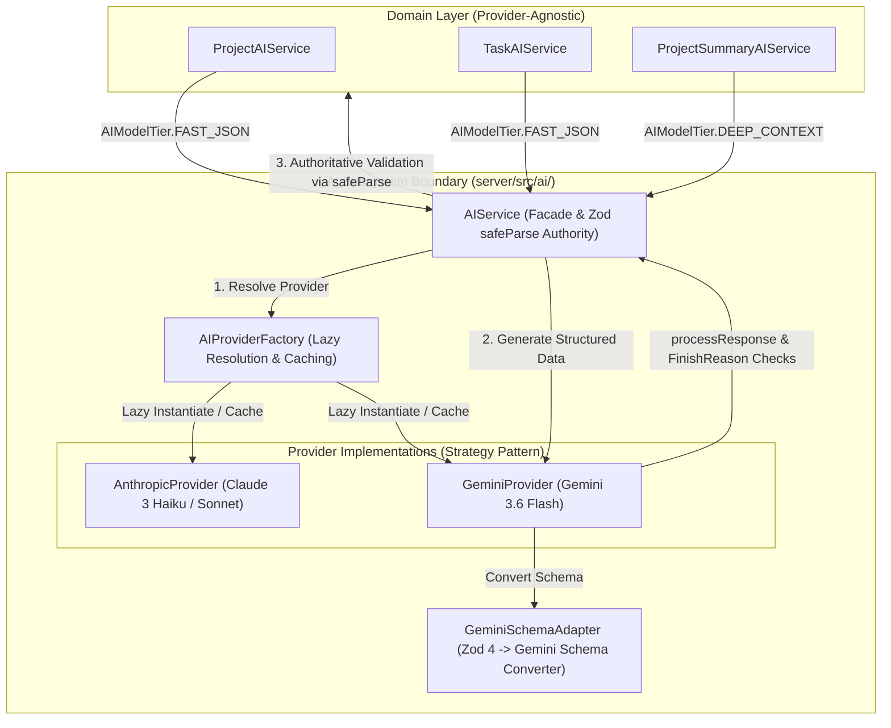

# Engineering Phases & Architecture History
Welcome to the internal engineering phase documentation portal for the **AI Project Manager** monorepo. This directory serves as an immutable, audited history of major architectural evolutions, vendor integrations, security hardenings, and subsystem overhauls.
Each phase represents a structured engineering initiative governed by formal contracts, technical specifications, empirical experiment logs, gate reviews, work packages, and verification suites.
---
##  Phase Index
| Phase | Initiative Name | Status | Primary Domain | Governance Entry Point | Completion Record |
| :--- | :--- | :--- | :--- | :--- | :--- |
| **Phase 20** | Multi-Provider AI Architecture & Google Gemini Integration | **COMPLETE** | AI Infrastructure & Vendor Abstraction | [Phase 20 Specification](./phase-20-multi-provider-ai/02-specification.md) | [Completion Report](./phase-20-multi-provider-ai/completion-report.md) |
---
# Phase 20 — Multi-Provider AI Architecture & Google Gemini Integration
| Attribute | Verified Status |
| :--- | :--- |
| **Initiative Status** | **COMPLETE (Gate 6 Approved)** |
| **Primary Domain** | Backend AI Infrastructure (`server/src/ai/`) |
| **Baseline Provider** | Anthropic Claude (`AnthropicProvider`) |
| **Integrated Provider** | Google Gemini (`GeminiProvider` via `@google/genai@^2.13.0`) |
| **Architecture Pattern** | Facade Pattern (`AIService`), Factory Pattern (`AIProviderFactory`), Strategy Pattern (`AIProvider`) |
| **Default Provider** | Anthropic (`AI_PROVIDER=anthropic`) |
| **Final Review Gate** | **Gate 6 (Final Verification) — PASS** |
| **Real AI Network Calls** | **0** (100% Offline Mock Verification Suite) |
---
## Why Phase 20 Existed
Prior to Phase 20, the repository depended directly on Anthropic Claude as a single LLM vendor. While functional, this tight coupling introduced key architectural limitations:
1. **Single-Vendor Risk:** Outages, API deprecations, or quota constraints from a single AI provider could stall project planning, auto-labeling, and task summarization capabilities.
2. **Lack of Capability Tiering:** Cost/latency optimization required dynamically switching between lightweight models (e.g., fast JSON generation) and heavy models (e.g., long-context project synthesis) without hardcoding vendor-specific SDK calls inside domain services.
3. **Vendor Leakage:** Domain services (`ProjectAIService`, `TaskAIService`, `ProjectSummaryAIService`) risk becoming tightly bound to vendor-specific payload formats, SDK exceptions, and schema rules.
**Phase 20 Objective:** Engineer an extensible, multi-provider AI subsystem foundation, integrate Google Gemini as a primary enterprise provider alongside Anthropic Claude, preserve complete provider decoupling, and enforce zero-network offline verification.
---
## 🏗 Architecture Before and After
### Legacy Architecture (Single Provider Coupling)
```
┌─────────────────────────────────────────────────────────────┐
│                       Domain Layer                          │
│  (ProjectAIService, TaskAIService, ProjectSummaryAIService) │
└──────────────────────────────┬──────────────────────────────┘
                               │ (Direct Dependency)
                               ▼
┌─────────────────────────────────────────────────────────────┐
│                        AIService                            │
│           (Direct Anthropic SDK Instantiation)              │
└──────────────────────────────┬──────────────────────────────┘
                               │
                               ▼
┌─────────────────────────────────────────────────────────────┐
│                    @anthropic-ai/sdk                        │
└─────────────────────────────────────────────────────────────┘
```
### Phase 20 Architecture (Multi-Provider Facade & Factory)

---
## What Phase 20 Delivered
1. **Provider-Agnostic `AIService` Facade:** Domain services consume AI capabilities using semantic model tiers (`AIModelTier.FAST_JSON`, `AIModelTier.DEEP_CONTEXT`) and standard Zod schemas. Zero vendor SDK types or concrete model names exist in the domain layer.
2. **Lazy `AIProviderFactory`:** Provider instances are constructed lazily upon first access and cached process-wide in a `Map<string, AIProvider>`. Unselected providers do not validate environment keys or initialize SDKs on application startup.
3. **Dependency Injection Seam:** `AIService` supports custom provider injection (`new AIService(customProvider)`), enabling unit and integration tests to pass mock doubles without network access.
4. **Google Gemini Integration:** Full `GeminiProvider` implementation using the official `@google/genai@^2.13.0` SDK, registered cleanly alongside `AnthropicProvider`.
5. **Schema Compatibility Adapter:** `GeminiSchemaAdapter` transforms Zod 4 schemas via `z.toJSONSchema()`, strips `$schema` headers and unsupported OpenAPI validation bounds (`minLength`, `maxLength`, `additionalProperties`), converts nullable type unions, and caches converted schemas in a `WeakMap`.
6. **Strict Safety & FinishReason Policies:** Invariant **"ONLY STOP succeeds"** enforced. `finishReason === 'MAX_TOKENS'` throws `AIProviderError` immediately before parsing. Safety refusals (`SAFETY`, `RECITATION`, `BLOCKLIST`, prompt blocks) throw pre-normalized `AIProviderError` instances.
7. **Timeout & Race-Free Cancellation:** Enforced `AbortController` timer management. Post-await checking ensures provider timeouts throw `AITimeoutError` while external caller aborts throw `AIProviderError`. Mandatory `clearTimeout` in `finally` blocks prevents handle leaks.
8. **Smoke & Credential Independence:** Application module import (`smoke.ts`) initializes Express routes, middleware, and `PromptRegistry` 100% credential-free without requiring Anthropic or Gemini keys.
---
## 🗺 Phase 20 Lifecycle Roadmap
| Stage / Gate | Focus & Objective | Result / Verdict | Primary Artifact |
| :--- | :--- | :--- | :--- |
| **Track A** | Provider-independent foundation (`AIProvider`, `AIProviderFactory`, `AIService` decoupling) | Completed | [Implementation Plan](./phase-20-multi-provider-ai/03-implementation-plan.md) |
| **Gate 5A** | Foundation architecture & DI review | **APPROVED** | [Specification](./phase-20-multi-provider-ai/02-specification.md) |
| **Gate 5B** | Anthropic backward-compatibility regression audit | **APPROVED** | [Specification](./phase-20-multi-provider-ai/02-specification.md) |
| **Track B** | Bounded Gemini experiments (Models, Schemas, Safety, Timeouts) | Completed | [Experiments Directory](./phase-20-multi-provider-ai/experiments/) |
| **Gate 4** | Formal Experiment Review & Policy Decision Gate | **APPROVED** | [Gate 4 Review](./phase-20-multi-provider-ai/reviews/gate-04-experiment-review.md) |
| **Track C** | Gemini integration implementation (`GeminiProvider`, `@google/genai`, schema adapter, unit tests) | Completed | [Gemini Review](./phase-20-multi-provider-ai/reviews/gate-05c-gemini-implementation-review.md) |
| **Gate 5C** | Gemini Implementation & Permanent Test Review | **APPROVED** | [Gate 5C Review](./phase-20-multi-provider-ai/reviews/gate-05c-gemini-implementation-review.md) |
| **Track D** | Smoke test alignment, `.env.example` alignment, CI pipeline verification | Completed | [WP-03B Artifact](./phase-20-multi-provider-ai/work-packages/wp-03b-smoke-ci-alignment.md) |
| **Gate 5D** | Testing & Offline CI Alignment Review | **APPROVED** | [Gate 5D Review](./phase-20-multi-provider-ai/reviews/gate-05d-testing-ci-review.md) |
| **Gate 6** | Final Phase Verification & Completion Audit | **APPROVED** | [Gate 6 Review](./phase-20-multi-provider-ai/reviews/gate-06-final-verification.md) |
---
## Experiments Index
Phase 20 conducted 5 formal, empirical experiments to evaluate SDK choices, schema compatibility, safety semantics, and cancellation invariants before writing production code:
| Experiment ID | Primary Question Investigated | Final Verified Finding / Policy | Artifact Link |
| :--- | :--- | :--- | :--- |
| **EXP-01** | Which Google Gemini SDK and model selection policy should be adopted? | Evaluated `@google/genai@^2.13.0`. Approved `ai.models.generateContent()` API surface. Model: `gemini-3.6-flash`. | [EXP-01 Document](./phase-20-multi-provider-ai/experiments/exp-01-model-selection.md) |
| **EXP-01B** | Should deep-context tasks use `gemini-1.5-pro` or `gemini-3.6-flash`? | Established policy: both `FAST_JSON` and `DEEP_CONTEXT` map to `gemini-3.6-flash` due to superior speed/schema support. | [EXP-01B Document](./phase-20-multi-provider-ai/experiments/exp-01b-deep-context-policy.md) |
| **EXP-02** | How should Zod 4 schemas be adapted to Gemini's OpenAPI constraints? | Developed `GeminiSchemaAdapter`: uses `z.toJSONSchema()`, strips `$schema` headers and unsupported bounds, converts nullable types. | [EXP-02 Document](./phase-20-multi-provider-ai/experiments/exp-02-schema-compatibility.md) |
| **EXP-03** | How should Gemini finishReasons, MAX_TOKENS, and safety refusals be handled? | Established invariant **"ONLY STOP succeeds"**. `MAX_TOKENS` truncation throws `AIProviderError` immediately before parsing. | [EXP-03 Document](./phase-20-multi-provider-ai/experiments/exp-03-safety-semantics.md) |
| **EXP-04** | How should request timeouts and cancellation signals be managed? | Implemented `AbortController` timer pattern. `timedOut === true` boolean is sole timeout signal (`AITimeoutError`). | [EXP-04 Document](./phase-20-multi-provider-ai/experiments/exp-04-timeout-cancellation.md) |
---
## Reviews and Gates
| Gate / Review | Review Purpose | Audit Findings & Verdict | Artifact Link |
| :--- | :--- | :--- | :--- |
| **Gate 4 Review** | Reconcile all experiment findings (EXP-01 through EXP-04) into binding specifications | **APPROVED** — Approved model policy (`gemini-3.6-flash`), schema adapter rules, and timeout invariants. | [Gate 4 Review](./phase-20-multi-provider-ai/reviews/gate-04-experiment-review.md) |
| **Gate 5C Review** | Independent code audit of `GeminiProvider`, `GeminiSchemaAdapter`, and 35 unit tests | **APPROVED** — 0 blockers, 0 major findings, zero provider leakage, clean exception mapping. | [Gate 5C Review](./phase-20-multi-provider-ai/reviews/gate-05c-gemini-implementation-review.md) |
| **Gate 5D Review** | Independent audit of unit test coverage, credential isolation, smoke test, and offline CI | **APPROVED** — Verified 15/15 test files pass, application bootstrap is key-independent. | [Gate 5D Review](./phase-20-multi-provider-ai/reviews/gate-05d-testing-ci-review.md) |
| **Gate 6 Review** | Final phase completion audit reconciling requirements, code, tests, CI, and docs | **APPROVED** — Phase 20 declared complete and ready for human git commit & PR merge. | [Gate 6 Review](./phase-20-multi-provider-ai/reviews/gate-06-final-verification.md) |
---
## Work Packages
| Work Package | Primary Scope & Responsibilities | Result & Status | Artifact Link |
| :--- | :--- | :--- | :--- |
| **WP-01A** | Multi-provider configuration schema (`aiConfig`) | Completed | [Specification](./phase-20-multi-provider-ai/02-specification.md) |
| **WP-01B** | Provider factory (`AIProviderFactory`) lazy resolution & caching | Completed | [Specification](./phase-20-multi-provider-ai/02-specification.md) |
| **WP-01C** | `AIService` facade decoupling & constructor injection seam | Completed | [Specification](./phase-20-multi-provider-ai/02-specification.md) |
| **WP-02A** | Install `@google/genai` dependency in `server/package.json` | Completed | [Gate 5C Review](./phase-20-multi-provider-ai/reviews/gate-05c-gemini-implementation-review.md) |
| **WP-02B** | `GeminiProvider` shell creation and factory registration | Completed | [Gate 5C Review](./phase-20-multi-provider-ai/reviews/gate-05c-gemini-implementation-review.md) |
| **WP-02C** | `GeminiSchemaAdapter` Zod 4 -> JSON Schema transformation | Completed | [Gate 5C Review](./phase-20-multi-provider-ai/reviews/gate-05c-gemini-implementation-review.md) |
| **WP-02D** | Gemini response parsing, safety policy, timeout, error mapping | Completed | [Gate 5C Review](./phase-20-multi-provider-ai/reviews/gate-05c-gemini-implementation-review.md) |
| **WP-03A** | Permanent Gemini unit test suite (`gemini-provider.test.ts`) | Completed (35/35 PASS) | [Gate 5C Review](./phase-20-multi-provider-ai/reviews/gate-05c-gemini-implementation-review.md) |
| **WP-03B** | Environment example alignment (`server/.env.example`), smoke verification, CI audit | Completed | [WP-03B Document](./phase-20-multi-provider-ai/work-packages/wp-03b-smoke-ci-alignment.md) |
---
## Model Policy
The application consumes AI capabilities through semantic model tiers (`AIModelTier`). The current provider model resolutions are configured as follows:
```typescript
// Anthropic Provider Model Mapping
AIModelTier.FAST_JSON   => ANTHROPIC_FAST_MODEL || 'claude-3-haiku-20240307'
AIModelTier.DEEP_CONTEXT => ANTHROPIC_DEEP_MODEL || 'claude-3-sonnet-20240229'
// Google Gemini Provider Model Mapping (EXP-01 / EXP-01B Policy)
AIModelTier.FAST_JSON   => GEMINI_FAST_MODEL || 'gemini-3.6-flash'
AIModelTier.DEEP_CONTEXT => GEMINI_DEEP_MODEL || 'gemini-3.6-flash'
```
*Note: While both Gemini tiers currently resolve to `gemini-3.6-flash` based on empirical experiment findings (EXP-01B), the semantic separation between `FAST_JSON` and `DEEP_CONTEXT` remains strictly preserved in application code.*
---
## 🛡 Structured Output & Validation Pipeline
The diagram below illustrates the exact execution path when a domain service requests structured data:
```
┌─────────────────────────────────────────────────────────────┐
│           Domain Service (e.g. ProjectAIService)           │
│        Calls aiService.generateStructuredData(prompt, schema)│
└──────────────────────────────┬──────────────────────────────┘
                               │
                               ▼
┌─────────────────────────────────────────────────────────────┐
│                 AIService (Facade Boundary)                 │
│      Resolves provider via AIProviderFactory.getProvider()  │
└──────────────────────────────┬──────────────────────────────┘
                               │
                               ▼
┌─────────────────────────────────────────────────────────────┐
│                       GeminiProvider                        │
│   1. Converts schema via GeminiSchemaAdapter.getGeminiSchema │
│   2. Sets responseMimeType: 'application/json'               │
│   3. Executes client.models.generateContent() with timeout   │
└──────────────────────────────┬──────────────────────────────┘
                               │
                               ▼
┌─────────────────────────────────────────────────────────────┐
│                  Response Hardening Checks                  │
│   1. Check promptFeedback.blockReason                       │
│   2. Check candidates[0] existence                          │
│   3. MAX_TOKENS finishReason -> Throws AIProviderError       │
│   4. Non-STOP finishReason -> Throws AIProviderError         │
│   5. Strip markdown fences (```json ... ```)                │
│   6. Parse raw text via JSON.parse                          │
└──────────────────────────────┬──────────────────────────────┘
                               │ (Parsed JSON)
                               ▼
┌─────────────────────────────────────────────────────────────┐
│                 validateAIResponse (Zod)                    │
│    Executes schema.safeParse(jsonData)                      │
│    AUTHORITATIVE APPLICATION RUNTIME SAFETY BOUNDARY        │
└──────────────────────────────┬──────────────────────────────┘
                               │ (Typed DTO)
                               ▼
┌─────────────────────────────────────────────────────────────┐
│                    Domain Service Return                    │
└─────────────────────────────────────────────────────────────┘
```
---
## 🛑 Safety & Timeout Semantics
1. **Prompt Block Inspection:** If `response.promptFeedback?.blockReason` is present, `GeminiProvider` throws an `AIProviderError` specifying the block reason.
2. **FinishReason Invariant:** ONLY `finishReason === 'STOP'` is allowed to proceed to JSON parsing.
3. **`MAX_TOKENS` Truncation Policy:** Output terminated with `finishReason === 'MAX_TOKENS'` throws an `AIProviderError("Gemini output truncated due to max_tokens limit")` immediately before parsing or Zod validation.
4. **Safety Refusals:** Responses terminated with `SAFETY`, `RECITATION`, or `BLOCKLIST` throw pre-normalized `AIProviderError` instances.
5. **Timeout Invariant:** Request execution is bounded by an `AbortController` and `setTimeout` (default 30,000ms). The `timedOut === true` boolean flag is checked post-await and in the `catch` block to ensure timeouts throw `AITimeoutError`. External caller aborts throw `AIProviderError`.
6. **Handle Leak Protection:** `clearTimeout(timerId)` is called inside a mandatory `finally` block to prevent Node.js event loop handles from leaking.
---
## ✅ Verification Results
Final verification results recorded during **Gate 6 Final Verification**:
| Verification Command / Suite | Scope & Description | Exit Status | Verification Result |
| :--- | :--- | :--- | :--- |
| **`git diff --check`** | Repository formatting & whitespace safety check | Clean (0 errors) | **PASS** |
| **`npm run typecheck`** | Full monorepo TypeScript compilation check (`client` & `server`) | Clean (0 errors) | **PASS** |
| **`npm run build`** | Full monorepo build pipeline (Client Vite & Server `tsc`) | Clean (0 errors) | **PASS** |
| **`npm test --prefix server`** | Complete server test suite (15 test files) | 15 / 15 PASS | **PASS** |
| **`npm run smoke`** | Express application bootstrap & Prompt Registry validation | Clean (0 errors) | **PASS** |
| **`npm run verify`** | Root verification pipeline (`lint` + `typecheck` + `test` + `build` + `smoke`) | Clean (0 errors) | **PASS** |
| **Real Gemini API Calls** | Offline verification check | **0 Calls** | **VERIFIED OFFLINE** |
| **Real Anthropic API Calls** | Offline verification check | **0 Calls** | **VERIFIED OFFLINE** |
---
## Configuration Reference
The following environment variables govern AI provider resolution and credentials in `server/.env.example`:
```env
# AI Configuration
# Primary AI Provider Selection: anthropic | gemini (defaults to anthropic)
AI_PROVIDER=anthropic
# Anthropic Provider Configuration
ANTHROPIC_API_KEY=
# Optional Model Overrides for Anthropic
ANTHROPIC_FAST_MODEL=claude-3-haiku-20240307
ANTHROPIC_DEEP_MODEL=claude-3-sonnet-20240229
# Backward-compatibility default model
AI_DEFAULT_MODEL=claude-3-haiku-20240307
# Google Gemini Provider Configuration
GEMINI_API_KEY=
# Optional Model Overrides for Gemini
GEMINI_FAST_MODEL=gemini-3.6-flash
GEMINI_DEEP_MODEL=gemini-3.6-flash
# Execution Timeout (ms)
AI_REQUEST_TIMEOUT=30000
```
---
## 🗺 Complete Documentation Navigation Portal
###  Governing Documents
- [00 — Contract](./phase-20-multi-provider-ai/00-contract.md)
- [01 — Investigation](./phase-20-multi-provider-ai/01-investigation.md)
- [01A — Repository Reconciliation](./phase-20-multi-provider-ai/01a-repository-reconciliation.md)
- [02 — Technical Specification](./phase-20-multi-provider-ai/02-specification.md)
- [03 — Implementation Plan](./phase-20-multi-provider-ai/03-implementation-plan.md)
- [Completion Report](./phase-20-multi-provider-ai/completion-report.md)
###  Experiment Records
- [EXP-01 — Gemini Model Selection & SDK Selection](./phase-20-multi-provider-ai/experiments/exp-01-model-selection.md)
- [EXP-01B — Deep Context Policy Analysis](./phase-20-multi-provider-ai/experiments/exp-01b-deep-context-policy.md)
- [EXP-02 — Zod Schema Compatibility & Adapter Policy](./phase-20-multi-provider-ai/experiments/exp-02-schema-compatibility.md)
- [EXP-03 — Safety & FinishReason Semantics](./phase-20-multi-provider-ai/experiments/exp-03-safety-semantics.md)
- [EXP-04 — Timeout & Cancellation Semantics](./phase-20-multi-provider-ai/experiments/exp-04-timeout-cancellation.md)
###  Review & Audit Gates
- [Gate 4 — Experiment Review](./phase-20-multi-provider-ai/reviews/gate-04-experiment-review.md)
- [Gate 5C — Gemini Implementation Review](./phase-20-multi-provider-ai/reviews/gate-05c-gemini-implementation-review.md)
- [Gate 5D — Testing & CI Alignment Review](./phase-20-multi-provider-ai/reviews/gate-05d-testing-ci-review.md)
- [Gate 6 — Final Phase Verification Review](./phase-20-multi-provider-ai/reviews/gate-06-final-verification.md)
### Work Package Reports
- [WP-03B — Smoke Verification & CI Alignment](./phase-20-multi-provider-ai/work-packages/wp-03b-smoke-ci-alignment.md)
---
## Final State & Architectural Guarantees
Future maintainers and contributors can rely on the following permanent system guarantees established by Phase 20:
1. **Domain Isolation:** Domain services (`ProjectAIService`, `TaskAIService`, `ProjectSummaryAIService`) remain 100% provider-agnostic. They consume AI capabilities exclusively through `AIService` and `AIModelTier`.
2. **Anthropic Backward Compatibility:** Anthropic Claude remains the default provider (`AI_PROVIDER=anthropic`). Existing workflows require zero configuration changes.
3. **Lazy Provider Construction:** Changing or adding AI providers does not alter domain logic. Unselected provider credentials are not validated during application startup.
4. **Authoritative Runtime Safety:** Schema conversion hints provided to Gemini guide LLM generation, but `AIService` validation via Zod `safeParse()` remains the sole authoritative runtime boundary before data persists to MongoDB.
5. **Deterministic Offline CI:** All unit and integration test suites run 100% offline using mock provider doubles. CI execution requires zero external AI API credentials.
For full phase completion details and operational sign-off, see the official [Phase 20 Completion Report](./phase-20-multi-provider-ai/completion-report.md).
