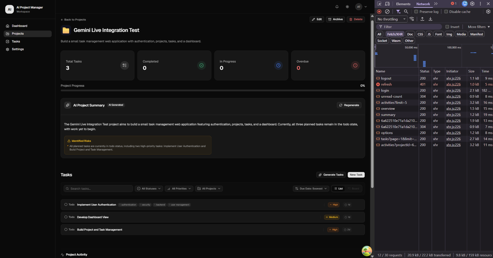
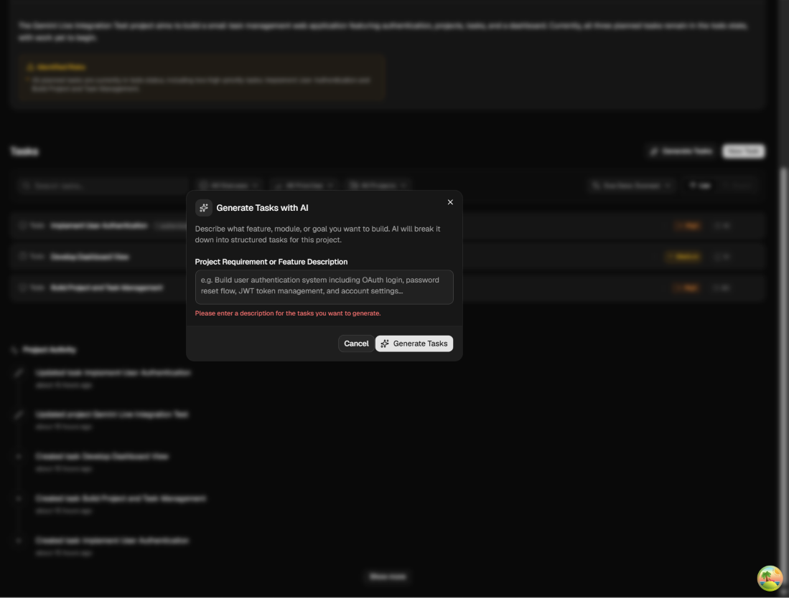
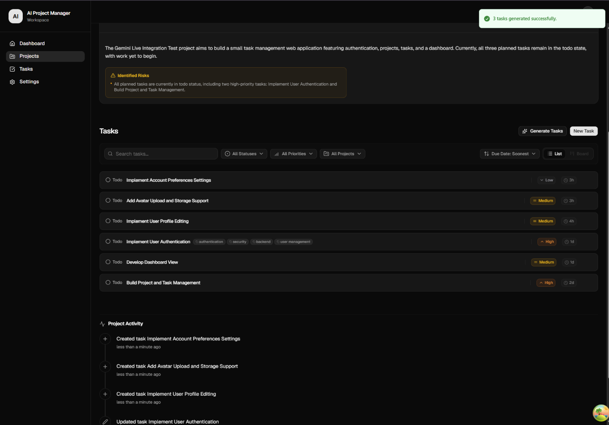
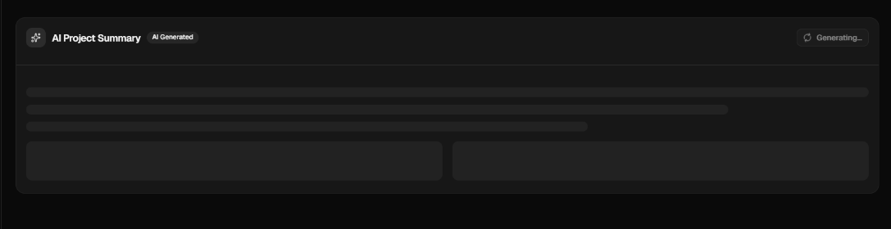
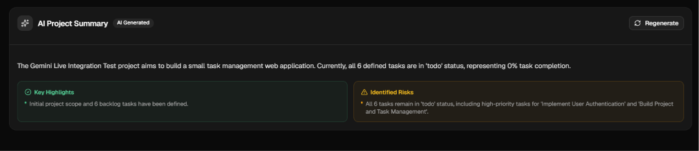
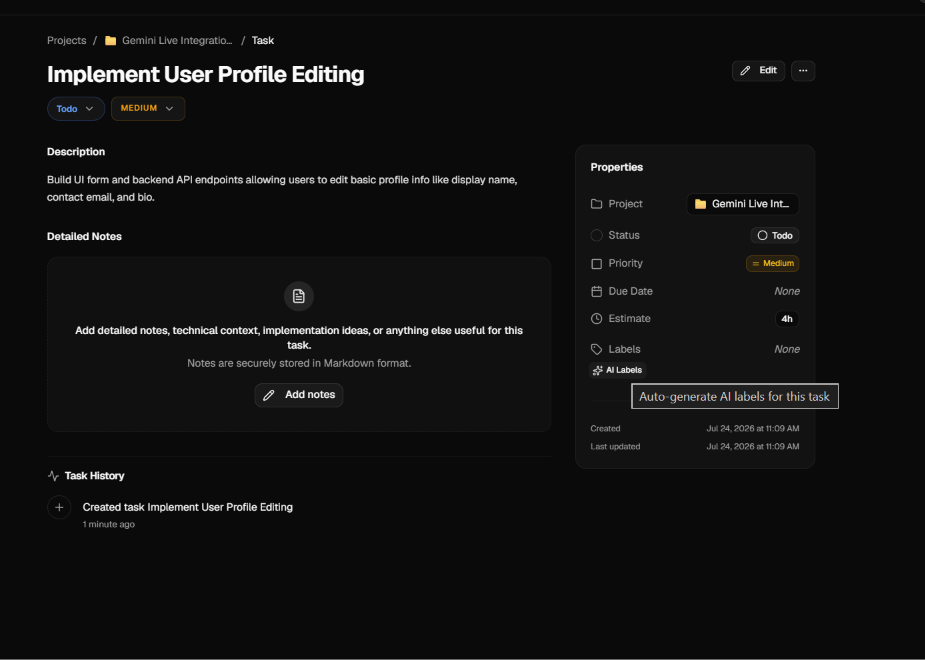
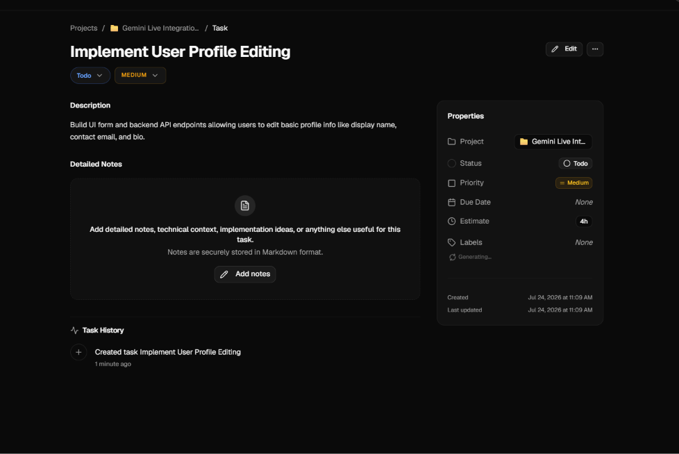
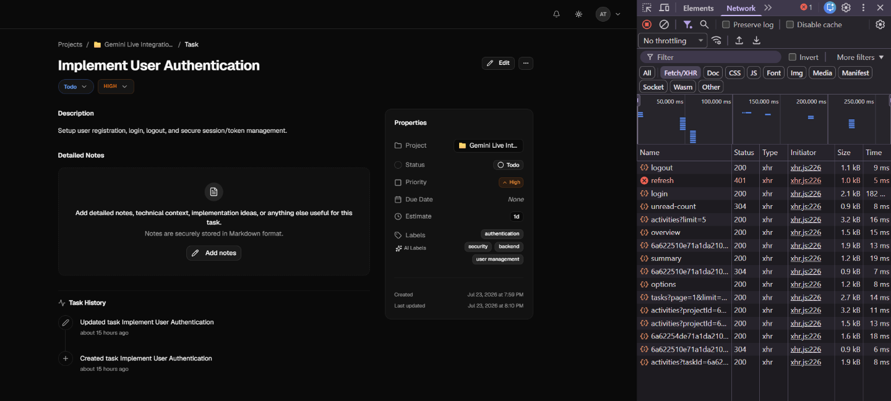

# Phase 24 — Manual Browser Verification

> **Phase:** Phase 24 — Frontend Foundation & AI Integration
> **Artifact Type:** Human-Performed Manual Browser Verification
> **Branch:** `feat/phase-24-frontend-ai-integration`
> **Application:** AI Project Manager
> **Verification Environment:** Local development environment
> **Verification Date:** July 24, 2026
> **Overall Result:** **PASS**

---

## 1. Purpose

This document records the manual browser verification performed for Phase 24 — Frontend Foundation & AI Integration.

Phase 24 connects the previously implemented AI backend architecture to the real frontend product experience.

The purpose of this verification was not merely to confirm that individual React components render correctly. The objective was to validate the complete user-facing execution path across:

- React UI components
- frontend feature modules
- TanStack Query mutations and queries
- the shared HTTP client
- Express API routes
- domain AI services
- `AIService`
- Phase 23 intelligent provider routing
- Phase 22 fallback and resilience behavior
- provider execution
- structured response validation
- MongoDB persistence
- activity/history persistence
- query invalidation
- frontend re-rendering
- loading and pending states
- user-visible success feedback

The tests documented here were performed manually in the browser against the running local application.

They therefore provide complementary evidence to the automated test suite.

Automated tests prove deterministic behavior under controlled conditions.

This artifact proves that the implemented system also functions correctly when exercised through the actual user interface.

---

# 2. Verification Scope

The following Phase 24 AI workflows were manually verified:

1. Project AI integration rendering
2. AI-generated project tasks
3. Generate Tasks input validation
4. Generated task persistence
5. Project task-list synchronization
6. Project Activity synchronization
7. Existing AI Project Summary rendering
8. AI Project Summary regeneration
9. AI Project Summary loading state
10. AI Project Summary synchronization with current project state
11. AI-generated task labels
12. AI Labels loading state
13. AI Labels persistence
14. Task History synchronization
15. Historical AI-generated data compatibility
16. Browser console stability
17. Normal authenticated API/network behavior
18. Phase 24 scope boundaries

The generic workspace-level AI assistant was intentionally excluded from Phase 24.

Controls such as:

- `Ask AI`
- workspace AI assistant
- AI Daily Brief assistant interaction

remain intentionally unavailable and continue to display:

> `The AI assistant is coming soon.`

This behavior is expected and preserves the established Phase 24 scope boundary.

---

# 3. Verification Environment

Manual verification was performed using the real local development application.

## Runtime

```text
Node: v20.20.2
npm: 10.8.2
Branch: feat/phase-24-frontend-ai-integration
```

The frontend was connected to the running backend and authenticated application session.

The browser DevTools Network panel was used during verification to observe application requests.

The browser console was also monitored for unexpected runtime failures.

---

# 4. Test Data

A real project was used for the integration test:

```text
Gemini Live Integration Test
```

The project description represented a small task-management application containing authentication, projects, tasks, and dashboard functionality.

Before AI task generation, the project contained three existing tasks:

```text
Implement User Authentication
Develop Dashboard View
Build Project and Task Management
```

This provided an existing persisted project against which the Phase 24 AI workflows could be exercised.

---

# 5. Test 1 — Project AI Integration Overview

## 5.1 Objective

Verify that the Project Detail page correctly integrates the Phase 24 AI functionality into the existing project experience without disrupting the surrounding project UI.

The page should simultaneously support:

- existing project metadata
- task statistics
- project progress
- AI Project Summary
- normal task management
- AI task generation
- Project Activity
- existing project actions

## 5.2 Observed Result

The `Gemini Live Integration Test` project loaded successfully.

The page displayed:

- project title
- project description
- project statistics
- progress information
- AI Project Summary
- task management controls
- `Generate Tasks`
- existing tasks
- Project Activity

No existing project functionality appeared to be displaced by the AI integration.

The AI features behaved as additions to the existing product architecture rather than as a separate or disconnected AI interface.

## 5.3 Screenshot Evidence

<!--
SCREENSHOT 01

FILE:
./screenshots/01-project-ai-integration-overview.png

USE THE SCREENSHOT:
The large Project Detail screenshot showing:
- "Gemini Live Integration Test"
- AI Project Summary
- task statistics
- Generate Tasks button
- existing three tasks
- Project Activity
- DevTools Network panel visible on the right

This should be the FIRST screenshot you sent in the manual testing set.
-->



## 5.4 Verdict

**PASS**

The Phase 24 AI functionality integrates cleanly into the existing Project Detail experience.

---

# 6. Test 2 — Generate Tasks Input Validation

## 6.1 Objective

Verify that the AI task-generation workflow prevents an invalid empty submission before attempting task generation.

This is important because frontend validation should reject obviously invalid input without requiring unnecessary backend or provider execution.

## 6.2 Procedure

1. Opened the `Gemini Live Integration Test` project.
2. Selected the `Generate Tasks` action.
3. Observed the `Generate Tasks with AI` dialog.
4. Attempted to submit without entering a valid project requirement or feature description.

## 6.3 Expected Behavior

The frontend should:

- keep the dialog open
- display a clear validation error
- prevent invalid generation
- allow the user to correct the input

## 6.4 Observed Behavior

The dialog remained open and displayed:

```text
Please enter a description for the tasks you want to generate.
```

The validation message appeared directly below the project requirement / feature description field.

The dialog remained usable after the validation failure.

## 6.5 Screenshot Evidence

<!--
SCREENSHOT 02

FILE:
./screenshots/02-generate-tasks-validation.png

USE THE SCREENSHOT:
The screenshot showing the centered:
"Generate Tasks with AI"

dialog with:
- description textarea
- empty/invalid input
- red validation text:
  "Please enter a description for the tasks you want to generate."
- Cancel button
- Generate Tasks button

This is the screenshot you sent where the background project page is blurred.
-->



## 6.6 Verdict

**PASS**

Invalid empty input was rejected correctly before task generation.

---

# 7. Test 3 — AI Task Generation and Persistence

## 7.1 Objective

Verify the complete AI task-generation workflow from user interaction through backend execution and persisted frontend state.

The workflow should prove that Phase 24 connects the frontend to the real AI backend rather than presenting mocked or static UI.

## 7.2 Procedure

1. Opened the Generate Tasks dialog.
2. Entered a valid feature/project requirement.
3. Submitted the request.
4. Waited for the AI generation request to complete.
5. Observed the resulting task list.
6. Observed Project Activity.

## 7.3 Initial State

Before generation, the project contained three tasks.

## 7.4 Observed Successful Result

The application displayed the success notification:

```text
3 tasks generated successfully.
```

Three newly generated tasks appeared in the project task list:

```text
Implement Account Preferences Settings
Add Avatar Upload and Storage Support
Implement User Profile Editing
```

The project therefore increased from:

```text
3 tasks
```

to:

```text
6 tasks
```

without requiring a manual browser refresh.

## 7.5 Persistence Evidence

The generated tasks appeared as normal project tasks alongside the previously existing tasks.

This demonstrates that generated output was not merely held in transient component state.

The resulting tasks participated in the same product model as manually created tasks.

## 7.6 Project Activity Evidence

The Project Activity timeline also displayed task-creation events for the newly generated tasks.

Observed activity included creation events corresponding to:

```text
Implement Account Preferences Settings
Add Avatar Upload and Storage Support
Implement User Profile Editing
```

This provides additional evidence that the AI-generated tasks flowed through the application's normal persistence and activity mechanisms.

## 7.7 Frontend Synchronization

No manual page reload was required.

The task list updated after successful mutation completion.

This verifies the frontend query/mutation synchronization path used by the Phase 24 integration.

## 7.8 Screenshot Evidence

<!--
SCREENSHOT 03

FILE:
./screenshots/03-generated-tasks-success.png

USE THE SCREENSHOT:
The screenshot showing:
- green success toast:
  "3 tasks generated successfully."
- all six tasks visible
- the three new tasks at the top
- Project Activity showing newly created task events

This is one of the strongest screenshots in the entire artifact.
-->



## 7.9 Verdict

**PASS**

The AI task-generation workflow successfully completed end-to-end.

Evidence confirms:

- frontend action works
- backend AI execution works
- generated tasks persist
- task queries refresh
- Project Activity synchronizes
- success feedback renders
- no duplicate visible generation occurred

---

# 8. Test 4 — Existing AI Project Summary Rendering

## 8.1 Objective

Verify that previously persisted AI Project Summary data can be retrieved and rendered by the Phase 24 frontend.

## 8.2 Observed Behavior

The Project Detail page successfully rendered the project's existing AI-generated summary.

The card displayed:

- `AI Project Summary`
- `AI Generated`
- summary text
- identified project risks
- `Regenerate` action

This confirms that Phase 24 can consume persisted AI data generated through the backend.

## 8.3 Compatibility Result

Existing AI summary data remained compatible with the frontend integration.

No migration-specific UI failure or malformed rendering was observed.

## 8.4 Evidence

The project overview screenshot in Test 1 also captures the existing AI Project Summary before regeneration.

See:

```text
./screenshots/01-project-ai-integration-overview.png
```

## 8.5 Verdict

**PASS**

Previously persisted project AI summary data rendered successfully.

---

# 9. Test 5 — AI Project Summary Regeneration Loading State

## 9.1 Objective

Verify that regeneration provides a deterministic pending state while AI work is executing.

The interface should communicate that generation is underway and prevent the user from interpreting the delay as an application failure.

## 9.2 Procedure

1. Located the existing AI Project Summary.
2. Selected `Regenerate`.
3. Observed the card while generation was in progress.

## 9.3 Observed Behavior

The summary card transitioned into a dedicated generating state.

The interface displayed:

```text
Generating...
```

and rendered skeleton placeholders representing the pending summary content.

The previous summary was not misleadingly presented as newly generated content while regeneration was in progress.

## 9.4 Screenshot Evidence

<!--
SCREENSHOT 04

FILE:
./screenshots/04-project-summary-generating.png

USE THE SCREENSHOT:
The close-up screenshot of the AI Project Summary card where:
- button says "Generating..."
- skeleton loading lines are visible
- two lower skeleton panels are visible

Use the screenshot that focuses almost entirely on the summary card.
-->



## 9.5 Verdict

**PASS**

The AI Project Summary provides a clear and deterministic pending state.

---

# 10. Test 6 — AI Project Summary Regeneration Result

## 10.1 Objective

Verify that a regenerated project summary:

- completes successfully
- renders structured AI output
- reflects current project data
- replaces/refetches stale summary state

## 10.2 Observed Result

After regeneration completed, the card rendered a new structured summary.

The result included:

```text
Key Highlights
```

and:

```text
Identified Risks
```

The summary recognized the current project state after AI task generation.

Most importantly, it referenced the project as containing:

```text
6 defined tasks
```

rather than the previous three-task state.

This demonstrates that the AI summary generation path received current persisted project/task information.

## 10.3 Current-State Synchronization Evidence

The test sequence was intentionally useful here:

```text
Initial project
      ↓
3 tasks
      ↓
Generate 3 AI tasks
      ↓
6 persisted tasks
      ↓
Regenerate AI Project Summary
      ↓
Summary recognizes all 6 tasks
```

This is stronger evidence than simply proving that the Regenerate button returns some text.

It demonstrates synchronization between:

- persisted project state
- persisted task state
- AI summary generation
- frontend query refresh
- rendered summary state

## 10.4 Screenshot Evidence

<!--
SCREENSHOT 05

FILE:
./screenshots/05-project-summary-regenerated.png

USE THE SCREENSHOT:
The close-up screenshot showing the completed regenerated summary with:
- AI Project Summary
- AI Generated
- Regenerate
- text mentioning all 6 defined tasks
- green "Key Highlights" panel
- amber "Identified Risks" panel

Use the clean close-up summary screenshot, NOT the larger full-page one.
-->



## 10.5 Verdict

**PASS**

AI Project Summary regeneration successfully consumed and rendered current project state.

---

# 11. Test 7 — Task AI Labels Initial State

## 11.1 Objective

Verify that a task without labels exposes the AI Labels action correctly and provides a valid baseline for testing AI label generation.

## 11.2 Test Task

The newly AI-generated task:

```text
Implement User Profile Editing
```

was opened.

## 11.3 Initial State

The task contained normal task properties including:

- Project
- Status
- Priority
- Due Date
- Estimate
- Labels

Before AI label generation, the normal Labels field displayed:

```text
None
```

The `AI Labels` action was available separately.

## 11.4 Screenshot Evidence

<!--
SCREENSHOT 06

FILE:
./screenshots/06-task-before-ai-labels.png

USE THE SCREENSHOT:
The Task Detail screenshot for:
"Implement User Profile Editing"

where:
- Labels = None
- AI Labels action is visible
- task description is visible
- properties panel is visible
- no generated AI labels have appeared yet

Use the screenshot BEFORE clicking AI Labels.
-->



## 11.5 Verdict

**PASS**

The task presented the correct pre-generation state.

---

# 12. Test 8 — Task AI Labels Pending State

## 12.1 Objective

Verify that task label generation communicates the in-flight state to the user.

## 12.2 Procedure

The AI Labels action was triggered for:

```text
Implement User Profile Editing
```

## 12.3 Observed Behavior

While generation was in progress, the Properties panel displayed:

```text
Generating...
```

with a loading indicator.

The UI therefore communicated that AI work was currently executing.

## 12.4 Screenshot Evidence

<!--
SCREENSHOT 07

FILE:
./screenshots/07-task-ai-labels-generating.png

USE THE SCREENSHOT:
The Task Detail screenshot for:
"Implement User Profile Editing"

where the Properties panel shows:
"Generating..."

under the labels area.

This should be the screenshot taken immediately after clicking AI Labels.
-->



## 12.5 Verdict

**PASS**

The task AI label workflow exposes an appropriate pending state.

---

# 13. Test 9 — Task AI Labels Generation and Persistence

## 13.1 Objective

Verify successful AI label generation, persistence, query synchronization, and task-history integration.

## 13.2 Observed Result

After generation completed, the task displayed the AI-generated labels:

```text
ui
backend
user profile
api
```

The labels appeared directly in the task Properties panel.

## 13.3 Persistence Evidence

The labels remained associated with the task after generation.

They were rendered as normal task data rather than transient AI output.

## 13.4 Task History Evidence

Task History also displayed an update event after AI label generation.

The history therefore changed from only the original task creation event to include an update event.

This demonstrates that the AI action participates in the existing task mutation/history architecture.

## 13.5 Screenshot Evidence

<!--
SCREENSHOT 08

FILE:
./screenshots/08-task-ai-labels-generated.png

USE THE SCREENSHOT:
The final Task Detail screenshot showing:
- "Implement User Profile Editing"
- generated AI labels:
  ui
  backend
  user profile
  api
- Task History showing:
  "Updated task Implement User Profile Editing"
- original Created task event below it

Use the clean final screenshot AFTER label generation completed.
-->



## 13.6 Verdict

**PASS**

AI label generation completed successfully and integrated with normal task persistence and history behavior.

---

# 14. Test 10 — Historical AI Label Compatibility

## 14.1 Objective

Verify that Phase 24 does not break AI-generated labels already persisted before this manual verification session.

## 14.2 Test Task

The existing task:

```text
Implement User Authentication
```

contained previously generated AI labels.

## 14.3 Observed Existing Labels

The following persisted labels rendered successfully:

```text
authentication
security
backend
user management
```

## 14.4 Compatibility Significance

This demonstrates that the Phase 24 frontend integration supports both:

1. newly generated AI data
2. previously persisted AI data

The frontend therefore does not depend exclusively on state produced during the current browser session.

## 14.5 Evidence

The historical-label screenshot may optionally be retained as supplementary evidence.

<!--
OPTIONAL SCREENSHOT

If you want to preserve ALL manual evidence, add:

./screenshots/09-historical-ai-labels.png

Use the screenshot of:
"Implement User Authentication"

showing:
authentication
security
backend
user management

Then uncomment the Markdown below.


-->

## 14.6 Verdict

**PASS**

Historical AI-generated labels remain compatible with the Phase 24 frontend.

---

# 15. Browser Console Verification

## 15.1 Objective

Verify that the tested AI workflows do not produce unexpected frontend runtime errors.

## 15.2 Observed Result

During successful manual AI testing:

```text
Browser console errors observed: 0
```

No React runtime failures, unhandled promise errors, rendering crashes, or AI integration errors were observed during the successful flows.

## 15.3 Verdict

**PASS**

No browser console errors were observed during the successful Phase 24 AI workflows.

---

# 16. Network Observation

The browser Network panel was monitored during manual verification.

Normal application requests successfully completed during the tested flows.

A session-related request sequence included:

```text
logout   -> 200
refresh  -> 401
login    -> 200
```

followed by successful authenticated application requests.

The historical/session-related `refresh -> 401` observation was not treated as a Phase 24 AI integration failure because authentication subsequently completed normally and the tested AI workflows functioned successfully.

No authentication behavior was modified as part of this verification.

---

# 17. End-to-End Integration Evidence

The browser verification provides evidence for the complete application flow.

Conceptually:

```text
User Interaction
      │
      ▼
React Phase 24 UI
      │
      ▼
Frontend AI Feature Layer
      │
      ▼
TanStack Query Mutation
      │
      ▼
Shared API Client
      │
      ▼
Express API
      │
      ▼
Domain AI Service
      │
      ▼
AIService
      │
      ├── Phase 23 Intelligent Routing
      │
      └── Phase 22 Fallback & Resilience
      │
      ▼
Configured AI Provider
      │
      ▼
Structured Output Validation
      │
      ▼
Domain Persistence
      │
      ├── Project / Task Update
      │
      └── Activity / History Update
      │
      ▼
API Response
      │
      ▼
TanStack Query Invalidation / Refetch
      │
      ▼
Updated React UI
```

The manual tests provide product-level evidence that this architecture operates successfully when invoked through the actual user interface.

---

# 18. Phase 22 Compatibility

Phase 22 introduced provider fallback and resilience.

Phase 24 does not reproduce fallback logic in the frontend.

The browser interface requests AI capabilities through the backend API and remains unaware of:

- provider fallback ordering
- fallback eligibility
- SDK retry behavior
- latency-budget calculations
- provider construction
- provider credentials

This preserves the Phase 22 architectural boundary.

**Verdict: PASS**

---

# 19. Phase 23 Compatibility

Phase 23 introduced intelligent provider routing.

Phase 24 does not perform provider selection in React.

The frontend does not decide whether Gemini or Anthropic should execute a request.

Provider/model routing remains a backend concern.

The client therefore remains a consumer of application-level AI capabilities rather than an owner of AI infrastructure decisions.

**Verdict: PASS**

---

# 20. Provider Abstraction Verification

No provider-specific SDK execution is required by the Phase 24 frontend.

The frontend does not require knowledge of:

```text
@google/genai
@anthropic-ai/sdk
```

and does not require provider credentials.

The user-facing workflow remains conceptually:

```text
Generate Tasks
Generate Summary
Generate Labels
```

rather than:

```text
Call Gemini
Call Anthropic
Choose Provider
Retry Provider
```

This distinction is critical to preserving the backend AI abstraction.

**Verdict: PASS**

---

# 21. Frontend State Ownership Verification

The successful browser tests demonstrate that AI-generated server data flows back into normal application state.

Observed examples include:

### Generated Tasks

```text
AI mutation
→ persisted tasks
→ task query refresh
→ six tasks rendered
```

### Project Summary

```text
Regenerate mutation
→ persisted summary
→ summary refresh
→ current six-task state rendered
```

### AI Labels

```text
Generate labels mutation
→ task update
→ task query refresh
→ labels rendered
→ history update rendered
```

No manual browser reload was required for these successful workflows.

**Verdict: PASS**

---

# 22. Loading-State Verification

Phase 24 exposes user-visible pending states for long-running AI operations.

Verified states include:

| Workflow | Pending State |
|---|---|
| Generate Tasks | Generation action enters pending/disabled state |
| Project Summary | `Generating...` + skeleton UI |
| AI Labels | `Generating...` + loading indicator |

This prevents AI operations from appearing frozen while waiting for backend/provider execution.

**Verdict: PASS**

---

# 23. Duplicate Submission Protection

During manual verification, no duplicate visible mutations were observed.

The AI controls transitioned into pending states during execution.

The tested operations resulted in the expected single logical mutation:

- one Generate Tasks submission produced three intended tasks
- one summary regeneration produced one updated summary
- one AI Labels request updated the intended task

**Duplicate visible mutations observed:** `NONE`

**Verdict: PASS**

---

# 24. Persistence Verification

The browser verification demonstrated that generated AI data participates in normal persisted domain state.

Verified persisted outcomes:

- generated project tasks
- generated task labels
- regenerated project summary
- project activity entries
- task history entries

The frontend therefore does not treat AI output as disposable presentation-only content.

**Verdict: PASS**

---

# 25. Historical Data Compatibility

Phase 24 successfully rendered AI-generated data that existed before the current manual generation session.

Verified historical data included:

- existing AI Project Summary
- existing AI task labels

This provides evidence that Phase 24 works with persisted application state rather than only newly generated frontend-session state.

**Verdict: PASS**

---

# 26. Phase 24 Scope Boundary

Phase 24 intentionally integrates concrete AI capabilities that already have backend support.

Implemented product integrations include:

- AI project task generation
- AI project summary generation/regeneration
- AI task label generation

Phase 24 intentionally does **not** introduce a generic AI workspace assistant.

The existing generic AI controls remain disabled and continue to communicate:

```text
The AI assistant is coming soon.
```

This is expected behavior.

It is not a Phase 24 defect.

This prevents Phase 24 from silently expanding into:

- generic AI chat
- streaming copilot infrastructure
- autonomous workspace actions
- conversational agent memory
- workspace-wide AI orchestration

Those capabilities require their own future architecture and governance.

**Verdict: PASS**

---

# 27. Manual Verification Matrix

| Verification | Result |
|---|---|
| Project Detail loads with Phase 24 integration | **PASS** |
| Existing project functionality remains visible | **PASS** |
| AI Project Summary renders | **PASS** |
| Generate Tasks action available | **PASS** |
| Generate Tasks dialog opens | **PASS** |
| Empty-description validation | **PASS** |
| Invalid generation prevented | **PASS** |
| Valid Generate Tasks request succeeds | **PASS** |
| Success notification renders | **PASS** |
| Three AI tasks generated | **PASS** |
| Generated tasks persist | **PASS** |
| Task list updates without manual refresh | **PASS** |
| Project task count increases from 3 to 6 | **PASS** |
| Project Activity reflects generated tasks | **PASS** |
| Existing AI summary renders | **PASS** |
| Summary Regenerate action works | **PASS** |
| Summary pending state renders | **PASS** |
| Summary skeleton renders | **PASS** |
| Regenerated summary renders | **PASS** |
| Summary reflects current six-task state | **PASS** |
| Key Highlights render | **PASS** |
| Identified Risks render | **PASS** |
| Task Detail renders for AI-generated task | **PASS** |
| AI Labels action available | **PASS** |
| AI Labels pending state renders | **PASS** |
| AI labels generated successfully | **PASS** |
| Generated labels persist | **PASS** |
| Task UI refreshes without manual reload | **PASS** |
| Task History reflects AI label mutation | **PASS** |
| Historical AI labels remain compatible | **PASS** |
| Existing AI summary remains compatible | **PASS** |
| Duplicate visible AI mutations | **NONE OBSERVED** |
| Browser console errors | **0 OBSERVED** |
| Generic Ask AI remains intentionally disabled | **PASS** |
| Provider selection exposed to frontend | **NO** |
| Provider credentials exposed to frontend | **NO** |
| End-to-end Phase 24 AI integration | **PASS** |

---

# 28. Screenshot Evidence Index

The following screenshot files constitute the primary visual evidence for this manual verification artifact.

| # | File | Evidence |
|---:|---|---|
| 01 | `01-project-ai-integration-overview.png` | Complete Project Detail AI integration |
| 02 | `02-generate-tasks-validation.png` | Generate Tasks frontend validation |
| 03 | `03-generated-tasks-success.png` | Generated tasks, success toast, Project Activity |
| 04 | `04-project-summary-generating.png` | Summary pending/skeleton state |
| 05 | `05-project-summary-regenerated.png` | Regenerated current-state AI summary |
| 06 | `06-task-before-ai-labels.png` | Task before AI label generation |
| 07 | `07-task-ai-labels-generating.png` | AI Labels pending state |
| 08 | `08-task-ai-labels-generated.png` | Generated labels + Task History update |

Optional supplementary evidence:

| # | File | Evidence |
|---:|---|---|
| 09 | `09-historical-ai-labels.png` | Previously persisted AI labels |

---

# 29. Relationship to Automated Verification

This artifact should not be interpreted as a replacement for automated verification.

Phase 24 uses two complementary verification layers.

## Automated Verification

Automated verification validates:

- unit behavior
- integration contracts
- lint correctness
- TypeScript correctness
- deterministic frontend behavior
- server regressions
- production builds
- smoke testing

At final Phase 24 verification, the automated suite reported:

```text
Client test files: 6 passed
Client tests:      40 passed

Client typecheck:  PASS
Client lint:       PASS
Client build:      PASS

Server verification: PASS
Server test files:   22/22 PASS
Server build:        PASS
Server smoke test:   PASS

npm run verify:      PASS
git diff --check:    CLEAN
```

## Manual Browser Verification

Manual verification validates:

- actual user interaction
- real component composition
- visual pending states
- backend connectivity
- persisted data rendering
- query synchronization
- browser runtime stability
- real product workflow coherence

Both layers passed.

---

# 30. Key Product-Level Findings

The manual verification produced several important findings.

### 30.1 AI Backend Is Now Reachable Through the Product

The AI backend built during earlier phases is no longer isolated behind backend tests and API routes.

Users can now invoke supported AI capabilities through normal application UI.

### 30.2 AI Output Becomes Normal Domain Data

Generated tasks and labels are not displayed as temporary chat responses.

They become real application entities and properties.

This is an important architectural characteristic of the AI Project Manager.

### 30.3 AI Mutations Integrate With Existing History Systems

AI-generated task creation appears in Project Activity.

AI-generated task label updates appear in Task History.

The AI integration therefore respects existing product auditing/history mechanisms.

### 30.4 Current State Reaches AI Generation

The regenerated project summary correctly recognized the increase from three tasks to six.

This provides evidence that AI generation operates against current persisted project state rather than stale frontend assumptions.

### 30.5 Frontend Remains Provider-Agnostic

The browser experience exposes product capabilities, not AI infrastructure.

The user requests outcomes such as:

```text
Generate Tasks
Regenerate Summary
Generate Labels
```

while routing, provider selection, fallback, retry behavior, and credentials remain server-side.

---

# 31. Issues Observed

## BLOCKER

```text
0
```

## MAJOR

```text
0
```

## MINOR

```text
0
```

## Informational Observation

A session-related `refresh -> 401` request was visible in DevTools before successful authentication requests.

This did not prevent normal authentication or any Phase 24 AI workflow.

It is recorded for completeness and was not classified as a Phase 24 defect.

---

# 32. Manual Verification Limitations

This manual verification demonstrates successful behavior for the tested local development workflows.

It does not claim exhaustive verification of:

- every possible AI provider outage
- every network-failure condition
- production deployment infrastructure
- every browser/device combination
- extreme concurrency
- accessibility certification
- large-scale performance
- every malformed provider response

Those concerns are either covered by automated architecture tests, previous phase verification, or require dedicated future testing.

The purpose of this artifact is specifically to establish that the Phase 24 frontend integration works correctly through the actual browser product flow.

---

# 33. Final Evidence Summary

The manual browser verification confirms that Phase 24 successfully connects the frontend product experience to the existing AI backend architecture.

The following real workflows were successfully exercised:

```text
Project
  │
  ├── Generate Tasks with AI
  │      ├── validation
  │      ├── generation
  │      ├── persistence
  │      ├── task refresh
  │      └── Project Activity
  │
  ├── AI Project Summary
  │      ├── existing summary rendering
  │      ├── regeneration
  │      ├── skeleton/pending state
  │      ├── current-state generation
  │      └── structured summary rendering
  │
  └── Task
         └── AI Labels
                ├── pending state
                ├── generation
                ├── persistence
                ├── task refresh
                └── Task History
```

Additionally:

- historical AI data remained compatible
- no browser console errors were observed during successful testing
- no duplicate visible AI mutations were observed
- no manual page reload was required for successful synchronization
- generic workspace AI functionality remains intentionally disabled
- provider-specific infrastructure remains outside the frontend boundary

---

# 34. Final Verdict

```text
============================================================
MANUAL BROWSER VERIFICATION: PASS
============================================================
```

All Phase 24 user-facing AI workflows included in the approved scope were successfully exercised through the running browser application.

The observed application behavior is consistent with the Phase 24 frontend integration architecture and with the backend capabilities established during previous phases.

No BLOCKER, MAJOR, or MINOR product defects were identified during this manual verification session.

The manual browser evidence supports the Phase 24 final Gate 2 verdict:

```text
GATE 2: APPROVED — PHASE 24 FRONTEND & AI INTEGRATION COMPLETE
```

---

# 35. Evidence Ownership

This artifact records **human-performed browser verification**.

The screenshots referenced by this document were captured from the running local application during the manual verification session and are maintained under:

```text
docs/phases/phase-24-frontend-ai-integration/reviews/screenshots/
```

Automated verification results are formally recorded separately in:

```text
docs/phases/phase-24-frontend-ai-integration/reviews/gate-02-final-verification.md
```

Together, these artifacts provide both:

```text
AUTOMATED ENGINEERING EVIDENCE
+
HUMAN PRODUCT VERIFICATION EVIDENCE
```

for Phase 24 closure.