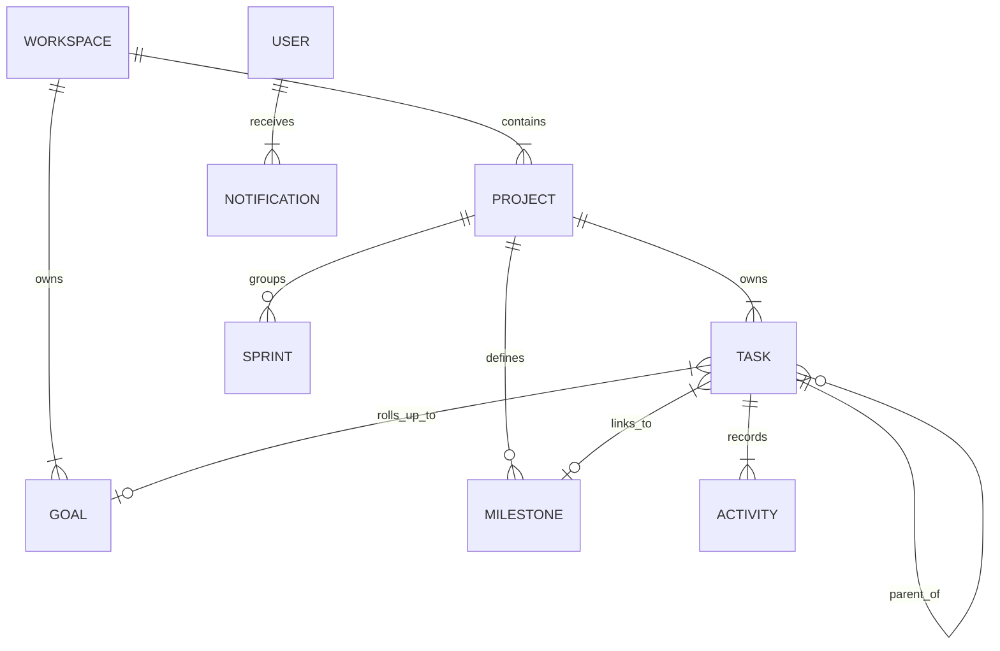

[Docs Wiki Portal](../README.md) > [Product](README.md) > Domain Model

# Product Vision & Domain Entity Model

This document defines the product philosophy, binding design principles, user journeys, and conceptual domain entity graph for **AI Project Manager**.

---

## 📋 Table of Contents
1. [Product Vision](#1-product-vision)
2. [Core Philosophy](#2-core-philosophy)
3. [10 Binding Design Principles](#3-10-binding-design-principles)
4. [Domain Entity Graph](#4-domain-entity-graph)

---

## 1. Product Vision

### The Coordination Tax
Teams already know what they need to do — the primary pain is the **coordination tax**: constant manual bookkeeping required to keep a shared picture of reality up to date (writing tickets, breaking epics, updating statuses, writing sprint summaries).

**AI Project Manager's job**: Absorb the coordination tax. The software maintains an accurate, honest picture of the project with as little manual bookkeeping as possible, surfacing only decisions requiring a human.

### Target User
- Small-to-mid engineering/product teams (3–30 people) without a dedicated full-time PM.
- Technical founders and leads who do project management as an unpaid second job.

---

## 2. Core Philosophy

- **AI-first, not AI-bolted-on.** The tracker exists to give the AI a structured place to act.
- **Narrate work, don't file paperwork.** Describe what happened in plain language; structured records are a byproduct.
- **Opinionated over configurable.** Default workflows should work for 90% of software teams out of the box.
- **Signal over noise.** Curation over endless display.
- **Single source of truth.** Every view is a projection of the same task graph.
- **Trust through transparency.** AI never acts as an unaccountable authority. Every suggestion shows its reasoning.

---

## 3. 10 Binding Design Principles

1. **Effort test** — Must reduce total human effort across the team.
2. **Zero-setup test** — Delivers value with default configuration.
3. **Reversibility test** — Any AI-initiated change must be visibly undoable.
4. **Single-truth test** — No secondary parallel sources of truth.
5. **"What do I do next" test** — Makes the next required decision obvious.
6. **Fallback test** — Manual data entry is always possible, but never mandatory.
7. **Actionable notification test** — Notifications that don't invite a decision belong in a digest line.
8. **One-sentence test** — Value can be explained in one sentence to a non-technical user.
9. **Progressive disclosure test** — Layer complexity, never flatten it.
10. **Show-your-work test** — Every AI suggestion must be traceable to input signals.

---

## 4. Domain Entity Graph

### Entity Definitions
- **Workspace:** Container for billing, membership, and cross-project goals.
- **Project:** Scoped body of work with tasks, milestones, and optional sprints.
- **Task:** Atomic unit of work — status, priority, estimate, labels, and Markdown notes (up to 250,000 chars).
- **Milestone:** Date-bound checkpoint ("Public beta", "v1 launch").
- **Goal:** Outcome outcome that can span multiple projects.
- **Activity:** Append-only event ledger tracking user/system actions.
- **Notification:** Actionable derived user record with read tracking.
