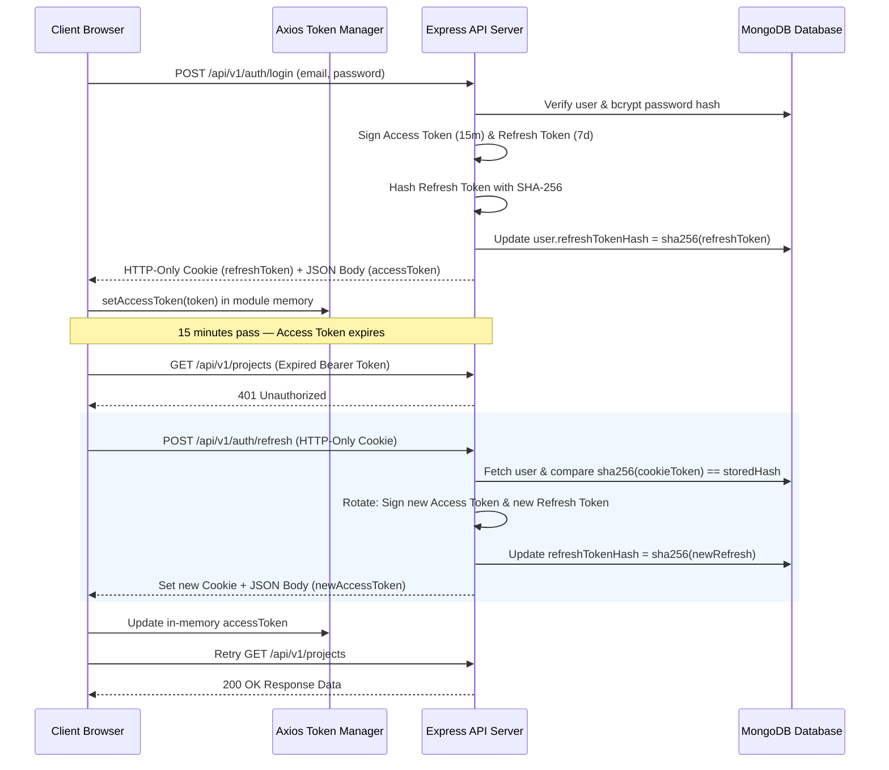

[Docs Wiki Portal](../README.md) > [Security](README.md) > Authentication Architecture

# Authentication Architecture & Session Security

The authentication system enforces a production-grade dual-token strategy designed to protect credentials against XSS token theft, session hijacking, and account enumeration.

---

## 📋 Table of Contents
1. [Overview](#1-overview)
2. [Token Lifecycle & Sequence](#2-token-lifecycle--sequence)
3. [Security Decisions & Rationale](#3-security-decisions--rationale)
4. [Frontend Authentication Architecture](#4-frontend-authentication-architecture)
5. [Authentication REST Endpoints](#5-authentication-rest-endpoints)
6. [Sensitive Field Protections](#6-sensitive-field-protections)

---

## 1. Overview

The system separates short-lived access credentials from long-lived refresh credentials:

- **Access Token** — short-lived JWT (15 minutes) returned in the JSON response body, held strictly in module memory.
- **Refresh Token** — long-lived JWT (7 days) transmitted exclusively as an HTTP-only cookie.

This separation ensures that long-lived session credentials are never accessible to client JavaScript, mitigating XSS-based session hijacking.

---

## 2. Token Lifecycle & Sequence

---

## 3. Security Decisions & Rationale

### A. SHA-256 Hashing for Refresh Tokens
Refresh tokens are hashed with **SHA-256** before database storage.
- **Why SHA-256, not bcrypt?** bcrypt is designed for low-entropy inputs (passwords). Refresh tokens are cryptographically random high-entropy JWTs — SHA-256 is deterministic and fast for database lookups.
- **Threat Mitigation:** If a database leak occurs, attackers obtain only `sha256(refreshToken)`, which cannot be used to authenticate requests.

### B. Immediate Token Rotation
Every `/auth/refresh` invocation invalidates the presented refresh token and issues a new one. This restricts stolen tokens to a single execution window.

### C. Reuse Detection & Emergency Logout
If a previously rotated refresh token is presented (e.g. a replay attack), the server:
1. Immediately sets `refreshTokenHash = null` in MongoDB — logging the user out across all sessions.
2. Throws a `401 Unauthorized` exception.

### D. HTTP-Only Cookie Scoping
The refresh token cookie is scoped to `Path=/api/v1/auth`, ensuring browsers transmit it only to auth endpoints and never to general API routes.

### E. Generic Auth Error Messages
Authentication failures return standardized error messages (`"Invalid email or password."`) regardless of cause, preventing account enumeration attacks.

---

## 4. Frontend Authentication Architecture

### Token Storage Matrix

| Token | Storage Location | Security Property |
|---|---|---|
| **Access Token** | Module memory (`client/src/services/axios.ts`) | Not in `localStorage`, Zustand, or React state. Cleared on tab close. |
| **Refresh Token** | HTTP-Only Cookie (Browser managed) | Inaccessible to client JavaScript. |
| **User Object** | Zustand (`store/auth.store.ts`) | UI state only. Synchronous rendering context. |

---

## 5. Authentication REST Endpoints

| Endpoint | Method | Headers/Cookies | Description |
|---|---|---|---|
| `/api/v1/auth/register` | `POST` | None | Create account |
| `/api/v1/auth/login` | `POST` | None | Authenticate & receive access token + refresh cookie |
| `/api/v1/auth/refresh` | `POST` | Cookie: `refreshToken` | Rotate refresh token & issue new access token |
| `/api/v1/auth/logout` | `POST` | `Authorization: Bearer token` | Invalidate session & clear cookie |
| `/api/v1/auth/me` | `GET` | `Authorization: Bearer token` | Get current user profile |

---

## 6. Sensitive Field Protections

Mongoose schema properties `password` and `refreshTokenHash` are marked `select: false` by default. Additionally, the model `toJSON` transform explicitly deletes `password`, `refreshTokenHash`, `_id`, and `__v` prior to JSON serialization.
